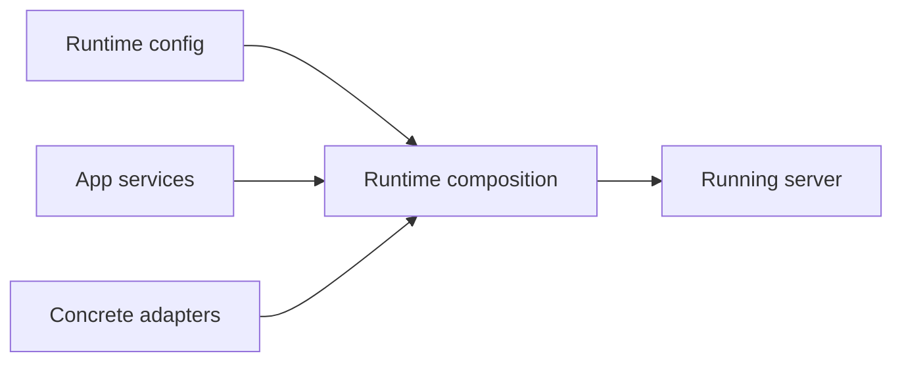
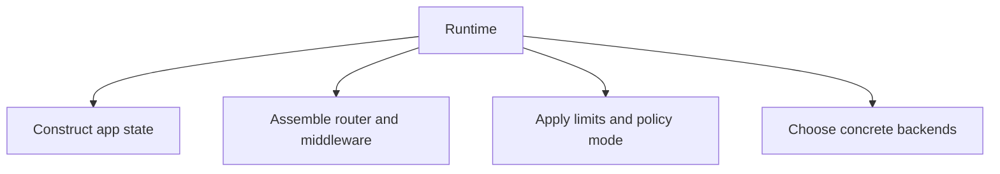

# Runtime Composition

Runtime composition is the step where Atlas becomes a real running process:
configuration is resolved, concrete backends are selected, and the HTTP server
is assembled.

## Composition Model

This composition model shows what runtime actually owns: turning application
services, concrete adapters, and configuration into one executable server.

## Runtime Responsibilities

This responsibility map matters because runtime wiring tends to accumulate
incidental choices over time. Keeping the boundary visible makes those choices
easier to review.

## Architectural Boundary

Runtime is where concrete choices belong:

- addresses and bind settings
- store and cache roots
- concurrency and rate-limiting settings
- telemetry backends

Those choices should not leak backward and become domain rules.

## Runtime Composition Smell Test

- are you wiring concrete behavior or redefining domain meaning?
- are you selecting a backend or sneaking infrastructure detail into a contract?
- are you composing limits and middleware where operators expect them to live?

## Reading Rule

Use this page when the question is not what Atlas does, but how the running
process is assembled from configuration, services, and backends.
