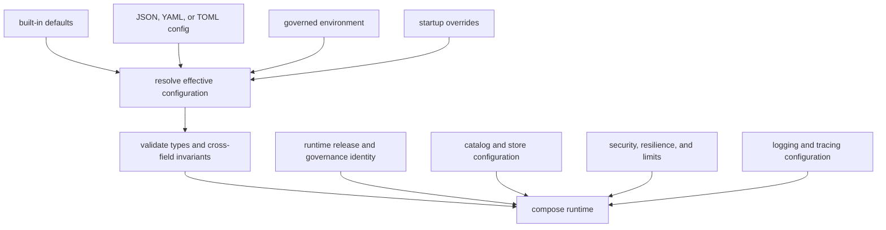
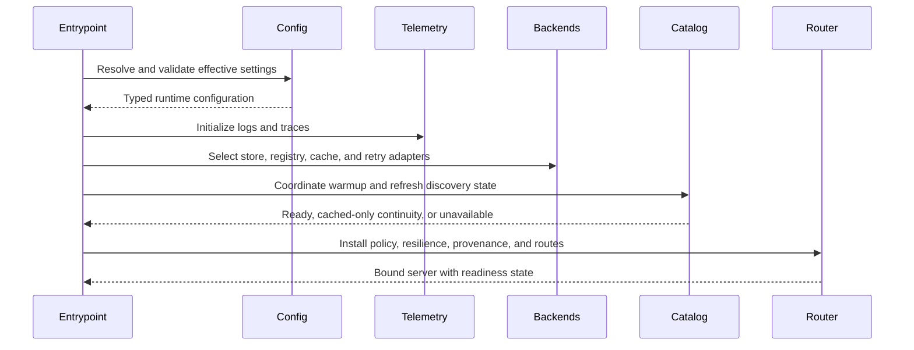

# Runtime Composition

Runtime composition turns validated intent into one attributable server
process. It selects concrete store and cache adapters, constructs application
state, installs request policy and telemetry, refreshes catalog authority, and
only then opens the service path. Composition may choose implementations; it
may not redefine dataset, query, authorization, or publication semantics.

## Composition Inputs

```mermaid
flowchart TD
    Defaults["built-in defaults"] --> Resolve["resolve effective configuration"]
    File["JSON, YAML, or TOML config"] --> Resolve
    Env["governed environment"] --> Resolve
    CLI["startup overrides"] --> Resolve
    Resolve --> Validate["validate types and cross-field invariants"]
    Validate --> Compose["compose runtime"]
    Release["runtime release and governance identity"] --> Compose
    Catalog["catalog and store configuration"] --> Compose
    Policy["security, resilience, and limits"] --> Compose
    Telemetry["logging and tracing configuration"] --> Compose
```

CLI values override environment, environment overrides the selected config
file, and the file overrides built-in defaults for the supported startup
fields. Validation applies to the resolved result. A valid file does not make
an invalid environment or CLI override safe.

The server exposes two non-serving inspection modes:

- `--validate-config` resolves and validates configuration, records the
  validation event, and exits;
- `--print-effective-config` emits the resolved payload and exits.

Effective configuration may describe secret-bearing endpoints or credentials.
Retain a redacted fingerprint and secret version references, not values.

## Assembly Sequence

```mermaid
sequenceDiagram
    participant Entrypoint
    participant Config
    participant Telemetry
    participant Backends
    participant Catalog
    participant Router
    Entrypoint->>Config: Resolve and validate effective settings
    Config-->>Entrypoint: Typed runtime configuration
    Entrypoint->>Telemetry: Initialize logs and traces
    Entrypoint->>Backends: Select store, registry, cache, and retry adapters
    Entrypoint->>Catalog: Coordinate warmup and refresh discovery state
    Catalog-->>Entrypoint: Ready, cached-only continuity, or unavailable
    Entrypoint->>Router: Install policy, resilience, provenance, and routes
    Router-->>Entrypoint: Bound server with readiness state
```

Observability initializes before normal service composition so startup identity
and failures can be attributed. The effective configuration, runtime release,
and governance version are recorded before the process begins serving.

## Backend Selection Is Explicit

| Selection | Concrete composition | Authority boundary |
| --- | --- | --- |
| local store root | local filesystem backend | published local layout and integrity records remain authoritative |
| S3-like store settings | object transport with bounded retry policy | object bytes and manifest identity remain authoritative; transport is not a transaction coordinator |
| HTTP registry source | read path through the configured remote endpoint | read capability does not grant publication authority |
| multiple registry sources | federated backend over named sources | source selection must retain registry and dataset identity |
| local or Redis cache | disposable acceleration and warmup coordination | cache presence never creates catalog or artifact authority |

The process must not silently switch to a different store mode because a
preferred dependency is unavailable. Cached-only service is a declared
continuity mode for previously verified identities, not an implicit backend
substitution or new-release discovery mechanism.

## Policy Placement

Composition binds policy at the boundary that can enforce it:

| Concern | Composition responsibility | Semantic owner |
| --- | --- | --- |
| authentication and authorization | install request context, route policy, and audit integration | runtime security policy and server request-policy adapter |
| work limits | construct rate, overload, concurrency, queue, response, and deadline controls | runtime and query contracts |
| dataset resolution | connect catalog refresh and verified store adapters | model, store, and runtime application contracts |
| route exposure | register service, dataset, and optional administrative routes | server adapter and deployment configuration |
| telemetry | connect structured logs, metrics, traces, release identity, and redaction | observability contracts |

Wiring an implementation does not transfer semantic ownership. The router
cannot reinterpret a dataset tuple; a store adapter cannot relax query limits;
telemetry cannot turn a failed authorization decision into successful work.

## Readiness and Failure Semantics

| Composition failure | Required outcome |
| --- | --- |
| effective configuration is invalid | exit before binding the service listener |
| requested backend scheme is unsupported | fail composition with an attributable configuration error |
| catalog cannot establish serving authority | remain unready unless cached-only policy explicitly permits retained identities |
| warmup coordination is unavailable | record the fallback and continue with local warmup; do not treat Redis as dataset authority |
| telemetry exporter is unavailable | apply the configured behavior and retain the resulting evidence gap |
| administrative routes are disabled | omit them from route registration rather than relying on authorization alone |

A composed process is not automatically ready, secure, or production
qualified. Readiness depends on catalog policy; security depends on effective
identity, authorization, network, and workload controls; qualification depends
on observed target-environment evidence.

Continue with [Runtime Process Model](runtime-process-model.md) for startup and
shutdown, [Request Lifecycle](request-lifecycle.md) for per-request ownership,
and [Runtime Configuration](../../bijux-atlas-ops/kubernetes/runtime-configuration.md)
for deployment reconciliation.
