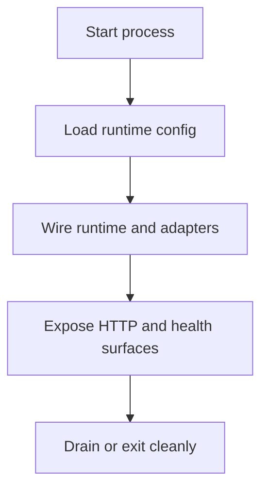

# Runtime Process Model

The Atlas runtime process is the composed application that binds config,
resolves stores, wires adapters, and exposes the HTTP surface.

## Process Model

This process view is deliberately simple because the page is about
responsibility boundaries: startup, composition, serving, and shutdown are not
the same concern and should not collapse into one vague notion of "the server."

## Process Responsibilities

- accept validated runtime configuration
- initialize store and cache dependencies
- expose health, readiness, metrics, and product endpoints
- keep request execution separate from build and maintainer control-plane work

## Repository Authority Map

- the long-running server entrypoint lives in [`src/bin/bijux-atlas-server.rs`](/Users/bijan/bijux/bijux-atlas/crates/bijux-atlas/src/bin/bijux-atlas-server.rs:1)
- runtime composition and application wiring live under [`src/runtime/`](/Users/bijan/bijux/bijux-atlas/crates/bijux-atlas/src/runtime) and [`src/app/`](/Users/bijan/bijux/bijux-atlas/crates/bijux-atlas/src/app)
- inbound HTTP behavior lives under [`src/adapters/inbound/http/`](/Users/bijan/bijux/bijux-atlas/crates/bijux-atlas/src/adapters/inbound/http)
- startup config shape is documented under [`configs/generated/runtime/runtime-startup-config.md`](/Users/bijan/bijux/bijux-atlas/configs/generated/runtime/runtime-startup-config.md:1)

## Process Boundaries

- CLI execution is not the long-running server process, even when both live in the same crate
- OpenAPI generation is a repository artifact path, not part of the runtime serving loop
- serving behavior should consume published store state, not rebuild datasets inside the request path
- request handling, middleware, and response shaping are runtime concerns once composition has completed

## Reading Rule

When the question is about startup wiring or live process behavior, stay in the
runtime slice rather than the maintainer or operations handbooks.

## Main Takeaway

The runtime process model explains how Atlas becomes a live server instead of a
set of source files. It starts from validated config, composes the runtime from
app and adapter layers, serves stable interfaces, and stays separate from build
or maintainer-only paths.
