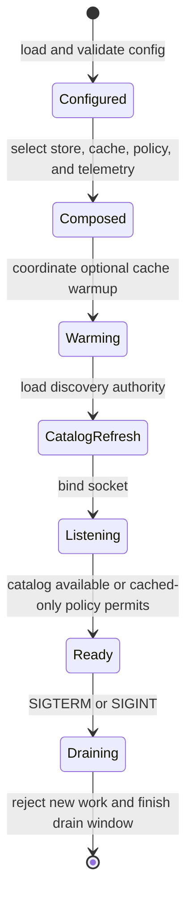
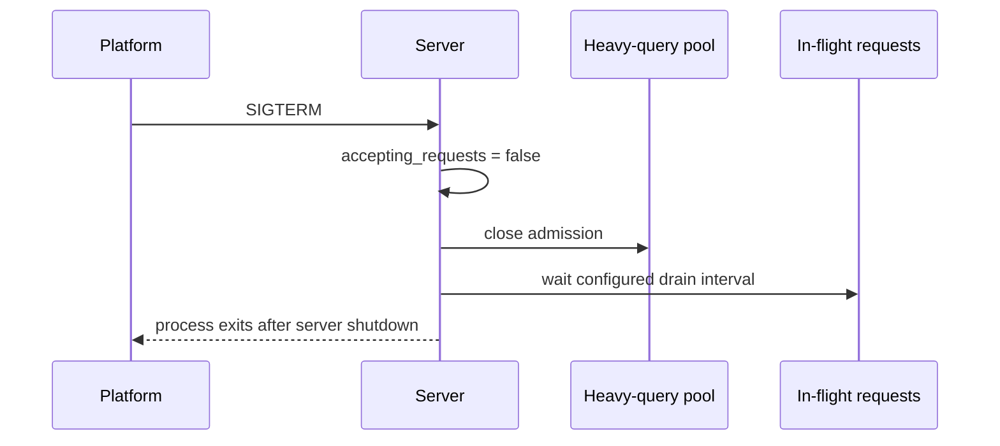

# Runtime Process Model

`bijux-atlas-server` is the long-running process that resolves runtime
configuration, selects store and cache backends, initializes observability,
loads catalog authority, and exposes the HTTP router. It never ingests or
publishes datasets in a request path.

```mermaid
stateDiagram-v2
    [*] --> Configured: load and validate config
    Configured --> Composed: select store, cache, policy, and telemetry
    Composed --> Warming: coordinate optional cache warmup
    Warming --> CatalogRefresh: load discovery authority
    CatalogRefresh --> Listening: bind socket
    Listening --> Ready: catalog available or cached-only policy permits
    Ready --> Draining: SIGTERM or SIGINT
    Draining --> [*]: reject new work and finish drain window
```

## Startup sequence

Configuration is resolved before any socket is bound. Command-line values may
select a config path and override bind, store root, or cache root. Two
inspection modes stop before serving:

- `--validate-config` validates the effective configuration and exits;
- `--print-effective-config` prints the resolved payload and exits.

Normal startup then:

1. initializes logging and tracing;
2. records the effective config, release identity, and governance version;
3. selects local, S3-like, HTTP, or federated store adapters;
4. coordinates configured warmups and starts cache background work;
5. records the selected policy and authentication modes;
6. refreshes the catalog and establishes readiness;
7. binds the configured address and serves the router.

Store mode is explicit. Registry sources select a federated backend; otherwise
S3 mode requires its base URL, and local mode uses the configured filesystem
root. A process must not silently change backends when one is unavailable.

## Readiness represents discovery authority

The process begins unready. A successful catalog refresh makes it ready.
Refresh runs periodically and clears readiness on failure, except when
cached-only mode explicitly permits retained reads. In cached-only mode,
readiness means bounded continuity for cached identities; it does not mean the
live store is healthy or new releases are discoverable.

Liveness, readiness, overload health, metrics, version, OpenAPI, catalog, and
product query routes share one router. Administrative and failure-injection
routes are absent unless admin endpoints are enabled. Middleware applies body
limits, request identity, tracing, CORS, security, resilience, provenance, and
the common error envelope.

## Warmup coordination

When Redis coordination is enabled, each configured dataset warmup uses an
owner-valued lease with a TTL. Bounded retries and pod-specific jitter reduce
duplicate work. Lease release checks ownership. If coordination cannot be
used, startup falls back to local warmup and records the event; Redis is not a
source of dataset authority.

Warmup failure is logged and startup continues. Readiness is decided by the
catalog refresh and cached-only policy, not by assuming every warmup succeeded.

## Shutdown and admission

On `SIGTERM` or `SIGINT`, the process stops accepting new requests, closes the
heavy-query bulkhead, waits for the configured drain interval, and then lets
the HTTP server complete graceful shutdown.

```mermaid
sequenceDiagram
    participant Platform
    participant Server
    participant Heavy as Heavy-query pool
    participant Requests as In-flight requests
    Platform->>Server: SIGTERM
    Server->>Server: accepting_requests = false
    Server->>Heavy: close admission
    Server->>Requests: wait configured drain interval
    Server-->>Platform: process exits after server shutdown
```

Route readiness away before the platform's termination deadline. The
configured drain interval must fit inside that deadline with room for process
exit and network propagation.

See [Runtime configuration](../../bijux-atlas-ops/kubernetes/runtime-configuration.md)
for deployment inputs and [Health, readiness, and drain](../../bijux-atlas-ops/observability/health-readiness-and-drain.md)
for operational probes.
