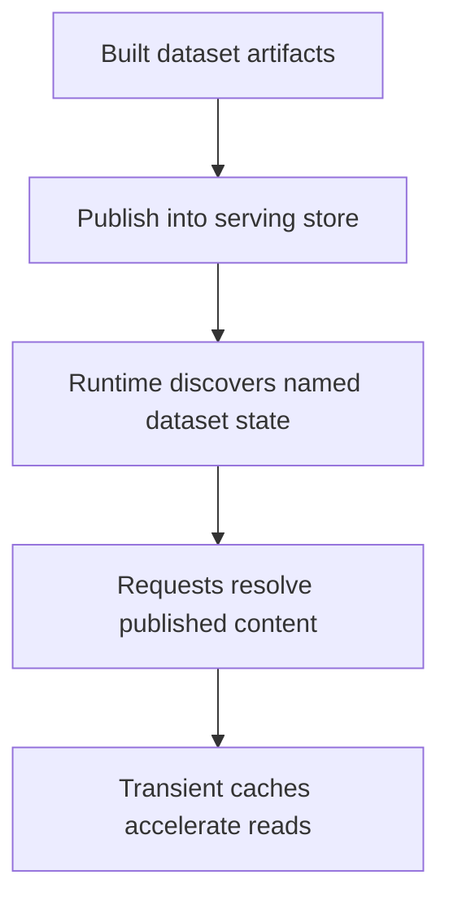

# Serving Store Model

The serving store is the durable runtime boundary for Atlas data.

It is not raw ingest input, temporary build output, or request-local cache
state. It is the published artifact-backed state the runtime resolves when
serving dataset and query traffic.

## Serving Store Model

This diagram is here because the store model is easy to blur with build output
or caching. The serving store is the durable published layer; caches are only a
runtime convenience around it.

## Core Role

- hold published immutable content
- support dataset discovery and resolution
- remain separate from transient runtime caches

## Repository Authority Map

- dataset identity and domain meaning live under [`src/domain/dataset/`](/Users/bijan/bijux/bijux-atlas/crates/bijux-atlas/src/domain/dataset)
- serving-store paths and object layout are implemented under [`src/adapters/outbound/store/`](/Users/bijan/bijux/bijux-atlas/crates/bijux-atlas/src/adapters/outbound/store)
- manifest file naming is declared in [`src/adapters/outbound/store/paths.rs`](/Users/bijan/bijux/bijux-atlas/crates/bijux-atlas/src/adapters/outbound/store/paths.rs:1)
- runtime read ports for store-backed serving live in [`src/app/ports/dataset_store.rs`](/Users/bijan/bijux/bijux-atlas/crates/bijux-atlas/src/app/ports/dataset_store.rs:1)
- runtime store access is exercised through the server and runtime layers, not through ingest internals

## Stable Boundary Versus Internals

- published manifests and named dataset paths are part of the store-facing stability story
- backend implementation details such as local, HTTP, or S3 transport logic are internal mechanisms behind that story
- request-local caches may observe the store, but they are not the source of truth for published data

## Main Takeaway

The serving store is Atlas's durable read boundary. It is where built dataset
content becomes named published state the runtime can discover, resolve, and
serve, while caches and backend mechanics remain supporting details around that
stable role.
