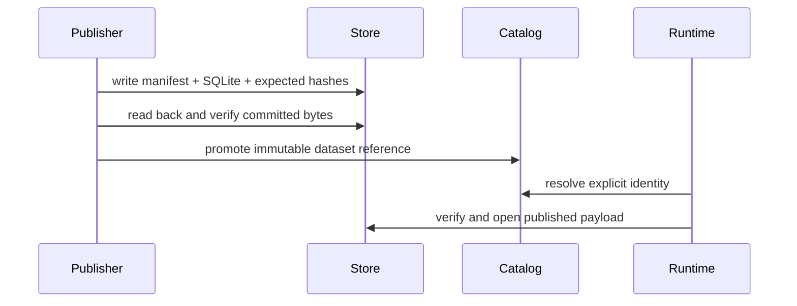
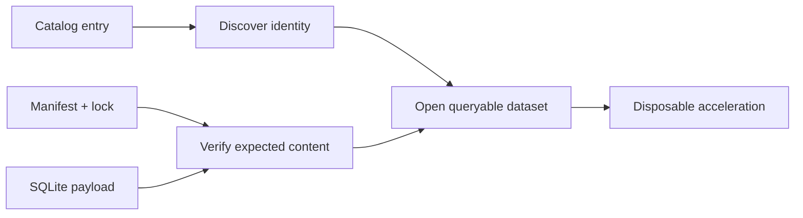

# Serving store model

The serving store is the durable boundary between ingest and query traffic.
Ingest builds a candidate. Publication commits verified bytes. Catalog
promotion makes those bytes discoverable. Runtime caches may accelerate later
reads, but none can create or redefine a published dataset.

## Publication creates two separate facts

```mermaid
sequenceDiagram
    participant Publisher
    participant Store
    participant Catalog
    participant Runtime
    Publisher->>Store: write manifest + SQLite + expected hashes
    Publisher->>Store: read back and verify committed bytes
    Publisher->>Catalog: promote immutable dataset reference
    Runtime->>Catalog: resolve explicit identity
    Runtime->>Store: verify and open published payload
```

Payload publication establishes that coherent bytes exist. Catalog promotion
establishes visibility. If promotion fails after publication, the payload is an
undiscoverable orphan—not a queryable release. If publication fails, catalog
state must remain unchanged.

## Published layout

Each dataset key resolves a governed file set:

| File | Authority |
| --- | --- |
| `manifest.json` | Dataset identity and artifact description |
| `gene_summary.sqlite` | Queryable content |
| `manifest.lock` | Expected SHA-256 digests for manifest and SQLite payload |
| `.publish.lock` | Local publication exclusion |
| `immutable.release.json` | Immutable-publication marker |
| `lifecycle.state.json` | Current lifecycle state |
| `lifecycle.transitions.json` | Recorded state transitions |

`catalog.json` advertises datasets; it does not replace each payload's manifest
and lock. Layout helpers own filesystem paths and object keys under
`release=<release>/species=<species>/assembly=<assembly>/`. Consumers should
not reconstruct those paths independently.

## Backend capabilities

| Capability | Local filesystem | HTTP read-only | S3-like |
| --- | --- | --- | --- |
| list and read | yes | yes | yes |
| publish | yes | no | yes |
| local per-dataset lock | yes | no | no |
| reject readable conflicting payload | yes | not applicable | yes |
| local lifecycle records | yes | read if present | no |

HTTP and S3-like support are enabled by `backend-s3`. Backend choice does not
change identity, key layout, checksums, or catalog meaning. The S3-like adapter
is not a distributed transaction coordinator; deployment controls must
serialize publishers and inspect remote state after ambiguous failures.

Before retrying an object-store write that timed out, read the target and
compare hashes. Matching bytes permit idempotent continuation. Different
readable bytes are an immutability conflict.

## Three read authorities

```mermaid
flowchart LR
    Catalog[Catalog entry] --> Resolve[Discover identity]
    Manifest[Manifest + lock] --> Verify[Verify expected content]
    Bytes[SQLite payload] --> Verify
    Resolve --> Open[Open queryable dataset]
    Verify --> Open
    Open --> Cache[Disposable acceleration]
```

| Authority | Safe claim |
| --- | --- |
| catalog entry | This identity is advertised by the selected catalog snapshot |
| manifest and lock | Expected content and hashes are known and parseable |
| verified SQLite bytes | The opened database matches its published checksum |

All three are required for a newly resolved dataset. Cached-only operation may
continue serving previously verified bytes when policy permits it, but cannot
claim that new catalog state was discovered. Cache keys must include the full
dataset identity and artifact hash.

## Failure semantics

| Failure | Safe behavior |
| --- | --- |
| catalog unavailable | Serve only policy-permitted verified retained state; otherwise fail explicitly |
| identity absent from catalog | Return a dataset miss; never scan storage for a substitute |
| invalid manifest or lock | Quarantine the identity and preserve evidence |
| SQLite checksum mismatch | Reject the payload and invalidate derived caches |
| transient backend timeout | Retry within policy and verify ambiguous outcomes |
| conflicting concurrent publication | Reject as an immutability or coordination conflict |

The runtime depends on a dataset-store port, not backend details. Ingest owns
artifact construction, the store owns publication and integrity, the runtime
owns selection and service policy, and caches own temporary acceleration.
