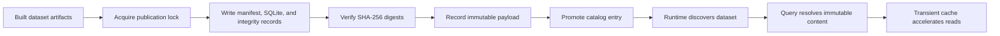

# Serving Store Model

The serving store is the durable boundary between artifact publication and
query traffic. Ingest produces dataset candidates. Publication places verified
artifacts into a named store layout. A separate catalog promotion makes the
identity discoverable. Runtime caches can accelerate reads, but they never
replace published state.

## Publication and Read Path

```mermaid
flowchart LR
    B["Built dataset artifacts"] --> L["Acquire publication lock"]
    L --> W["Write manifest, SQLite, and integrity records"]
    W --> V["Verify SHA-256 digests"]
    V --> M["Record immutable payload"]
    M --> C["Promote catalog entry"]
    C --> D["Runtime discovers dataset"]
    D --> Q["Query resolves immutable content"]
    Q --> H["Transient cache accelerates reads"]
```

Publication and catalog promotion are separate commands and authorities.
Promote only after the dataset payload and its integrity records are coherent.
Readers then resolve a named release instead of an arbitrary build directory.

## Dataset Layout

Each published dataset has a deterministic key prefix and a governed set of
files:

| File | Role |
| --- | --- |
| `manifest.json` | Dataset identity, content description, and artifact metadata |
| `gene_summary.sqlite` | Queryable dataset content |
| `manifest.lock` | Expected SHA-256 digests for the manifest and SQLite payload |
| `.publish.lock` | Mutual exclusion for local publication |
| `immutable.release.json` | Marker for immutable published state |
| `lifecycle.state.json` | Current lifecycle state |
| `lifecycle.transitions.json` | Recorded lifecycle transitions |

`catalog.json` indexes published datasets. The catalog is a discovery surface;
the manifest lock remains the integrity check for each dataset payload.

## Storage Capabilities

The store library separates read, write, and administrative capabilities. This
allows a serving process to receive only the authority it needs.

- `LocalFsStore` supports local filesystem publication and reads.
- `HttpReadonlyStore` serves immutable content from HTTP when the `backend-s3`
  feature is enabled.
- `S3LikeStore` supports object-storage publication and reads under the same
  feature.

Backend choice does not change dataset identity, layout keys, checksum
expectations, or catalog semantics. It does change publication guarantees:

| Capability | Local filesystem | HTTP read-only | S3-like |
| --- | --- | --- | --- |
| list and read datasets | yes | yes | yes |
| publish payload | yes | no | yes |
| per-dataset local lock | yes | no | no |
| reject readable existing dataset | yes | not applicable | yes |
| local immutability and lifecycle records | yes | read if present | no |
| cache-backed reads | runtime concern | backend support | optional backend cache |

The S3-like implementation is an object transport adapter, not a distributed
transaction coordinator. Serialize publishers through deployment controls and
inspect object state after interrupted writes.

## Runtime Boundary

The runtime depends on a dataset-store port rather than backend implementation
details. Its store adapters load catalogs, manifests, locks, and SQLite
artifacts, then expose resolved dataset state to the application layer.

This boundary keeps four concerns separate:

- ingest owns normalization and artifact construction;
- the store owns layout, publication, locking, integrity, and persistence;
- the runtime owns dataset resolution and service policy;
- request-local caches own temporary acceleration only.

Cached-only operation is an explicit degraded mode. It may continue serving
retained state when the live catalog is unavailable, but it cannot claim that
newly published datasets have been discovered.

## Integrity and Failure Semantics

A dataset is not safe to serve when its required files are missing, its lock
cannot be parsed, or a recorded digest differs from the bytes read. Treat those
conditions as integrity failures; do not rebuild the lock around unexplained
content.

Because catalog promotion is separate, a failed payload publication should not
change catalog visibility. Retry policy may address transient backend errors,
while store instrumentation records reads, writes, failures, and latency.
Persistent integrity, concurrency, permission, or layout failures require
operator action.

The result is a stable read contract: a query names a published dataset, the
runtime resolves verified immutable content, and caches remain disposable.
