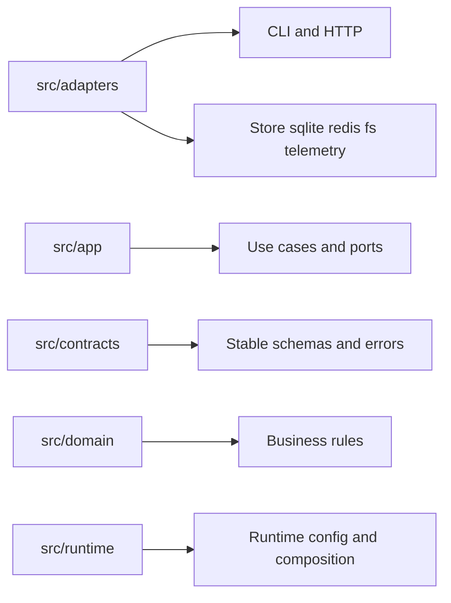
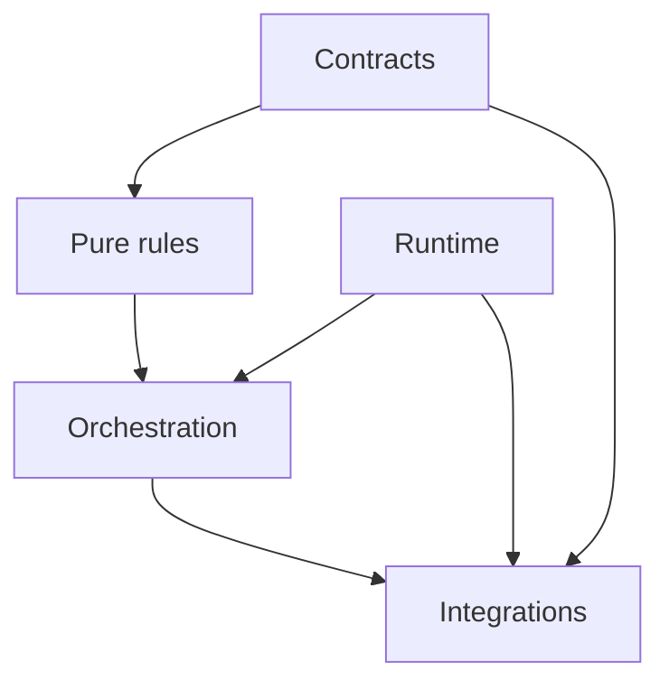

# Source Layout and Ownership

Atlas source layout is meant to teach the architecture directly from the tree,
without relying on tribal knowledge.

## Canonical Ownership Model

This ownership map gives contributors a direct translation from architectural
idea to source-tree location. New code placement should not depend on old
directory names or local folklore.

## Why These Roots Exist

This diagram explains the dependency intent behind the root layout. The point is
not just tidy directories; it is making responsibility and change impact easier
to reason about.

The canonical roots are:

- `adapters`
- `app`
- `contracts`
- `domain`
- `runtime`

These are the roots contributors should optimize for when placing new code.

## Ownership Rules

- if the code translates between Atlas and the outside world, it belongs in `adapters`
- if the code orchestrates use cases and ports, it belongs in `app`
- if the code defines stable schemas, config contracts, or errors, it belongs in `contracts`
- if the code defines business rules and domain semantics, it belongs in `domain`
- if the code wires the process together, it belongs in `runtime`

## Architectural Benefit

This layout makes it harder to hide source of truth behind historical barrels or convenience shims.

## Quick Placement Test

- if you are translating HTTP, CLI, filesystem, or network concerns, start in `adapters`
- if you are composing use cases or ports, start in `app`
- if you are defining stable promises, start in `contracts`
- if you are defining rules that should not depend on transport, start in `domain`
- if you are wiring concrete runtime behavior, start in `runtime`

## Reading Rule

Use this page when a change feels reasonable in concept but you still cannot
tell which root should own it.
