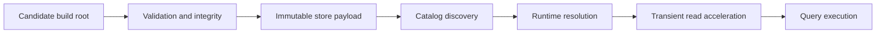
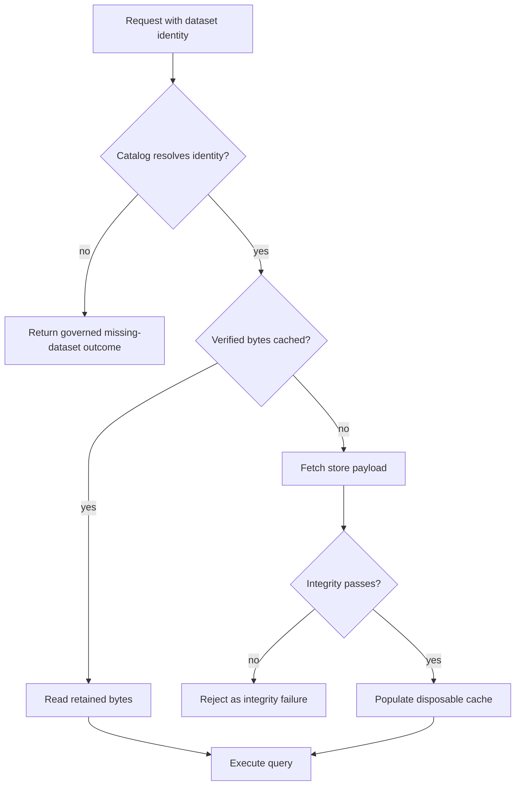

# Storage Architecture

Atlas separates candidate construction, durable publication, discovery, and
read acceleration. Each layer answers a different question and carries a
different failure policy.

Authority moves in one direction. Builds feed stores. Catalogs expose
identities. Runtimes read. Caches accelerate. None of those downstream layers
may rewrite upstream release truth.

## Storage Layers

The arrows describe authority, not merely file movement. A cache entry can
accelerate bytes already authorized by store and catalog identity. It cannot
publish, promote, or redefine them.

## Layer Ownership

| Layer | Owns | Must not become |
| --- | --- | --- |
| build root | candidate artifacts and producer evidence | a runtime store selected by convenience |
| serving store | immutable payloads and integrity material | a mutable workspace or scratch directory |
| catalog | discoverable dataset identities and locations | proof that payload bytes are valid |
| runtime adapter | verified reads and backend translation | a writer of release truth |
| cache | disposable copies and request acceleration | catalog, integrity authority, or backup |

Store presence and catalog visibility are different facts. Verify both. A
runtime can also lag behind a promoted catalog. Observe its resolved identity.
A warm cache is useful for continuity, but it is not proof of freshness.

## Read Authority

Cached-only mode is an explicit degraded path. It can preserve reads for
already retained objects when the live backend is unavailable. A cache miss in
that mode is not permission to fall back to an unverified directory or another
dataset.

## Classify Storage Failures

| Symptom | Boundary to inspect | Evidence |
| --- | --- | --- |
| build files missing | producer and build root | ingest result and candidate manifest |
| payload absent after publication | backend write path | publication result, keys or paths, and expected hashes |
| dataset absent from listing | catalog | catalog identity and promotion result |
| manifest rejected | integrity | manifest lock, actual bytes, and structured store error |
| backend unavailable, cache hit | degraded read path | cache identity, age, and cached-only status |
| backend unavailable, cache miss | continuity limit | missing key and retry evidence |
| stale result after promotion | runtime refresh | catalog revision, refresh age, and resolved dataset identity |

Always identify the dataset tuple and selected backend before changing state.
Deleting a cache may reveal a store failure; rewriting a catalog may hide one.
Preserve the original observation and repair the owning boundary.
