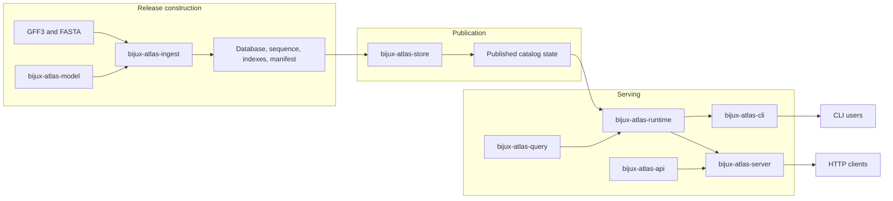
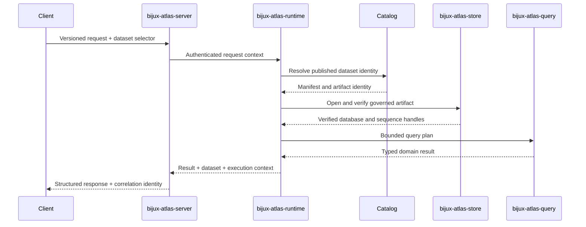
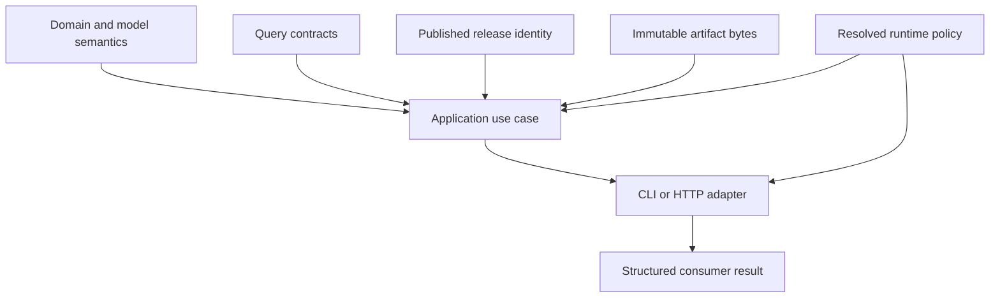
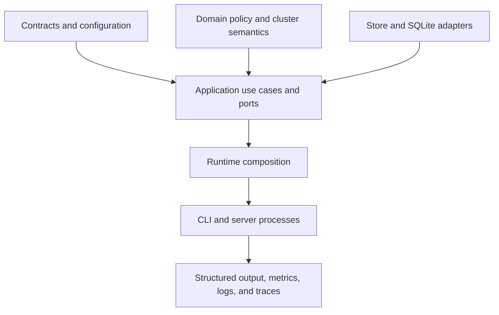
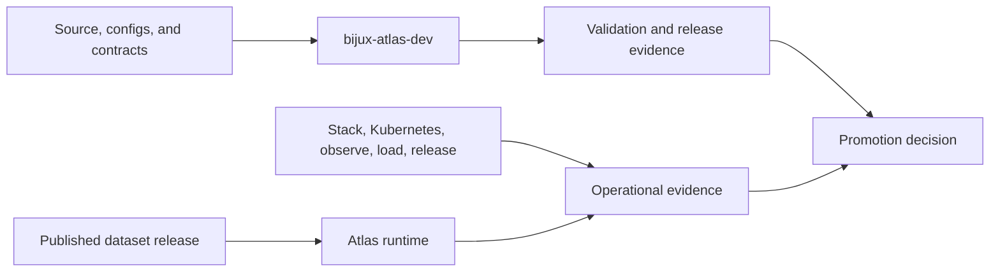

# System Overview

Atlas separates genomic semantics from artifact construction and storage.
Runtime composition and delivery interfaces have their own owners. Repository
automation remains outside the product runtime. Crate dependencies and exchanged
artifacts make those boundaries visible.

The boundaries are deliberate. They keep scientific meaning stable. They also
make process failures attributable to an owner.
Each owner publishes a narrow contract. Composition happens above those
contracts.

Read the system from identity outward. Start with the dataset key. Follow it to
the manifest and verified artifact. Treat the catalog as discovery. Treat the
store as byte authority. Treat caches as disposable acceleration. Then use the
request identity to reconstruct one execution.

## End-to-End Architecture

No delivery interface owns genomic truth. The model and leaf crates define
domain behavior. The runtime composes them. The CLI and server translate user
requests. The store and catalog establish which immutable release is serveable.

## One Request Across Owners

Each arrow crosses a contract. The server owns transport, authentication
placement, middleware, and response mapping. The runtime owns use-case policy
and composition. Catalog and store resolution establish data identity. Query
owns selection, ordering, cursor, and SQLite execution semantics. Failure at
one boundary must retain its owner instead of collapsing into an untyped
internal error.

## Product Invariants Across Components

| Invariant | Established by | Preserved by | Exposed to consumers by |
| --- | --- | --- | --- |
| explicit dataset identity | model and ingest | store keys, catalog entries, runtime resolution | CLI arguments, API parameters, provenance, cursors |
| deterministic content | core canonicalization and ingest | manifest checksums and immutable publication | artifact hash, ETag, reproducibility evidence |
| coordinate semantics | model and ingest | query filters and SQLite schema | API DTOs and CLI output |
| bounded work | query plan and runtime policy | server admission, deadlines, concurrency, response limits | stable rejection codes and telemetry |
| attributable access | security policy | server identity propagation and audit | request identity, authorization result, audit record |
| diagnosable failure | owning leaf crate | runtime error context and delivery mapping | typed CLI errors, API envelope, logs, metrics, traces |

An invariant has one semantic owner but crosses several implementations. A
delivery adapter may present it differently; it may not weaken or silently
reconstruct it.

## Authority Flow

Authority flows inward from owned contracts and published state, then outward
as a structured result. Delivery code may translate transport details but may
not synthesize dataset identity, weaken query limits, or turn unavailable
artifact state into a successful response.

There are two identity chains in every served answer:

- scientific identity: source hashes, normalization policy, dataset identity,
  manifest, and artifact checksum;
- execution identity: runtime release, effective configuration, request ID,
  principal, route, query plan, and response status.

The first explains which biological data was used. The second explains how a
particular request was processed. Provenance and incident evidence need both;
one cannot be inferred reliably from the other.

## Crate Ownership

| Crate | Owns | Does not own |
| --- | --- | --- |
| `bijux-atlas-core` | runtime-independent primitives, canonicalization, hashes, and shared error codes | dataset workflows or delivery |
| `bijux-atlas-model` | dataset, gene, transcript, diff, manifest, and policy value types | IO or orchestration |
| `bijux-atlas-ingest` | normalization, anomaly policy, and artifact construction | serving or catalog publication policy |
| `bijux-atlas-query` | parsing, planning, ordering, cursoring, and SQLite query execution | HTTP or process lifecycle |
| `bijux-atlas-store` | artifact-store ports, backend capabilities, integrity, and publication contracts | query semantics |
| `bijux-atlas-runtime` | application use cases, policy, cache, ports, and canonical composition | installed command or HTTP route ownership |
| `bijux-atlas-api` | DTOs, API errors, client contracts, OpenAPI, and `bijux-atlas-openapi` | server process lifecycle |
| `bijux-atlas-cli` | installed `bijux-atlas` command and presentation | reusable domain implementation |
| `bijux-atlas-server` | HTTP router, middleware, runtime state, telemetry, and `bijux-atlas-server` | artifact construction |
| `bijux-atlas` | compatibility re-exports for the historical `bijux_atlas` import path | canonical implementation ownership |
| `bijux-atlas-ops` | published operational path and metadata contracts | deployment execution or repository governance |
| `bijux-atlas-dev` | repository-only validation, generation, reporting, and release automation | product runtime behavior |

## Runtime Zones

- Contracts define stable configuration, errors, and boundary shapes.
- Domain code owns policy, security, placement, routing, and topology semantics.
- Application code coordinates ingest, query, caching, and outbound ports.
- Adapters implement storage and database boundaries without redefining domain
  meaning.
- Runtime composition selects concrete implementations and process settings.
- Delivery crates own parsing, middleware, presentation, and process lifecycle.

## Data and Control Planes

The data plane serves published catalog and artifact state. The operational
control plane renders and validates deployment profiles. It observes the
runtime, executes governed load and failure scenarios, and assembles release
evidence. The repository control plane validates code-adjacent contracts and
generates machine-readable reports. Neither control plane is a hidden dependency
of normal query execution.

The data plane may continue serving while a control plane is unavailable, but
that does not make future promotion safe. Conversely, a passing repository or
deployment validation report cannot establish live query correctness without
data-plane observation.

## Failure Isolation

| Unavailable component | Expected containment | Unsafe interpretation |
| --- | --- | --- |
| repository control plane | running queries continue; new validation evidence cannot be produced | treating old reports as evidence for changed inputs |
| deployment control plane | existing pods may continue serving | assuming rollout, rollback, or policy enforcement remains available |
| catalog | previously verified cached-only data may remain eligible by policy | claiming discovery of new datasets |
| authoritative store | verified cache hits may survive; misses fail explicitly | converting missing bytes into empty scientific results |
| Redis or response cache | query path falls back within capacity policy | treating cache loss as dataset loss or bypassing overload limits |
| telemetry sink | data path may remain correct for a bounded period | promoting an unobservable candidate or claiming recovery timing |
| one server replica | readiness removes it while peers serve | ignoring shared catalog, store, or configuration causes |

Isolation is a runtime property, not merely a dependency diagram. Load,
failure-injection, and recovery evidence must demonstrate the containment claim
for the selected topology and profile.

Continue with [Request Lifecycle](request-lifecycle.md),
[Artifact Lifecycle](artifact-lifecycle.md), and
[Runtime Composition](runtime-composition.md).
