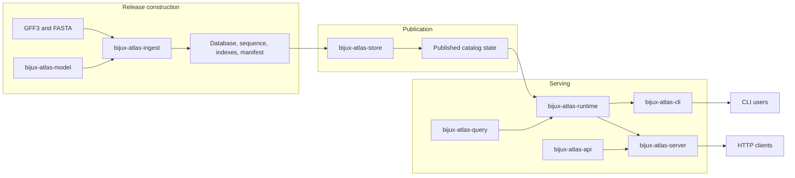
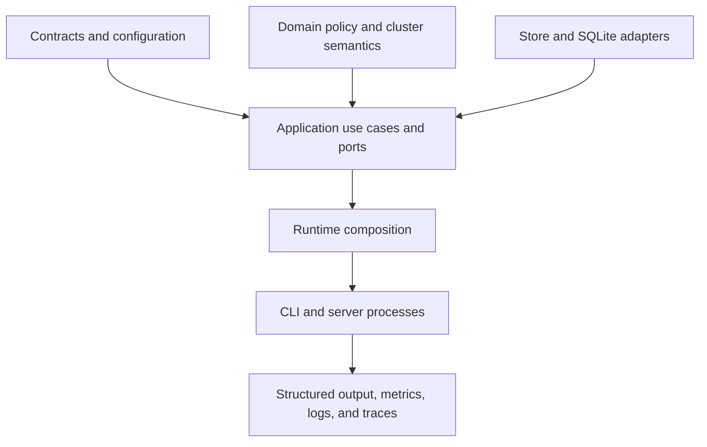
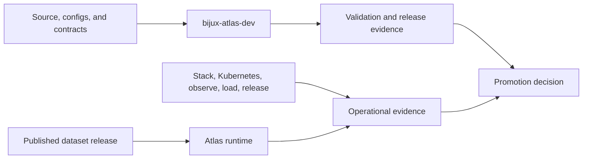

# System Overview

Atlas separates genomic semantics from artifact construction and storage.
Runtime composition and delivery interfaces have their own owners. Repository
automation remains outside the product runtime. Crate dependencies and exchanged
artifacts make those boundaries visible.

## End-to-End Architecture

No delivery interface owns genomic truth. The model and leaf crates define
domain behavior. The runtime composes them. The CLI and server translate user
requests. The store and catalog establish which immutable release is serveable.

## Crate Ownership

| Crate | Owns | Does not own |
| --- | --- | --- |
| `bijux-atlas-core` | runtime-independent primitives, canonicalization, hashes, and shared error codes | dataset workflows or delivery |
| `bijux-atlas-model` | dataset, gene, transcript, diff, manifest, and policy value types | IO or orchestration |
| `bijux-atlas-ingest` | normalization, anomaly policy, and artifact construction | serving or catalog publication policy |
| `bijux-atlas-query` | parsing, planning, ordering, cursoring, and SQLite query execution | HTTP or process lifecycle |
| `bijux-atlas-store` | artifact-store ports, backend capabilities, integrity, and publication contracts | query semantics |
| `bijux-atlas-runtime` | application use cases, policy, cache, ports, and canonical composition | installed command or HTTP route ownership |
| `bijux-atlas-api` | DTOs, API errors, client contracts, OpenAPI, and `bijux-atlas-openapi` | server process lifecycle |
| `bijux-atlas-cli` | installed `bijux-atlas` command and presentation | reusable domain implementation |
| `bijux-atlas-server` | HTTP router, middleware, runtime state, telemetry, and `bijux-atlas-server` | artifact construction |
| `bijux-atlas` | compatibility re-exports for the historical `bijux_atlas` import path | canonical implementation ownership |
| `bijux-atlas-ops` | published operational path and metadata contracts | deployment execution or repository governance |
| `bijux-atlas-dev` | repository-only validation, generation, reporting, and release automation | product runtime behavior |

## Runtime Zones

- Contracts define stable configuration, errors, and boundary shapes.
- Domain code owns policy, security, placement, routing, and topology semantics.
- Application code coordinates ingest, query, caching, and outbound ports.
- Adapters implement storage and database boundaries without redefining domain
  meaning.
- Runtime composition selects concrete implementations and process settings.
- Delivery crates own parsing, middleware, presentation, and process lifecycle.

## Data and Control Planes

The data plane serves published catalog and artifact state. The operational
control plane renders and validates deployment profiles. It observes the
runtime, executes governed load and failure scenarios, and assembles release
evidence. The repository control plane validates code-adjacent contracts and
generates machine-readable reports. Neither control plane is a hidden dependency
of normal query execution.

Continue with [Request Lifecycle](request-lifecycle.md),
[Artifact Lifecycle](artifact-lifecycle.md), and
[Runtime Composition](runtime-composition.md).
