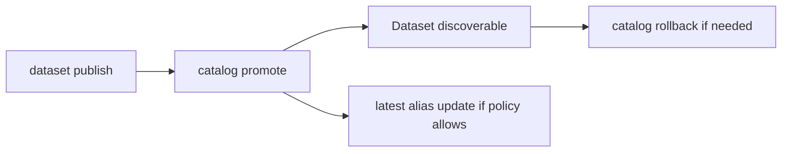
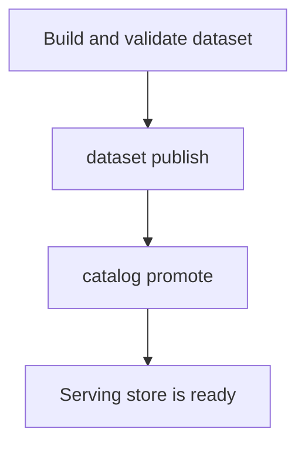

# Catalog Workflows

Catalog workflows decide which published datasets the serving layer can
discover.

The catalog is the discoverable registry of published datasets. A serving store
without a valid catalog is not a complete serving surface.

## Catalog Lifecycle



This lifecycle diagram shows the catalog’s real job: making published dataset
state discoverable to the serving layer. Publication alone is not enough if the
catalog never points the runtime at the dataset.

## Main Catalog Operations

- `catalog validate`: validate a catalog document
- `catalog publish`: write a catalog into a store root
- `catalog promote`: add a published dataset to the catalog
- `catalog rollback`: remove a dataset from the catalog
- `catalog latest-alias-update`: update the latest alias after promotion

## Recommended Normal Flow



This normal flow matters because it separates dataset publication from dataset
discovery. Many issues that look like runtime bugs are really catalog-state
omissions.

For most users, `catalog promote` is the important day-to-day action after a dataset is successfully published.

## Example Commands

Promote a published dataset into the catalog:

```bash
cargo run -p bijux-atlas --bin bijux-atlas -- catalog promote \
  --store-root artifacts/getting-started/tiny-store \
  --release 110 \
  --species homo_sapiens \
  --assembly GRCh38
```

Remove it again if needed:

```bash
cargo run -p bijux-atlas --bin bijux-atlas -- catalog rollback \
  --store-root artifacts/getting-started/tiny-store \
  --release 110 \
  --species homo_sapiens \
  --assembly GRCh38
```

## What Can Go Wrong

- the dataset was never published into the store
- the catalog is missing or malformed
- the latest alias is updated before promotion
- the serving store is mistaken for the ingest build root

## What This Page Helps You Confirm

- whether a dataset is actually discoverable by the server
- whether the catalog reflects the dataset state you think is published
- whether alias changes happened in the right order

## Rule of Thumb

If the question is “can the server discover this dataset,” the answer usually lives in the catalog state, not only in the existence of artifact files.

## Reading Rule

Use this page when the dataset exists in the store but the real question is
whether the server can discover it.
