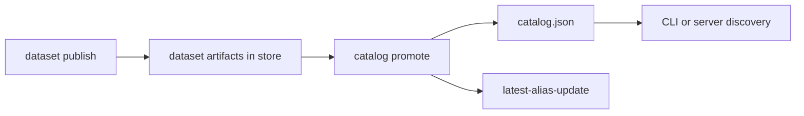
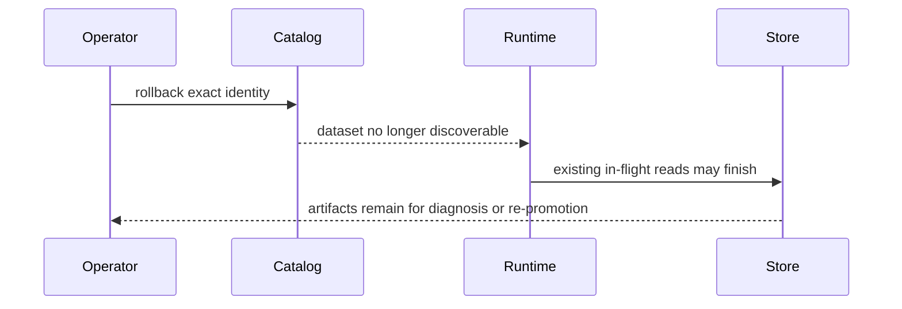

# Catalog Workflows

The catalog is the serving store's discovery authority. Dataset artifacts may
exist without being visible to readers. Promotion changes the catalog only
after the identified dataset is present and valid.


```mermaid
flowchart LR
    Publish["dataset publish"] --> Stored["dataset artifacts in store"]
    Stored --> Promote["catalog promote"]
    Promote --> Catalog["catalog.json"]
    Catalog --> Runtime["CLI or server discovery"]
    Promote --> Alias["latest-alias-update"]
```

## Catalog operations and their authority

| Command | Reads | Changes | Does not do |
| --- | --- | --- | --- |
| `catalog validate PATH` | a catalog document | nothing | verify referenced dataset artifacts |
| `catalog publish` | an external catalog document | `catalog.json` in a store | copy dataset artifacts |
| `catalog promote` | stored manifest and artifacts | adds the exact dataset identity to `catalog.json` | update the latest alias |
| `catalog rollback` | current catalog | removes the exact identity from discovery | delete dataset artifacts |
| `catalog latest-alias-update` | current catalog | writes `latest.alias.json` | promote an absent dataset |

Catalog writes use a temporary file and rename boundary. Operate on the store
through these commands rather than editing `catalog.json` in place.

## Promote an exact dataset

After publication, promote the same release, species, and assembly:

```bash
cargo run -p bijux-atlas-cli --bin bijux-atlas -- catalog promote \
  --store-root artifacts/getting-started/tiny-store \
  --release 110 \
  --species homo_sapiens \
  --assembly GRCh38
```

Promotion checks that the dataset's manifest and SQLite artifact exist. A
successful command establishes catalog membership. Confirm visibility with a
query against the same store before directing traffic to it.

Update the convenience alias only after promotion:

```bash
cargo run -p bijux-atlas-cli --bin bijux-atlas -- catalog latest-alias-update \
  --store-root artifacts/getting-started/tiny-store \
  --release 110 \
  --species homo_sapiens \
  --assembly GRCh38
```

The alias command rejects a dataset absent from the catalog. Explicit dataset
identities remain the reproducible choice for automation. Use `latest` only
where following the current promoted release is intentional.

## Roll back discovery

Rollback removes a catalog entry without deleting its stored artifacts:

```bash
cargo run -p bijux-atlas-cli --bin bijux-atlas -- catalog rollback \
  --store-root artifacts/getting-started/tiny-store \
  --release 110 \
  --species homo_sapiens \
  --assembly GRCh38
```


```mermaid
sequenceDiagram
    participant Operator
    participant Catalog
    participant Runtime
    participant Store
    Operator->>Catalog: rollback exact identity
    Catalog-->>Runtime: dataset no longer discoverable
    Runtime->>Store: existing in-flight reads may finish
    Store-->>Operator: artifacts remain for diagnosis or re-promotion
```

Coordinate rollback with runtime caches and active requests. If the latest
alias points to the removed identity, move it to an accepted catalog member.
Keep that change separate and auditable.

## Validate the outcome

For every promotion or rollback, retain:

- the exact dataset identity and store root;
- the command's structured output and exit status;
- a catalog validation result;
- a representative query showing the intended visibility state;
- the previous and resulting catalog digest when the store is operationally
  controlled.

If a stored dataset is undiscoverable, inspect catalog membership first. If a
cataloged dataset cannot be opened, inspect manifest paths and artifact
integrity. Repeating promotion will not repair those artifacts.
