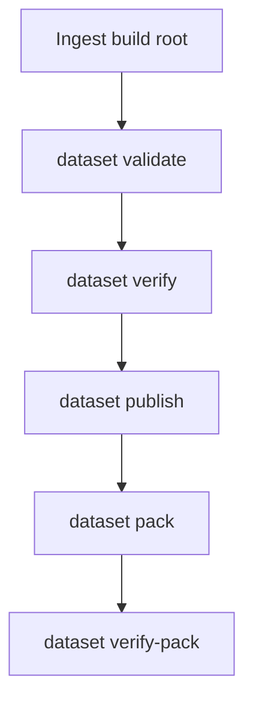
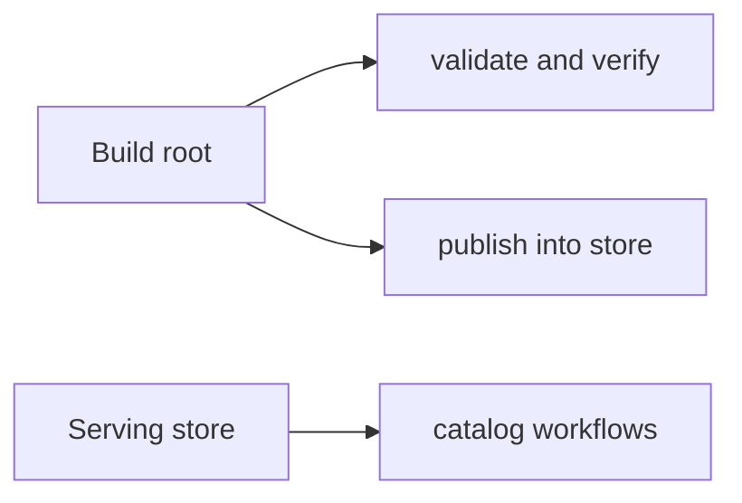

# Dataset Workflows

Dataset workflows are the bridge between built artifact state and store-backed
serving state.

## Dataset Workflow Map



This workflow map shows the main dataset lifecycle after ingest. Atlas keeps
validation, publication, and packaging as explicit steps so it stays clear
which boundary is being crossed.

## The Important Distinction



This distinction diagram exists because “dataset state” can mean more than one
thing in casual conversation. The build root and the serving store are related,
but they are not interchangeable.

Atlas uses dataset commands both before and after publication:

- before publication, they validate or verify build output
- after publication, they help package or inspect durable dataset state

## Most Common Dataset Commands

- `dataset validate`
- `dataset verify`
- `dataset publish`
- `dataset pack`
- `dataset verify-pack`

## Example Workflow

Validate and deeply verify a build root:

```bash
cargo run -p bijux-atlas --bin bijux-atlas -- dataset validate \
  --root artifacts/getting-started/tiny-build \
  --release 110 \
  --species homo_sapiens \
  --assembly GRCh38

cargo run -p bijux-atlas --bin bijux-atlas -- dataset verify \
  --root artifacts/getting-started/tiny-build \
  --release 110 \
  --species homo_sapiens \
  --assembly GRCh38 \
  --deep
```

Publish into a store:

```bash
cargo run -p bijux-atlas --bin bijux-atlas -- dataset publish \
  --source-root artifacts/getting-started/tiny-build \
  --store-root artifacts/getting-started/tiny-store \
  --release 110 \
  --species homo_sapiens \
  --assembly GRCh38
```

## When to Use Pack Operations

Use `dataset pack` and `dataset verify-pack` when you need a portable dataset bundle for transport, validation, or release handling outside the immediate build directory.

## Workflow Advice

- do not skip validation before publication
- treat build roots and serving stores as different lifecycle stages
- use pack verification when moving dataset bundles across trust boundaries

## When This Page Is Enough

- you are validating or publishing a dataset root
- you are packaging a dataset bundle for transport or review
- you need the dataset lifecycle without the deeper contract details

## Reading Rule

Use this page when the ingest step is already done and the question is how a
dataset moves through validation, publication, packaging, and serving-state
handling.
