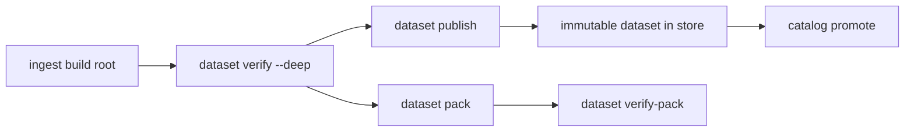

# Dataset Workflows

Dataset commands move an ingested build through verification, publication, and
portable packaging. Each command crosses a different trust boundary. A file in
a build root is not automatically safe to serve or distribute.


```mermaid
flowchart LR
    Build["ingest build root"] --> Verify["dataset verify --deep"]
    Verify --> Publish["dataset publish"]
    Publish --> Stored["immutable dataset in store"]
    Stored --> Promote["catalog promote"]
    Verify --> Pack["dataset pack"]
    Pack --> CheckPack["dataset verify-pack"]
```

## Know which root you are changing

| Root | Created by | Mutable operation | Used by |
| --- | --- | --- | --- |
| build root | `ingest` | verification reads it; a new ingest writes a new root | publication and packaging |
| store root | `dataset publish` | catalog operations change discoverability metadata | CLI queries and servers |
| pack file | `dataset pack` | none; replace it with a newly created pack | transfer and independent verification |

Keep build and store roots distinct, even on a workstation. This prevents a
partial ingest from becoming visible to readers.

## Verify before publication

Deep verification checks the dataset artifacts and their relationships rather
than only parsing top-level metadata:

```bash
cargo run -p bijux-atlas-cli --bin bijux-atlas -- dataset verify \
  --root artifacts/getting-started/tiny-build \
  --release 110 \
  --species homo_sapiens \
  --assembly GRCh38 \
  --deep
```

Treat the structured output and exit status as evidence. Preserve them with the
source checksums and ingest reports. The hidden `dataset validate` command
exists for compatibility. Use `dataset verify --deep` for acceptance.

## Publish atomically into the store

Publication rechecks the source artifacts and writes the identified dataset
under the store root. It does not make the dataset discoverable by itself.

```bash
cargo run -p bijux-atlas-cli --bin bijux-atlas -- dataset publish \
  --source-root artifacts/getting-started/tiny-build \
  --store-root artifacts/getting-started/tiny-store \
  --release 110 \
  --species homo_sapiens \
  --assembly GRCh38
```

Use `--dry-run` to see whether publication would change the store. Use
`--explain` to inspect the decision. Do not repair a failed publish by copying
individual files into the store. That bypasses manifest checks, locking, and
the atomic write boundary.

After a successful publish, promote the exact identity with the catalog
workflow. Existing readers continue to use the current catalog until promotion.

## Package for transfer

Packing starts from a verified root and produces a portable file:

```bash
cargo run -p bijux-atlas-cli --bin bijux-atlas -- dataset pack \
  --root artifacts/getting-started/tiny-build \
  --release 110 \
  --species homo_sapiens \
  --assembly GRCh38 \
  --out artifacts/getting-started/tiny-dataset.tar

cargo run -p bijux-atlas-cli --bin bijux-atlas -- dataset verify-pack \
  --pack artifacts/getting-started/tiny-dataset.tar
```

Verify the pack again after transport and before extraction or distribution.
This establishes the bundle's internal integrity. It does not replace source
provenance, signature verification, or catalog promotion.

## Diagnose by boundary

| Symptom | Inspect first | Safe response |
| --- | --- | --- |
| deep verification fails | manifest, checksum, QC, and shard evidence in the build root | rebuild from pinned inputs; do not publish |
| publication fails | source verification result, destination permissions, free space, publish lock | correct the condition and rerun the command |
| published dataset is not returned by queries | `catalog.json` and the requested dataset identity | promote the dataset; do not edit artifact paths |
| transferred pack fails verification | transport checksum and original pack | discard the received copy and transfer again |

Continue with [Catalog workflows](catalog-workflows.md) to make a published
dataset discoverable.
