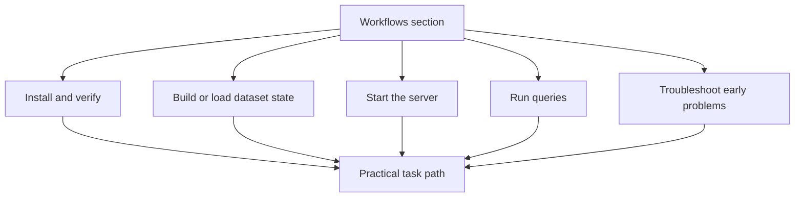

# Workflows

`bijux-atlas/workflows` is the section home for this handbook slice.

Workflows are where the repository handbook becomes directly usable. These
pages should teach the right order of actions, the checkpoints that prove a
step worked, and the boundaries that keep users from mixing build state,
serving state, and runtime state by accident.

Use this section when you need to do product work with Atlas rather than study
its architecture.

## Reader Paths

Choose the path that matches your goal:

- first local setup: [Install and Verify](install-and-verify.md) -> [Run Atlas Locally](run-atlas-locally.md) -> [Load a Sample Dataset](load-a-sample-dataset.md)
- first serving flow: [Start the Server](start-the-server.md) -> [Run Your First Queries](run-your-first-queries.md)
- ingest and catalog work: [Ingest Workflows](ingest-workflows.md) -> [Dataset Workflows](dataset-workflows.md) -> [Catalog Workflows](catalog-workflows.md)
- debugging early failures: [Troubleshoot Early Problems](troubleshoot-early-problems.md)

## Workflow Boundary

These pages describe how users and integrators move through the product-facing
runtime path. They do not replace:

- `bijux-atlas-ops` for deployment, rollout, observability, and load guidance
- `bijux-atlas-dev` for repository validation, release automation, and maintainer-only checks

## What This Section Is For

Use workflows when you need the product task path in order: install, verify,
load data, start the server, run queries, and debug early mistakes. When the
question becomes “what exact flag is this?” or “where does this logic live in
code?”, move to interfaces or runtime instead of forcing workflow pages to do
everything.

## Lifecycle View

Atlas workflow material follows the normal artifact-first lifecycle:

1. install and verify the runtime surface
2. build or load dataset state
3. publish or point at a serving store
4. start the server or use the CLI
5. run queries and inspect outputs

## Pages

- [Catalog Workflows](catalog-workflows.md)
- [Dataset Workflows](dataset-workflows.md)
- [Ingest Workflows](ingest-workflows.md)
- [Install and Verify](install-and-verify.md)
- [Load a Sample Dataset](load-a-sample-dataset.md)
- [Query Workflows](query-workflows.md)
- [Run Atlas Locally](run-atlas-locally.md)
- [Run Your First Queries](run-your-first-queries.md)
- [Start the Server](start-the-server.md)
- [Troubleshoot Early Problems](troubleshoot-early-problems.md)

## Related Sections

- move to [Interfaces](../interfaces/index.md) when you need exact flags, env vars, or endpoint details
- move to [Runtime](../runtime/index.md) when a workflow question turns into an architecture question
