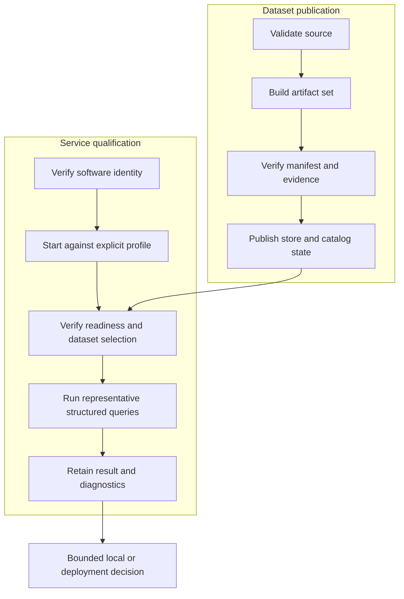
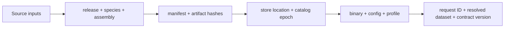

# Workflows

Atlas workflows preserve the boundary between building a dataset and serving a
published release. Each path ends with an observable checkpoint so completion
does not depend on an operator interpreting silence as success.

```mermaid
flowchart TB
    subgraph Dataset[Dataset publication]
        Source[Validate source] --> Ingest[Build artifact set]
        Ingest --> Verify[Verify manifest and evidence]
        Verify --> Publish[Publish store and catalog state]
    end
    subgraph Service[Service qualification]
        Install[Verify software identity] --> Start[Start against explicit profile]
        Start --> Ready[Verify readiness and dataset selection]
        Ready --> Query[Run representative structured queries]
        Query --> Observe[Retain result and diagnostics]
    end
    Publish --> Ready
    Observe --> Decision[Bounded local or deployment decision]
```

The dataset and service paths may advance independently until readiness joins
them. A published dataset can exist without a qualified deployment. A healthy
process can exist while its catalog is stale or its selected dataset is wrong.
The join is successful only when the observed service reports the intended
dataset identity and representative queries satisfy their contracts.

## Choose a Path

| Outcome | Workflow | Completion signal |
| --- | --- | --- |
| verify an installation | [Install and Verify](install-and-verify.md) | expected command identity and version output |
| exercise the product locally | [Run Atlas Locally](run-atlas-locally.md) | runtime starts against explicit local state |
| learn with governed sample data | [Load a Sample Dataset](load-a-sample-dataset.md) | artifact and dataset identities are inspectable |
| build release-shaped data | [Ingest Workflows](ingest-workflows.md) | validation succeeds and a complete manifest exists |
| inspect or select datasets | [Dataset Workflows](dataset-workflows.md) | requested dataset resolves unambiguously |
| publish discoverable identity | [Catalog Workflows](catalog-workflows.md) | catalog and serving store agree on the release |
| start HTTP serving | [Start the Server](start-the-server.md) | health and readiness report the intended state |
| query published content | [Query Workflows](query-workflows.md) | structured output identifies the resolved release |
| verify the first user path | [Run Your First Queries](run-your-first-queries.md) | representative lookup and sequence results succeed |
| diagnose an early failure | [Troubleshoot Early Problems](troubleshoot-early-problems.md) | failed boundary and corrective action are identified |

## Checkpoints That Matter

A workflow result should preserve enough identity to answer:

- which binary and configuration were used;
- which source inputs and validation policy were admitted;
- which artifact manifest and hashes were produced;
- which catalog entry and store location were selected;
- which release a query resolved; and
- which output or diagnostic established the result.

Success at one boundary does not imply success at the next. In particular, an
ingest directory is not a serving store, an artifact manifest is not a catalog
publication record, and process health is not query correctness.

## Identity Carried Across the Journey

```mermaid
flowchart LR
    Source[Source inputs] --> Dataset[release + species + assembly]
    Dataset --> Artifact[manifest + artifact hashes]
    Artifact --> Publication[store location + catalog epoch]
    Publication --> Runtime[binary + config + profile]
    Runtime --> Result[request ID + resolved dataset + contract version]
```

The identity becomes richer as work moves toward serving. The dataset tuple
names biological content; manifests and hashes name immutable output;
publication adds discoverability; runtime identity names the code and policy
that served it. Preserve all of them when a result must be reproducible.

## Workflow Contract

Every workflow has four parts:

| Part | Reader question | Example |
| --- | --- | --- |
| Preconditions | What must already be true? | binaries resolve and source inputs validate |
| Mutation | What state can change? | build output, store content, or catalog selection |
| Acceptance | What proves completion? | manifest validation, catalog resolution, or query response |
| Evidence boundary | What remains unproven? | production durability, capacity, or another release identity |

When a command exits successfully but its acceptance signal is missing, treat
the workflow as incomplete. When the signal exists but identifies different
state, stop at that boundary instead of allowing the mismatch to propagate.

## Exact Surfaces and Production Operations

Flags, environment variables, endpoints, output shapes, and error behavior are
defined under [Interfaces](../interfaces/index.md). Architecture and lifecycle
ownership are under [Runtime](../runtime/index.md). Deployment, security,
observability, load, rollback, and retained operational evidence are governed
by the [Operations handbook](../../bijux-atlas-ops/index.md).
