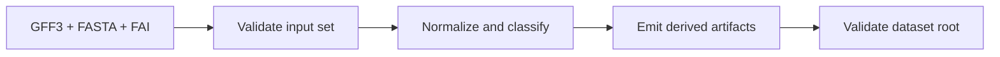
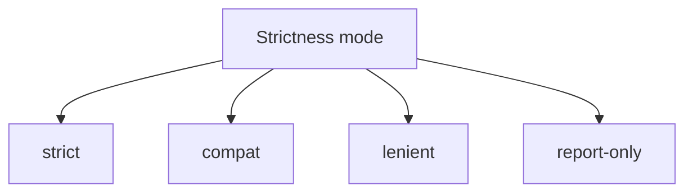

# Ingest Workflows

Ingest is the workflow that turns source inputs into validated Atlas build
output.

## Ingest Pipeline



This ingest pipeline diagram shows that Atlas ingest is more than file copying.
The step produces validated derived output and quality signals that later
workflows depend on.

## Important Ingest Inputs

- GFF3 annotation input
- FASTA reference input
- FAI index input
- release, species, and assembly identity
- strictness and policy-related options

## Strictness Matters



The strictness mode changes how Atlas responds to problematic input conditions. Use stricter modes unless you have a clear reason not to.

This strictness view helps choose intentionally. A looser mode may be useful
for exploration, but it changes the meaning of a “successful” ingest.

## Why Ingest Output Is a Build Root

The output of ingest is not automatically the serving store. It is validated build state containing derived artifacts and quality signals.

That distinction is what allows Atlas to:

- apply publication gates
- keep serving state explicit
- prevent accidental runtime drift from raw ingest output

## Example Ingest Command

```bash
cargo run -p bijux-atlas --bin bijux-atlas -- ingest \
  --gff3 crates/bijux-atlas/tests/fixtures/tiny/genes.gff3 \
  --fasta crates/bijux-atlas/tests/fixtures/tiny/genome.fa \
  --fai crates/bijux-atlas/tests/fixtures/tiny/genome.fa.fai \
  --output-root artifacts/getting-started/tiny-build \
  --release 110 \
  --species homo_sapiens \
  --assembly GRCh38
```

## After Ingest

Always do these next:

1. validate the build root
2. verify the build root if needed
3. publish into a serving store
4. promote into the catalog

## What Ingest Alone Does Not Prove

- that the runtime can discover the dataset
- that the serving store has been populated correctly
- that catalog state now points to the new dataset

## Practical Advice

- use committed fixtures for experimentation before using real inputs
- keep output roots under `artifacts/`
- treat report-only and lenient modes as intentional exceptions, not the default

## Reading Rule

Use this page when the source inputs are ready and the question is how to
produce a valid Atlas build root without confusing it for serving state.
