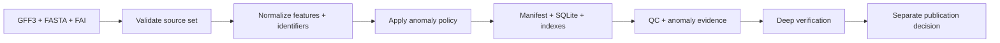
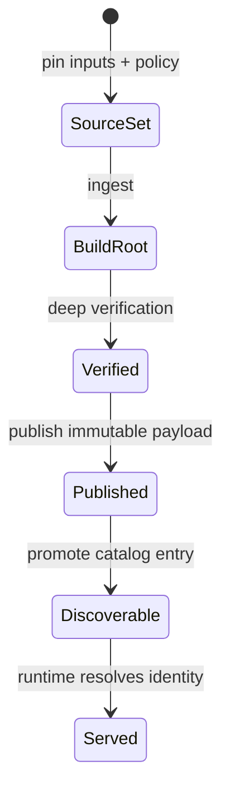

# Ingest workflows

Ingest turns matched GFF3 annotations, a FASTA reference, and its FAI index into
a deterministic Atlas build root. It validates coordinates and identifiers,
applies anomaly policy, and emits queryable artifacts plus the evidence needed
to decide whether those artifacts may be published.


```mermaid
flowchart LR
    Inputs[GFF3 + FASTA + FAI] --> Admit[Validate source set]
    Admit --> Normalize[Normalize features + identifiers]
    Normalize --> Policy[Apply anomaly policy]
    Policy --> Build[Manifest + SQLite + indexes]
    Build --> Evidence[QC + anomaly evidence]
    Evidence --> Verify[Deep verification]
    Verify --> Publish[Separate publication decision]
```

## Establish identity and source agreement

`release`, `species`, and `assembly` identify the dataset through ingest,
verification, publication, catalog promotion, and queries. Atlas does not infer
them from filenames.

The three inputs must describe the same biological source:

- GFF3 supplies features, relationships, coordinates, and identifiers;
- FASTA supplies reference sequence bytes;
- FAI supplies contig names and lengths used to validate coordinates.

Network inputs require `--allow-network-inputs`. A reproducible build pins its
source locations and preserves source checksums independently from the output
root.

## Select anomaly policy before execution

| Strictness | Appropriate use | Resulting claim |
| --- | --- | --- |
| `strict` | Release candidates and trusted serving data | Policy violations stop ingest |
| `compat` | Sources with understood compatibility defects | Accepted compatibility cases remain evidence-bearing |
| `lenient` | Source investigation | More anomalies may pass; output needs explicit review before reuse |
| `report-only` | Measuring source quality | Diagnostic output, not publication approval |

Identifier, duplicate-gene, Ensembl-key, and sequence-alias policies can change
stable IDs and counts. Record every non-default choice with source provenance.
Strictness is part of dataset meaning, not a knob to relax until a run passes.

## Build the committed sample

```bash
cargo run --locked -p bijux-atlas-cli --bin bijux-atlas -- ingest \
  --gff3 crates/bijux-atlas-ingest/tests/fixtures/tiny/genes.gff3 \
  --fasta crates/bijux-atlas-ingest/tests/fixtures/tiny/genome.fa \
  --fai crates/bijux-atlas-ingest/tests/fixtures/tiny/genome.fa.fai \
  --output-root artifacts/getting-started/tiny-build \
  --release 110 \
  --species homo_sapiens \
  --assembly GRCh38 \
  --strictness strict
```

Use a new output root when source or policy changes. `--resume` continues a
compatible interrupted build; it must not combine different inputs. Use
`--dry-run` or `--explain` to inspect costly work before execution.

## Decide whether the build is admissible

A zero exit code means the selected ingest policy completed. It does not mean
the output is published or production-qualified. Review:

- source and dataset identity;
- feature, contig, warning, and rejection counts;
- every accepted anomaly and compatibility case;
- shard coverage when sharding is enabled;
- whether development-only input behavior was used.

Then verify the complete artifact set:

```bash
cargo run --locked -p bijux-atlas-cli --bin bijux-atlas -- dataset verify \
  --root artifacts/getting-started/tiny-build \
  --release 110 \
  --species homo_sapiens \
  --assembly GRCh38 \
  --deep
```

## Preserve the publication boundary


```mermaid
stateDiagram-v2
    [*] --> SourceSet: pin inputs + policy
    SourceSet --> BuildRoot: ingest
    BuildRoot --> Verified: deep verification
    Verified --> Published: publish immutable payload
    Published --> Discoverable: promote catalog entry
    Discoverable --> Served: runtime resolves identity
```

The build root is not serving state. If verification fails, retain the failed
root and reports for diagnosis; do not publish around the failure. Continue
with [Dataset Workflows](dataset-workflows.md) for publication, catalog
promotion, and serving verification.
