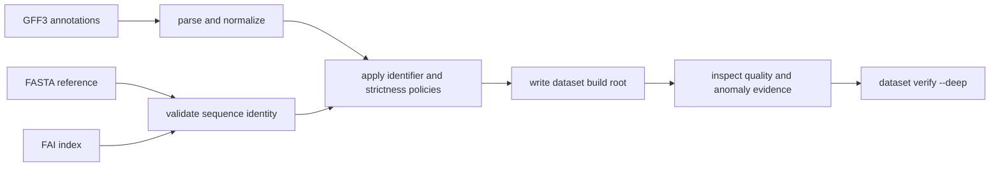
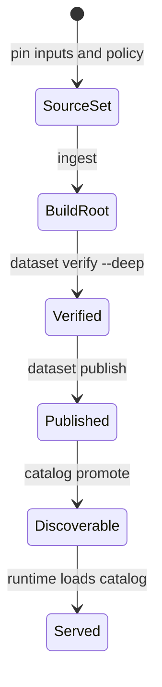

# Ingest Workflows

Ingest converts a matched annotation and reference set into an immutable Atlas
build root. It parses GFF3 records, resolves sequence coordinates against the
FASTA index, applies identifier and anomaly policies, and emits the manifest,
database, indexes, and quality evidence used by later gates.


```mermaid
flowchart LR
    GFF3["GFF3 annotations"] --> Parse["parse and normalize"]
    FASTA["FASTA reference"] --> Identity["validate sequence identity"]
    FAI["FAI index"] --> Identity
    Parse --> Policy["apply identifier and strictness policies"]
    Identity --> Policy
    Policy --> Build["write dataset build root"]
    Build --> QC["inspect quality and anomaly evidence"]
    QC --> Verify["dataset verify --deep"]
```

## Establish the dataset identity

`release`, `species`, and `assembly` form the dataset identity. Use the same
values during ingest, verification, publication, catalog promotion, and query.
Atlas does not infer that identity from filenames.

The three biological inputs must describe the same source release:

- the GFF3 supplies features and their identifiers;
- the FASTA supplies the reference sequence;
- the FAI supplies contig names and lengths used to validate coordinates.

Network inputs are disabled unless `--allow-network-inputs` is supplied. For a
repeatable production build, pin source URLs or files and preserve their
checksums outside the output root.

## Choose policy before running

Strictness controls whether anomalous input stops the build or is recorded in
its evidence. It is part of the meaning of the resulting dataset, not a tuning
knob to change until a command succeeds.

| Mode | Intended use | Acceptance consequence |
| --- | --- | --- |
| `strict` | release candidates and trusted serving data | policy violations fail ingest |
| `compat` | sources with known, bounded compatibility defects | accepted compatibility cases remain visible in evidence |
| `lenient` | investigation and source assessment | more anomalies may be accepted; inspect reports before reuse |
| `report-only` | measuring a source without accepting it | produces diagnostic output, not publication approval |

`--duplicate-gene-id-policy`, `--gene-identifier-policy`, `--ensembl-keys`, and
`--seqid-aliases` further define normalization. Record non-default choices with
the source provenance because they can change stable identifiers and counts.

## Build a dataset

The repository fixture is useful for learning the lifecycle:

```bash
cargo run -p bijux-atlas-cli --bin bijux-atlas -- ingest \
  --gff3 crates/bijux-atlas-ingest/tests/fixtures/tiny/genes.gff3 \
  --fasta crates/bijux-atlas-ingest/tests/fixtures/tiny/genome.fa \
  --fai crates/bijux-atlas-ingest/tests/fixtures/tiny/genome.fa.fai \
  --output-root artifacts/getting-started/tiny-build \
  --release 110 \
  --species homo_sapiens \
  --assembly GRCh38 \
  --strictness strict
```

Use a new output root for a changed source or policy. `--resume` is for
continuing a compatible interrupted run; it is not permission to combine
different inputs. Use `--dry-run` or `--explain` to inspect the planned action
before a costly build.

## Inspect the evidence

A zero exit code means the selected ingest policy completed. Before treating
the build as a release candidate, inspect its manifest, quality report, anomaly
report, and any shard catalog. Check that:

- source identity and dataset identity are the intended values;
- feature, contig, and rejection counts are plausible for the source;
- every accepted anomaly is understood;
- emitted shards cover the expected key space when sharding is enabled;
- no development-only input behavior was used unintentionally.

Then perform deep verification:

```bash
cargo run -p bijux-atlas-cli --bin bijux-atlas -- dataset verify \
  --root artifacts/getting-started/tiny-build \
  --release 110 \
  --species homo_sapiens \
  --assembly GRCh38 \
  --deep
```

## Preserve the trust boundaries

The output root is build state. It is not discoverable serving state until it
passes publication and catalog gates.


```mermaid
stateDiagram-v2
    [*] --> SourceSet: pin inputs and policy
    SourceSet --> BuildRoot: ingest
    BuildRoot --> Verified: dataset verify --deep
    Verified --> Published: dataset publish
    Published --> Discoverable: catalog promote
    Discoverable --> Served: runtime loads catalog
```

If ingest succeeds but verification fails, keep the failed build and its
reports for diagnosis; do not publish around the failure. Continue with
[Dataset workflows](dataset-workflows.md) once the build root is accepted.
