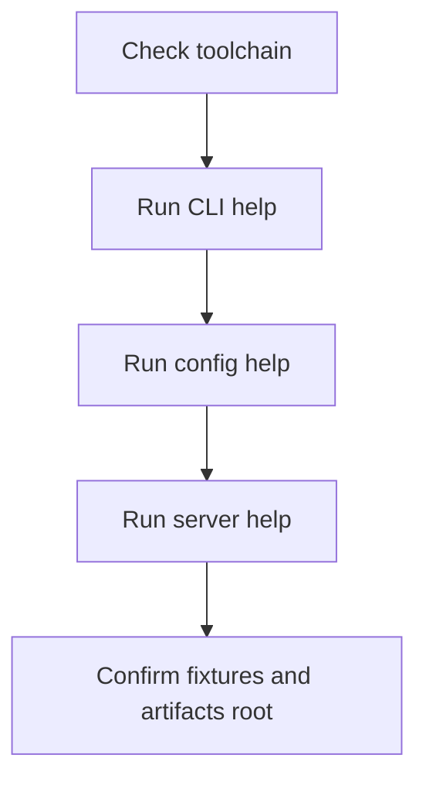
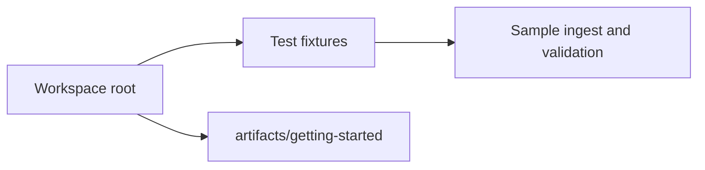
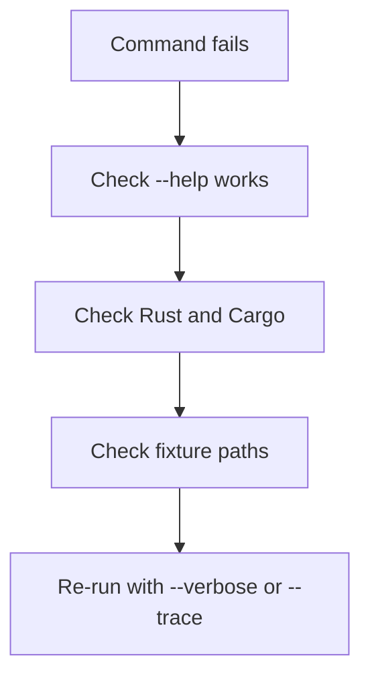

# Install and Verify

Atlas has two stable command identities:

- runtime commands through `bijux atlas ...` or the direct `bijux-atlas` binary
- repository-governance commands through `bijux dev atlas ...` or the direct `bijux-dev-atlas` binary

The fastest reliable way to start with Atlas is still to run it from the
workspace with Cargo. That avoids installation drift while you are learning the
system.

This page verifies that the binaries, fixture paths, and local artifact roots
are usable. It does not verify that ingest, publication, or runtime serving are
already correct. Those come in later steps.

## Verification Flow



This verification flow is intentionally shallow but strict. It proves that the
binaries, fixture paths, and local output roots are usable before you spend
time debugging later workflow steps.

## Prerequisites

- Rust toolchain compatible with the workspace
- Cargo
- a shell that can run `cargo run`
- optional: a preinstalled `bijux` umbrella CLI if you want the installed `bijux atlas ...` or `bijux dev atlas ...` routes

## Install Paths

Choose the install route that matches the workflow you want to verify:

```bash
cargo install --locked bijux-atlas
```

```bash
bijux install bijux-atlas
bijux install bijux-dev-atlas
```

If you are working from a repository checkout, you can skip installation entirely and use `cargo run`.

For a first pass from source, prefer `cargo run`. It removes uncertainty about
whether the installed binary and the checked-out repository are on the same
version.

## Step 1: Verify the Runtime CLI Entrypoint

```bash
cargo run -p bijux-atlas --bin bijux-atlas -- --help
bijux-atlas --help
bijux atlas --help
```

You should see the top-level families such as `config`, `catalog`, `dataset`, `ingest`, `diff`, `gc`, `policy`, and `openapi`.

If `--help` does not work, stop here. A failing help surface usually means the
workspace or binary wiring is not healthy enough for the rest of the
getting-started flow.

## Step 2: Verify Runtime, Server, and Maintainer Surfaces

```bash
cargo run -p bijux-atlas --bin bijux-atlas -- config --help
cargo run -p bijux-atlas --bin bijux-atlas-server -- --help
cargo run -p bijux-dev-atlas -- --help
bijux dev atlas --help
```

These commands tell you whether the product CLI, runtime server binary, and
repository control plane are wired correctly in your environment.

They do not prove that your local store, dataset, or runtime configuration is valid yet. They only prove that the entrypoints are present and invokable.

## Step 3: Verify Repository Fixture Availability and Local Output Paths

```bash
ls crates/bijux-atlas/tests/fixtures/tiny
ls crates/bijux-atlas/tests/fixtures/realistic
mkdir -p artifacts/getting-started/tiny-build
mkdir -p artifacts/getting-started/tiny-store
mkdir -p artifacts/getting-started/server-cache
```

Atlas documentation uses committed fixtures under `crates/bijux-atlas/tests/fixtures/` for the getting-started path.



This layout diagram exists because many first-run failures are path mistakes. The getting-started
docs assume one workspace root, committed fixtures, and disposable outputs under `artifacts/`.

## Step 4: Sanity-Check Structured Output

```bash
cargo run -p bijux-atlas --bin bijux-atlas -- config --canonical --json
cargo run -p bijux-dev-atlas -- list --format json
```

These are good first checks because they exercise structured-output paths
without requiring a built dataset or running server.

It is also the first place to notice whether your shell setup, JSON mode, and top-level config surface agree with each other.

## If Something Fails



This troubleshooting order prevents a common mistake: debugging later Atlas workflow layers before
the local toolchain and workspace are even healthy enough to run the binaries.

- if `cargo run` fails, resolve the workspace build issue first
- if help commands fail, do not proceed to ingest or server startup
- if fixture paths are missing, confirm you are at the repository root

## What Good Looks Like

At this point you should be able to:

- run CLI help successfully
- run server help successfully
- run repository control-plane help successfully
- see committed fixtures under `crates/bijux-atlas/tests/fixtures`
- create an `artifacts/getting-started` directory for local outputs

If all of that works, you have a usable starting environment. You do not yet have proof that Atlas can ingest, publish, or serve real dataset state.

## What This Page Does Not Prove

- that ingest succeeds on the sample fixture
- that the serving store is shaped correctly
- that the HTTP runtime can boot and answer queries

## Reading Rule

Use this page when the question is whether the local Atlas entrypoints are
usable at all before you spend time debugging ingest, publication, or serving.
