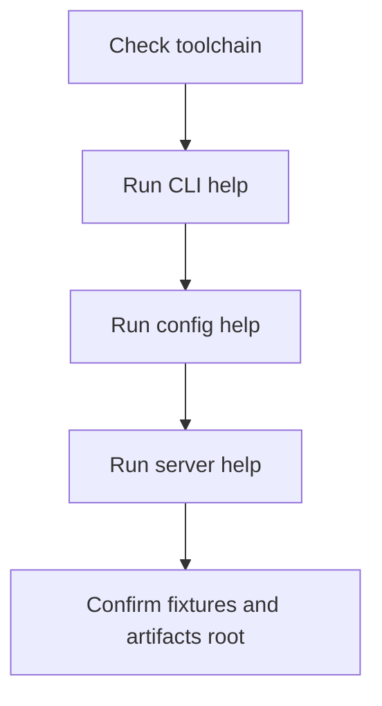
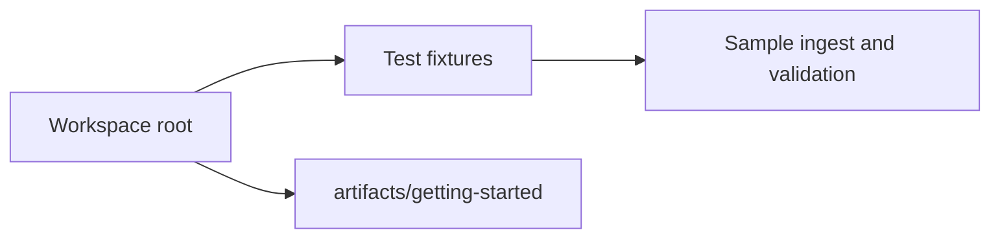
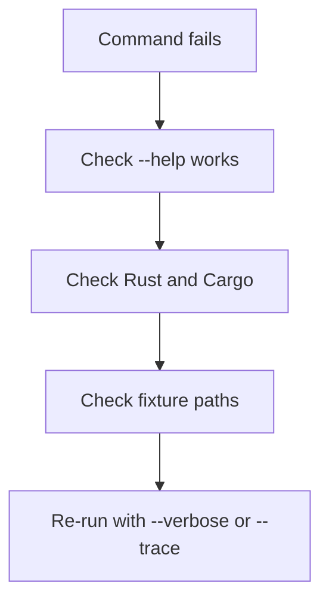

# Install and Verify

Atlas has two stable command identities:

- runtime commands through `bijux atlas ...` or the direct `bijux-atlas` binary
- repository-governance commands through `bijux dev atlas ...` or the direct `bijux-atlas-dev` binary

Run from the workspace with Cargo when validating a checkout. This binds every
observation to the source tree under review and avoids confusion with a
different installed version. Use installed binaries when validating a packaged
release.

## Verification Flow


```mermaid
flowchart TD
    A[Check toolchain] --> B[Run CLI help]
    B --> C[Run config help]
    C --> D[Run server help]
    D --> E[Confirm fixtures and artifacts root]
```

Each checkpoint must pass before ingest begins. These checks establish command
availability and local path readiness. They do not establish dataset or runtime
correctness.

## Prerequisites

- Rust toolchain compatible with the workspace
- Cargo
- a shell that can run `cargo run`
- optional: a preinstalled `bijux` umbrella CLI if you want the installed `bijux atlas ...` or `bijux dev atlas ...` routes

## Install Paths

Choose the install route that matches the published runtime surface you want to verify:

```bash
cargo install --locked bijux-atlas-cli --bin bijux-atlas
cargo install --locked bijux-atlas-server
cargo install --locked bijux-atlas-api --bin bijux-atlas-openapi
```

`bijux-atlas-dev` is a repository control-plane crate and is not published to
crates.io in the `0.2.2` release line. Run it from a repository checkout with
`cargo run -p bijux-atlas-dev -- ...`.

`bijux-atlas-ops` is part of the published crate set, but it is a library
surface for operational contracts rather than an installed end-user binary.

If you are working from a repository checkout, you can skip installation
entirely and use `cargo run`.

For a first pass from source, prefer `cargo run`. It removes uncertainty about
whether the installed binary and the checked-out repository are on the same
version.

## Verify the Runtime CLI Entrypoint

```bash
cargo run -p bijux-atlas-cli --bin bijux-atlas -- --help
bijux-atlas --help
bijux atlas --help
```

You should see the top-level families such as `config`, `catalog`, `dataset`, `ingest`, `diff`, `gc`, `policy`, and `openapi`.

If `--help` does not work, stop here. A failing help surface usually means the
workspace or binary wiring is not healthy enough for the rest of the
getting-started flow.

## Verify Runtime, Server, and Maintainer Surfaces

```bash
cargo run -p bijux-atlas-cli --bin bijux-atlas -- config --help
cargo run -p bijux-atlas-server --bin bijux-atlas-server -- --help
cargo run -p bijux-atlas-dev -- --help
bijux dev atlas --help
```

These commands tell you whether the product CLI, runtime server binary, and
repository control plane are wired correctly in your environment.

They do not prove that your local store, dataset, or runtime configuration is valid yet. They only prove that the entrypoints are present and invokable.

## Verify Fixture and Output Paths

```bash
ls crates/bijux-atlas-ingest/tests/fixtures/tiny
ls crates/bijux-atlas-ingest/tests/fixtures/realistic
mkdir -p artifacts/getting-started/tiny-build
mkdir -p artifacts/getting-started/tiny-store
mkdir -p artifacts/getting-started/server-cache
```

Atlas documentation uses committed fixtures under
`crates/bijux-atlas-ingest/tests/fixtures/` for the getting-started path.


```mermaid
flowchart LR
    Repo[Workspace root] --> Fixtures[Test fixtures]
    Repo --> Artifacts[artifacts/getting-started]
    Fixtures --> Next[Sample ingest and validation]
```

The workflow assumes one workspace root, committed fixtures, and disposable
outputs under `artifacts/`. Resolve path errors before changing product
configuration.

## Verify Structured Output

```bash
cargo run -p bijux-atlas-cli --bin bijux-atlas -- config --canonical --json
cargo run -p bijux-atlas-dev -- list --format json
```

These are good first checks because they exercise structured-output paths
without requiring a built dataset or running server.

These commands also expose disagreements between shell invocation, JSON mode,
and the top-level configuration surface.

## Record the Verification Context

Keep enough context to reproduce a failed first run:

```bash
rustc --version
cargo --version
git rev-parse HEAD
git status --short
```

For installed binaries, record their package versions and paths instead of the
checkout revision. A copied success message without binary or source identity
cannot distinguish the release under test.

| Checkpoint | Evidence | Safe conclusion |
| --- | --- | --- |
| runtime help | command, exit status, binary identity | runtime CLI dispatch is available |
| server help | command, exit status, binary identity | server entrypoint is available |
| maintainer help | command, exit status, source revision | repository control plane is available |
| fixture listing | resolved paths | documented sample inputs exist |
| output-root creation | resolved writable paths | local workflow outputs can be created |
| structured command | captured JSON and exit status | that command emitted parseable output |

## If Something Fails


```mermaid
flowchart TD
    Failure[Command fails] --> Help[Check --help works]
    Help --> Toolchain[Check Rust and Cargo]
    Toolchain --> Paths[Check fixture paths]
    Paths --> Logs[Re-run with --verbose or --trace]
```

This order keeps later workflow failures separate from toolchain and path
failures.

- if `cargo run` fails, resolve the workspace build issue first
- if help commands fail, do not proceed to ingest or server startup
- if fixture paths are missing, confirm you are at the repository root

## What Good Looks Like

At this point you should be able to:

- run CLI help successfully
- run server help successfully
- run repository control-plane help successfully
- see committed fixtures under `crates/bijux-atlas-ingest/tests/fixtures`
- create an `artifacts/getting-started` directory for local outputs

If all of that works, you have a usable starting environment. You do not yet have proof that Atlas can ingest, publish, or serve real dataset state.

## Evidence Boundary

- that ingest succeeds on the sample fixture
- that the serving store is shaped correctly
- that the HTTP runtime can boot and answer queries
- that an installed package matches an arbitrary checkout
- that a help or configuration command covers dataset-specific behavior

Continue to [Load a Sample Dataset](load-a-sample-dataset.md) only after every
checkpoint above is attributable to the same checkout or packaged release.
