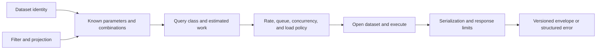

# Query Workflows

Atlas queries bind every request to a dataset identity, validate the selector
set, classify estimated work, and apply admission and response budgets before
returning data.

## Name the Dataset

Use either the three explicit dimensions:

```text
release=110&species=homo_sapiens&assembly=GRCh38
```

or the canonical selector:

```text
dataset=110/homo_sapiens/GRCh38
```

If both forms are present, they must agree. Missing dimensions, malformed
canonical selectors, and conflicting identity values return a client error
before dataset access.

## Choose a Supported Selector

`GET /v1/genes` supports exact `gene_id` or `name`, prefix `name_like`,
`biotype`, and genomic `range` selection, plus bounded projection, sorting, and
pagination options. Exact `gene_id` lookup cannot be combined with another
filter. Prefix matching accepts a trailing `*`, such as `BRCA*`; leading or
embedded wildcards are rejected.



Start with an exact lookup:

```bash
curl -fsS \
  'http://127.0.0.1:8080/v1/genes?dataset=110/homo_sapiens/GRCh38&gene_id=g1&limit=1'
```

For a region, use `range=contig:start-end`. `interval_mode` requires a range,
and `sort=region:asc` does too. `min_transcripts` and `max_transcripts` are
recognized by the parameter parser but rejected by the server because the
current dataset schema does not implement them. Explicit strand values other
than `any` are likewise rejected today.

## Validate Shape Without Executing

`POST /v1/query/validate` accepts a JSON object whose values are strings:

```bash
curl -fsS \
  -H 'Content-Type: application/json' \
  -d '{"dataset":"110/homo_sapiens/GRCh38","gene_id":"g1","limit":"1"}' \
  http://127.0.0.1:8080/v1/query/validate
```

A successful response returns the normalized dataset identity, query class,
estimated work units, active limits, and classification reasons. It does not
open the dataset, execute SQL, prove the dataset exists, or exercise the full
admission path. Use it for request-shape and cost classification, then run the
real endpoint for availability and result evidence.

## Discover and Inspect

```bash
curl -fsS http://127.0.0.1:8080/v1/version
curl -fsS http://127.0.0.1:8080/v1/datasets
curl -fsS http://127.0.0.1:8080/v1/openapi.json
```

`/v1/datasets` discovers catalog identities. `/v1/openapi.json` is the
machine-readable HTTP authority. `GET /v1/genes/count` still exists but is
marked deprecated in OpenAPI; new consumers should not build a fresh
dependency on it.

## Read Failures by Boundary

| Status | Typical boundary |
| --- | --- |
| `400` | missing identity, unknown parameter, invalid format, or incompatible selectors |
| `401` | authentication requirement on a protected request |
| `413` | request or response size boundary |
| `422` | query or serialization policy rejection |
| `429` | rate, queue, or concurrency admission limit |
| `503` | draining, load shedding, unavailable dataset, or upstream dependency |

Inspect the structured error code, message, details, and request ID. Status
alone is not specific enough for remediation. Retrying a `400` or `422` without
changing the request is different from retrying a transient `429` or `503`.

A healthy query record identifies the server build, dataset tuple, exact
request, status, structured response, and relevant provenance. A successful
request proves that one endpoint and snapshot; it does not establish broad
catalog completeness or production capacity.
