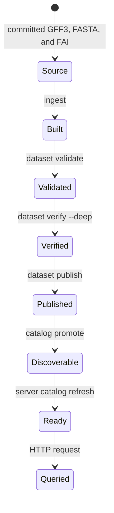

# Run Atlas Locally

A complete local Atlas run moves one immutable dataset identity through build,
verification, publication, discovery, and query. It uses committed fixtures as
inputs and keeps every disposable output under `artifacts/`.



## Keep Four Paths Distinct

| Path | Role | Durable expectation |
| --- | --- | --- |
| `crates/bijux-atlas-ingest/tests/fixtures/tiny/` | committed source fixture | input bytes belong to the checkout |
| `artifacts/getting-started/tiny-build/` | ingest candidate and verified dataset root | may be discarded and rebuilt |
| `artifacts/getting-started/tiny-store/` | published serving store and catalog | runtime discovery source |
| `artifacts/getting-started/server-cache/` | local runtime cache | disposable process state |

The server store is not the ingest output directory. Publication copies the
validated dataset into serving shape; promotion makes its exact
`release/species/assembly` identity discoverable through the catalog.

## Run the Local Loop

1. [Install and verify](install-and-verify.md) the checkout entrypoints and
   fixture paths.
2. [Load the sample dataset](load-a-sample-dataset.md) with release `110`,
   species `homo_sapiens`, and assembly `GRCh38`.
3. [Start the server](start-the-server.md) against `tiny-store`, not
   `tiny-build`.
4. [Run the first queries](run-your-first-queries.md) with the same dataset
   identity.

Stop at the first invalid boundary. A later success cannot repair an ingest,
validation, verification, publication, or promotion failure. Keep the failed
artifact root for diagnosis or remove only the explicit disposable root before
rerunning.

## Record Reproducibility

Capture the checkout and toolchain with the local result:

```bash
git rev-parse HEAD
git status --short
rustc --version
cargo --version
```

Record the three fixture hashes when a result will be compared across
revisions. Repository-relative paths identify source locations; they do not
identify file bytes after the checkout changes.

For runtime evidence, retain the resolved dataset tuple, server bind address,
redacted effective configuration, `/v1/version`, `/readyz`, and the exact query
response. This separates product behavior from shell state and stale installed
binaries.

## Interpret the Result

| Passed boundary | Safe conclusion |
| --- | --- |
| ingest | the selected fixture was transformed into a candidate dataset root |
| dataset validation | required dataset structure and metadata passed that validator |
| deep verification | the selected integrity checks passed for the candidate |
| publication and promotion | the serving store contains a catalog-discoverable dataset identity |
| readiness and catalog listing | the running process can discover catalog state |
| an explicit query | that endpoint served that request for that dataset snapshot |

The loop does not prove production throughput, remote object-store behavior,
multi-node convergence, authentication policy, failover, backup recovery, or
capacity. Those claims belong to operations, security, load, and resilience
evidence with their own targets.

## Local Failure Map

- Missing fixture: verify the checkout root and revision.
- Missing dataset after ingest: verify identity flags and candidate paths.
- Publication failure: do not manually copy partial files into the store.
- `readyz` failure: inspect catalog refresh and catalog identity.
- Empty query result: confirm the tuple and selector before treating it as a
  runtime defect.
- `400`, `422`, `429`, or `503`: inspect the structured error code; these
  statuses represent different parsing, policy, admission, and availability
  boundaries.

You have completed the intended local loop when every transition is attributable
to one checkout and the final query targets the exact promoted dataset.
