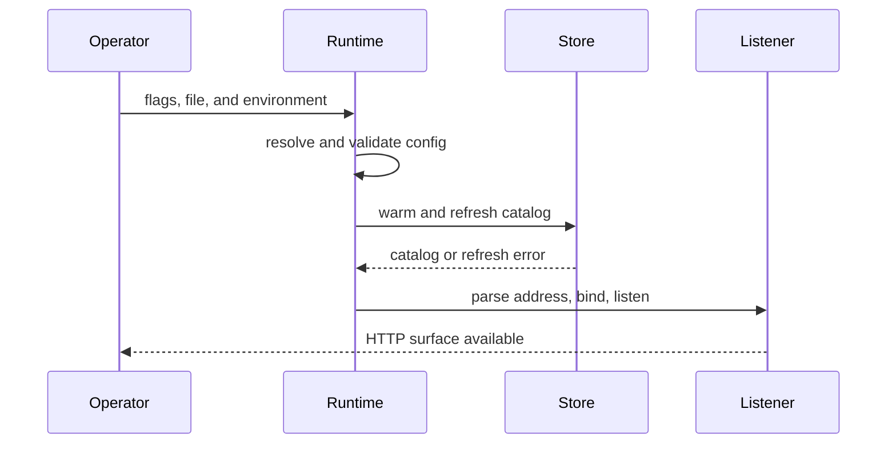

# Start the Server

Start the local server from a published and catalog-promoted serving store. The
server process can bind without a usable dataset, but readiness and queries
depend on catalog discovery. Keep the build root, serving store, and cache root
as separate directories.

## Validate Configuration

From the repository root:

```bash
mkdir -p artifacts/getting-started/server-cache

cargo run -p bijux-atlas-server --bin bijux-atlas-server -- \
  --store-root artifacts/getting-started/tiny-store \
  --cache-root artifacts/getting-started/server-cache \
  --validate-config
```

This command parses the startup sources, resolves precedence, loads the full
`ATLAS_*` environment-backed configuration, and checks its cross-field
invariants. It exits before catalog refresh, socket bind, and request serving.
It does **not** prove that the serving store exists, contains a promoted
dataset, or can be queried.

Inspect the redacted resolved configuration when precedence is unclear:

```bash
cargo run -p bijux-atlas-server --bin bijux-atlas-server -- \
  --store-root artifacts/getting-started/tiny-store \
  --cache-root artifacts/getting-started/server-cache \
  --print-effective-config
```

## Start the Runtime

```bash
cargo run -p bijux-atlas-server --bin bijux-atlas-server -- \
  --bind 127.0.0.1:8080 \
  --store-root artifacts/getting-started/tiny-store \
  --cache-root artifacts/getting-started/server-cache
```

Keep this terminal open. Atlas prepares its cache, performs startup warmup,
refreshes the catalog, computes the runtime-policy hash, binds the listener,
and begins serving. A failed initial catalog refresh leaves ordinary mode not
ready, but the server can still bind so health and diagnostic behavior remain
observable.



## Check Lifecycle and Identity

Use a second terminal and preserve HTTP failures:

```bash
curl -fsS http://127.0.0.1:8080/healthz
curl -fsS http://127.0.0.1:8080/live
curl -fsS http://127.0.0.1:8080/readyz
curl -fsS http://127.0.0.1:8080/v1/version
curl -fsS http://127.0.0.1:8080/v1/datasets
```

| Endpoint | Successful response establishes |
| --- | --- |
| `/healthz` | the router can answer; this handler always returns `200 ok` while reachable |
| `/live` | the runtime is accepting requests rather than draining |
| `/readyz` | the ready flag is set and required catalog state is present |
| `/v1/version` | API, plugin, config-schema, policy, and artifact identity are reachable |
| `/v1/datasets` | catalog-backed dataset discovery succeeds |

`/healthz` is not a store or catalog check. `/v1/version` is also independent
of dataset availability. Use `/readyz` and `/v1/datasets` before making a query
readiness claim.

## Diagnose Startup

- If config validation fails, fix the first named variable or cross-field
  invariant.
- If bind fails, verify the `host:port` syntax and whether another process owns
  the port.
- If health succeeds but readiness returns `503 not-ready`, inspect catalog
  refresh errors and confirm `tiny-store/catalog.json` exists.
- If the catalog is empty, repeat dataset publication and promotion; do not
  point the server at `tiny-build` as a shortcut.
- If the process is live but queries fail, distinguish missing dataset,
  admission policy, and upstream availability from process health.

A successful local startup establishes configuration resolution, listener
availability, and the lifecycle states you explicitly checked. It does not
establish production security, resilience, scale, or remote-store behavior.
