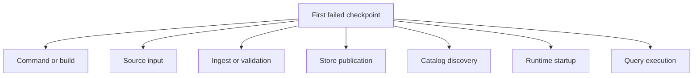
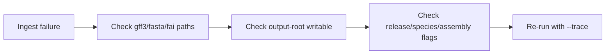
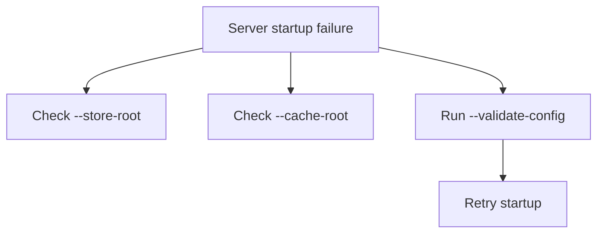

# Troubleshoot Early Problems

Most first-run Atlas failures belong to one boundary: command dispatch, input
resolution, build output, publication, catalog discovery, runtime startup, or
query execution. Preserve the first failure and classify that boundary before
changing inputs or configuration.

## Early Failure Map



This failure map shortens diagnosis time. Atlas first-run issues usually belong
to one layer at a time, and diagnosis moves faster when that layer is
identified before changing multiple things.

## If `cargo run` Fails Before the Command Starts

Focus on build and workspace issues first:

- confirm you are at the repository root
- confirm the workspace compiles
- re-run the exact command with `--verbose` or `--trace`

Do not debug dataset paths or server flags before the binary can even start. That usually wastes time in the wrong layer.

## If Fixture Paths Cannot Be Found

Check that these exist:

```bash
ls crates/bijux-atlas-ingest/tests/fixtures/tiny/genes.gff3
ls crates/bijux-atlas-ingest/tests/fixtures/tiny/genome.fa
ls crates/bijux-atlas-ingest/tests/fixtures/tiny/genome.fa.fai
```

If they do not, you are likely not at the workspace root or the worktree is incomplete.

## If Ingest Fails



This ingest triage order keeps the likely causes practical and local. Most
early ingest failures are input, path, or identity mismatches rather than deep
product defects.

Common causes:

- wrong fixture path
- build root not writable
- mismatched flags for release, species, or assembly
- trying to skip the FAI or other required inputs

Fix one concrete input problem and rerun the same ingest command. Changing
multiple identity flags and paths at once destroys the comparison that isolates
the cause.

## If Dataset Validation Fails

The usual causes are:

- ingest never completed successfully
- validation is pointed at the wrong build root
- release identity flags do not match the built output

Always validate the same root you passed as `--output-root` during ingest.

If validation fails, do not move on to publish or startup. That only spreads uncertainty into later layers.

## If the Server Fails Even Though Ingest Succeeded

One common reason is using the ingest build root as if it were the serving store. Atlas serving expects published artifacts plus a catalog.

Run these steps before startup:

```bash
cargo run -p bijux-atlas-cli --bin bijux-atlas -- dataset publish \
  --source-root artifacts/getting-started/tiny-build \
  --store-root artifacts/getting-started/tiny-store \
  --release 110 \
  --species homo_sapiens \
  --assembly GRCh38

cargo run -p bijux-atlas-cli --bin bijux-atlas -- catalog promote \
  --store-root artifacts/getting-started/tiny-store \
  --release 110 \
  --species homo_sapiens \
  --assembly GRCh38
```

## If the Server Does Not Start



This startup decision tree exists because server failures often get
overcomplicated. Atlas startup problems are usually explained by serving-store
shape, cache-root setup, or resolved runtime config.

Use:

```bash
cargo run -p bijux-atlas-server --bin bijux-atlas-server -- \
  --store-root artifacts/getting-started/tiny-store \
  --cache-root artifacts/getting-started/server-cache \
  --validate-config
```

## If Health Works but Queries Fail

That usually means the runtime started, but the store or dataset resolution path is not returning the state you expect.

Check:

- `curl -s http://127.0.0.1:8080/v1/version`
- `curl -s http://127.0.0.1:8080/v1/datasets`
- your query parameters for release, species, and assembly

This is the classic point where people confuse "the server is up" with "the
expected dataset is published and discoverable." Atlas keeps those as separate
questions on purpose.

## Fast Diagnosis Order

1. Can `--help` run?
2. Can the fixture files be listed?
3. Did ingest complete?
4. Did dataset validation pass?
5. Does server config validation pass?
6. Does `v1/version` work?
7. Does `v1/datasets` work?

If you answer “no” at one step, fix that layer before you continue. Atlas is easier to debug when
you narrow the failure boundary instead of pushing uncertainty forward through the workflow.

If you answer those in order, you usually isolate the failing layer quickly.

## Preserve Diagnostic Evidence

For the first failing boundary, retain:

- the exact command and working directory;
- binary version or checkout revision;
- exit status and structured error fields;
- resolved release, species, assembly, store, and cache paths;
- the first relevant log event before retries; and
- the last successful checkpoint from the same run.

| Symptom | Establish first | Avoid concluding |
| --- | --- | --- |
| help fails | the intended binary was invoked | dataset data is invalid |
| ingest fails | inputs, identity tuple, and output root match the command | the store is corrupt |
| validation fails | the validator targets the completed build root | publication can repair it |
| startup fails | configuration resolves and the store is published | every artifact is corrupt |
| health passes, datasets empty | catalog path and refresh state | the query layer is defective |
| dataset resolves, query fails | selector, limits, error code, and dataset identity | readiness was false |

Retries can erase the original error or alter cache and lock state. Preserve
the first observation, make one controlled change, and compare the next result
at the same boundary.

## Classify the Failure Surface

Atlas exposes different diagnostic contracts for shell, CLI, and HTTP
failures. Use the one that actually failed:

| Surface | Stable evidence | Next action |
| --- | --- | --- |
| shell or Cargo | process status and stderr before Atlas dispatch | resolve executable, workspace, or toolchain identity |
| Atlas CLI | numeric exit code and machine error code in JSON mode | classify usage, validation, dependency, or internal failure |
| HTTP API | status, structured error code, request ID, and response details | correlate the request with runtime logs and traces |
| health or readiness | endpoint status and body from the same instance and time | distinguish process life, traffic admission, and overload |

Human-readable messages can gain context across releases. Automation should
branch on the structured code and treat the message as diagnostic detail. See
[Error Codes and Exit Codes](../interfaces/error-codes-and-exit-codes.md) for
the stable classes.

## Stop Conditions

Stop and preserve state rather than continuing when validation reports an
artifact hash mismatch, the catalog selects an unexpected dataset, a published
path would overwrite immutable state, or the server cannot establish the
intended store identity. Those conditions cross from ordinary first-run setup
into integrity or authority failures; retries and cache deletion can destroy
the evidence needed to diagnose them.
