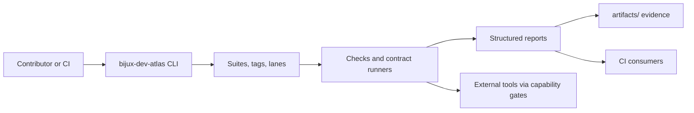

# Control-plane architecture

- Owner: `platform`
- Type: `concept`
- Audience: `contributor`
- Stability: `stable`
- Last verified against: `main@2026-03-01`
- Reason to exist: explain the control-plane as a ports-and-adapters system instead of a script bundle.

## Diagram



## Text explanation

The CLI is the stable port. Lane and selection logic choose which checks or contract runners execute. Effectful adapters such as external tools are only reached through explicit capability gates. Reports and artifacts are the output boundary consumed by humans and CI.

## Verify success

```bash
cargo run -q -p bijux-dev-atlas -- --help
cargo run -q -p bijux-dev-atlas -- ci surface --format json
```

## Next steps

- [Why a control-plane](why-a-control-plane.md)
- [Capabilities model](capabilities-model.md)
- [Security posture](security-posture.md)
