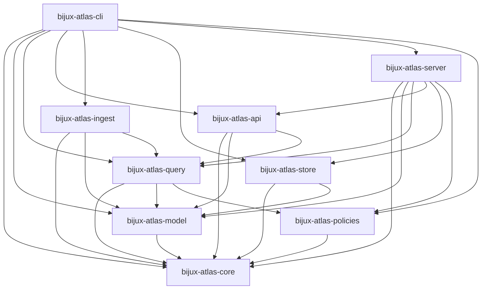

# Crate Boundary Dependency Graph

This graph visualizes allowed dependency direction across Atlas crates.

Source of truth for boundaries and guardrails:
- `docs/architecture/boundaries.md`
- `docs/architecture/effects.md`
- crate-level `docs/ARCHITECTURE.md`
