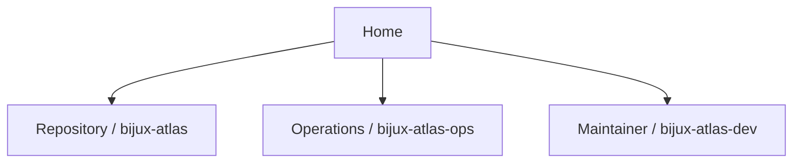
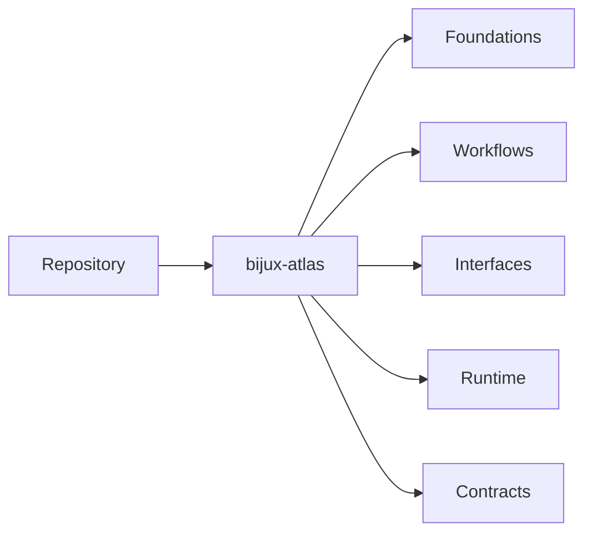
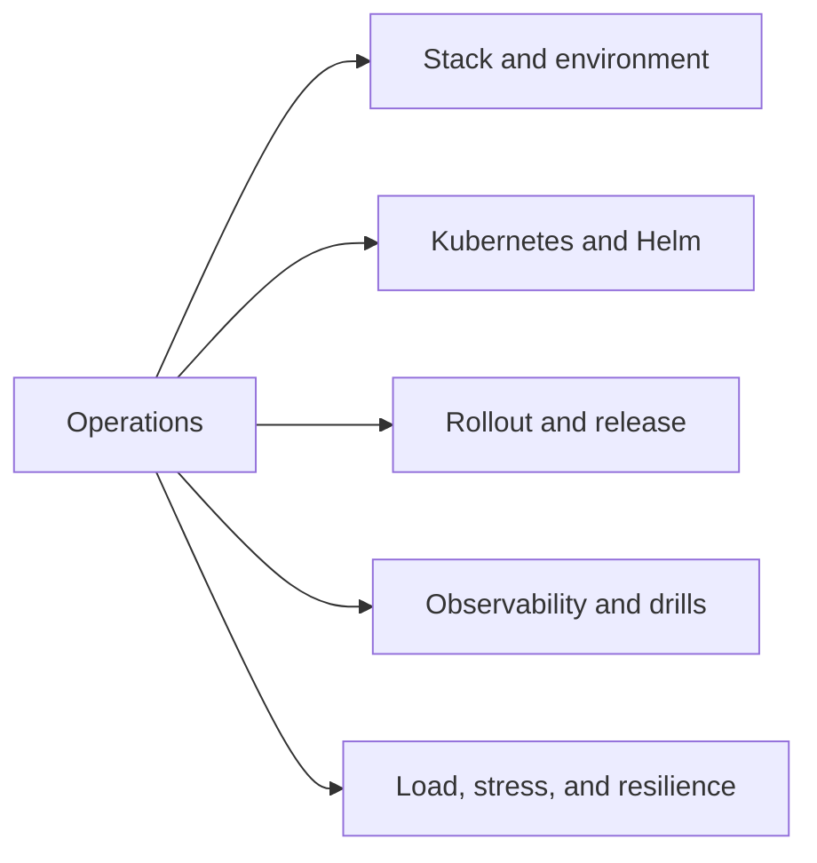
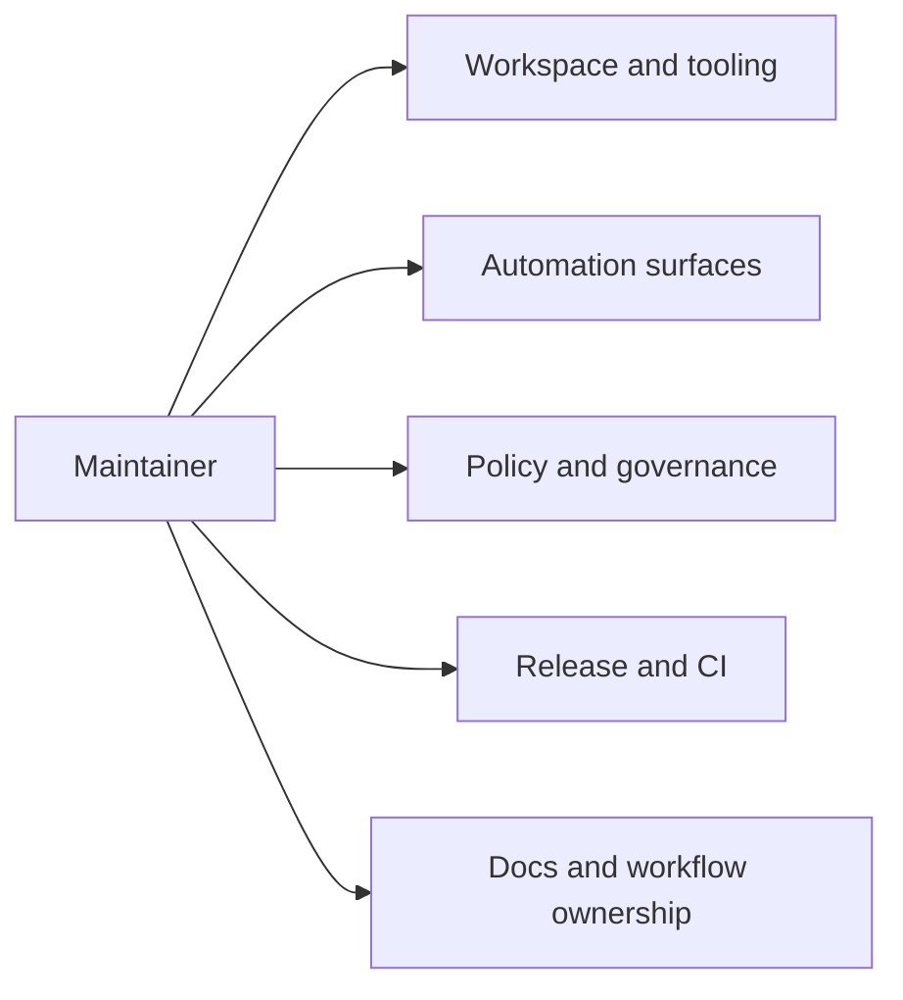

# Bijux Atlas

`bijux-atlas` needs a domain-first documentation model because the repository
is not just a small runtime package. It carries a large product surface, a
heavy operating surface, and a real control plane.

Use the top navigation to enter by ownership boundary:

<strong>Home is orientation only.</strong>
Repository explains the product-facing Atlas surface. Operations explains the
deployment, Kubernetes, Helm, stack, observability, and load surfaces.
Maintainer explains `bijux-dev-atlas`, `makes/`, docs governance, and GitHub
workflow ownership.

  
<h3>Repository</h3>
Product behavior, ingest, datasets, queries, APIs, architecture, and runtime contracts for `bijux-atlas`.

  
<h3>Operations</h3>
Kubernetes, Helm, stack profiles, rollout safety, observability, drills, and load execution for `bijux-atlas-ops`.

  
<h3>Maintainer</h3>
Automation, governance, release, makes, docs validation, and GitHub workflow ownership for `bijux-atlas-dev`.

<a class="md-button md-button--primary" href="repository/">Open repository handbook</a>
<a class="md-button" href="operations/">Open operations handbook</a>
<a class="md-button" href="maintainer/">Open maintainer handbook</a>

## Atlas Domains

- [Repository](repository/index.md)
- [Operations](operations/index.md)
- [Maintainer](maintainer/index.md)

## Reading Rule

Start from the owned Atlas domain that matches the work. Use Home for
orientation only, then move into a domain handbook to use the left-side page
navigation.
*** Add File: /Users/bijan/bijux/bijux-atlas/docs/repository/index.md
---
title: Repository Home
audience: mixed
type: index
status: canonical
owner: atlas-docs
last_reviewed: 2026-04-12
---

# Repository

The repository handbook is the product-facing Atlas handbook for
`bijux-atlas`.

It will hold the deep documentation for the runtime package itself:

- product identity and boundaries
- ingest, dataset, and query workflows
- API and runtime interfaces
- source layout and runtime architecture
- published contracts for downstream users

## Scope

Use this handbook when the question is about what Atlas does as a product,
how users and integrators interact with it, and which runtime promises are
intended to stay stable.

## What Comes Next

The repository handbook is being rebuilt around `repository/bijux-atlas/`
with five durable subdirectories so the Atlas product surface can carry more
depth without mixing in maintainer-only or operations-only material.
*** Add File: /Users/bijan/bijux/bijux-atlas/docs/operations/index.md
---
title: Operations Home
audience: operators
type: index
status: canonical
owner: atlas-docs
last_reviewed: 2026-04-12
---

# Operations

The operations handbook is the operating surface for `bijux-atlas-ops`.

Atlas has a large operational footprint across `ops/`, `ops/k8s/`,
`ops/stack/`, `ops/observe/`, `ops/load/`, `ops/release/`, and surrounding
policy and report surfaces. This handbook exists so that depth has a real home
instead of being compressed into a small generic section.

## Scope

Use this handbook when the question is about operating Atlas safely:
deployment profiles, Helm values, Kubernetes validation, stack dependencies,
release drills, observability, or load execution.

## What Comes Next

The operations handbook is being rebuilt around `operations/bijux-atlas-ops/`
with five durable subdirectories so Kubernetes, Helm, stress, and operating
evidence can be documented at the depth the repository actually needs.
*** Add File: /Users/bijan/bijux/bijux-atlas/docs/maintainer/index.md
---
title: Maintainer Home
audience: maintainers
type: index
status: canonical
owner: atlas-docs
last_reviewed: 2026-04-12
---

# Maintainer

The maintainer handbook is the control-plane handbook for `bijux-atlas-dev`.

It will hold the deep documentation for `bijux-dev-atlas`, `makes/`, docs
governance, GitHub workflow ownership, release support, and repository checks.

## Scope

Use this handbook when the question is about how the repository is operated and
maintained as a governed system rather than how the Atlas product behaves at
runtime.

## What Comes Next

The maintainer handbook is being rebuilt around `maintainer/bijux-atlas-dev/`
with five durable subdirectories so maintainer-only depth has a clear home and
stops competing with product and operations material.
