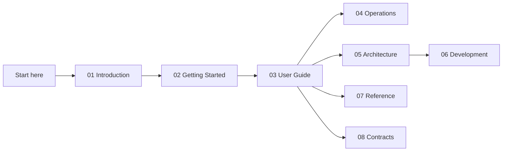
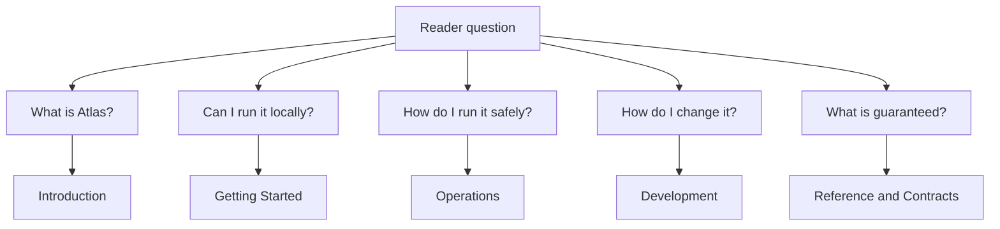

# Docs Index

This is the canonical documentation home for `bijux-atlas`.

Use this page to choose the shortest honest route through the docs for your role. The numbered
spine is written so readers can start with a high-level model, move into a first successful run,
and then deepen into operations, architecture, reference facts, or contract promises only when
they need them.

This reading map shows the intended progression. Readers who are new to Atlas should go left to
right. Readers who already know the workflow can jump directly to the exact section they need.

## Canonical Sections

- [Introduction](01-introduction/index.md)
- [Getting Started](02-getting-started/index.md)
- [User Guide](03-user-guide/index.md)
- [Operations](04-operations/index.md)
- [Architecture](05-architecture/index.md)
- [Development](06-development/index.md)
- [Reference](07-reference/index.md)
- [Contracts](08-contracts/index.md)

## Choose a Path

- evaluating whether Atlas fits your problem: start with [Introduction](01-introduction/index.md)
  and [What Atlas Is](01-introduction/what-atlas-is.md)
- trying the product for the first time: follow [Getting Started](02-getting-started/index.md) in
  order
- using Atlas day to day: begin in [User Guide](03-user-guide/index.md)
- running Atlas in production or recovery scenarios: move to [Operations](04-operations/index.md)
- changing the codebase or repository automation: read [Architecture](05-architecture/index.md)
  and [Development](06-development/index.md)
- checking exact facts, limits, or compatibility promises: use [Reference](07-reference/index.md)
  and [Contracts](08-contracts/index.md)

## Start Here

- new to Atlas: [What Atlas Is](01-introduction/what-atlas-is.md)
- installing and validating a local runtime: [Install and Verify](02-getting-started/install-and-verify.md)
- loading and serving your first dataset: [Run Atlas Locally](02-getting-started/run-atlas-locally.md)
- running Atlas in real environments: [Operations](04-operations/index.md)
- checking exact surfaces and limits: [Reference](07-reference/index.md)
- reviewing stable promises: [Contracts](08-contracts/index.md)

This decision map is here so readers do not have to infer the right section from directory names
alone. It turns the docs from a table of contents into a task-oriented entry point.

## Current Review

- [Server Workflows](03-user-guide/server-workflows.md)
- [System Overview](05-architecture/system-overview.md)
- [Testing and Evidence](06-development/testing-and-evidence.md)
- [API Compatibility](08-contracts/api-compatibility.md)

## Reading Rule

Behavior documented in `07-reference` and `08-contracts` is intended to be relied on more strongly.

If something appears only in examples, source code, or debug output, treat it as current behavior unless the contracts say otherwise.

That distinction matters because Atlas intentionally separates tutorial guidance, current
implementation details, and explicit compatibility promises. This page points to all three, but it
does not pretend they carry the same weight.

## Maintenance Rule

Keep one canonical home per topic. When a page becomes redundant, fold its durable content into the existing docs spine instead of creating a parallel doc tree.

## How to Read This Docs Set

- read section index pages first when you are entering a topic for the first time
- use reference pages when you need exact command names, keys, paths, or schemas
- use contract pages when a decision depends on stability promises or compatibility review
- treat generated outputs as evidence, not as the primary narrative explanation

## Purpose

This page explains the Atlas material for bijux-atlas documentation and points readers to the canonical checked-in workflow or boundary for this topic.

## Stability

This page is part of the canonical Atlas docs spine. Keep it aligned with the current repository behavior and adjacent contract pages.
