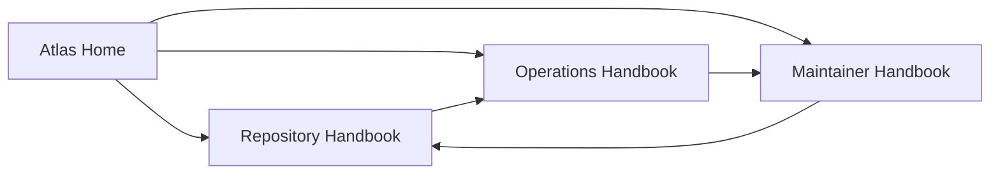
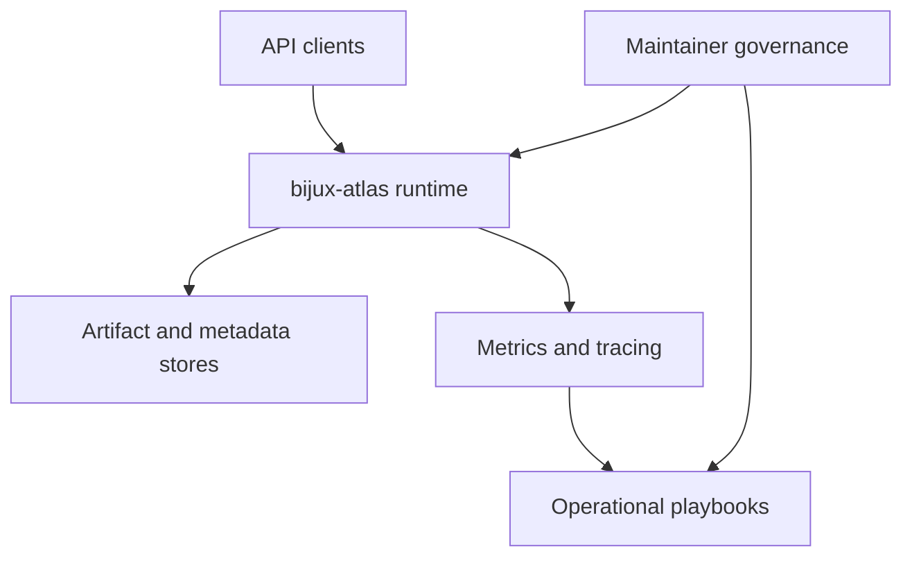

# Bijux Atlas

<section class="bijux-hero">
  
Genomics Query and Operations Platform

  <h1 class="bijux-hero__title">Operate a deterministic genomics API stack with explicit runtime, operations, and maintainer boundaries.</h1>
  
`bijux-atlas` is organized as three connected handbooks so you can move from API surface and runtime contracts, to operating procedures, to repository control-plane governance without losing context.

  

    HTTP query contracts
    Ops and release surfaces
    Governance and policies
    Reproducible maintenance
  

</section>

  <strong>Start from the pressure you have right now.</strong> Use <em>Repository</em> for runtime/API behavior, <em>Operations</em> for deployment and observability workflows, and <em>Maintainer</em> for policy, automation, and ownership rules.

<!-- bijux-atlas-badges:generated:start -->

<!-- bijux-atlas-badges:generated:end -->

  

    <h3>Repository Handbook</h3>
    
Runtime package boundaries, HTTP interfaces, architecture seams, query behavior, contracts, and quality gates for `bijux-atlas`.

  

  

    <h3>Operations Handbook</h3>
    
Stack lifecycle, Kubernetes surfaces, release procedures, observability, incident workflows, and load/performance verification.

  

  

    <h3>Maintainer Handbook</h3>
    
Control-plane ownership for check suites, policy enforcement, governance contracts, repo standards, and automation maintenance.

  

  <a class="md-button md-button--primary" href="bijux-atlas/">Open Repository Handbook</a>
  <a class="md-button" href="bijux-atlas-ops/">Open Operations Handbook</a>
  <a class="md-button" href="bijux-atlas-dev/">Open Maintainer Handbook</a>

## Start Paths

Use the path that matches your immediate decision:

- API/runtime behavior, query semantics, and interface contracts:
  [Repository](bijux-atlas/index.md)
- deployment, stack operations, and operational readiness:
  [Operations](bijux-atlas-ops/index.md)
- policy ownership, governance contracts, and maintenance workflows:
  [Maintainer](bijux-atlas-dev/index.md)

## How The Documentation Is Structured

The three handbooks are deliberately separate so operational guidance does not get mixed into runtime docs, and maintainer governance does not get buried inside product-facing pages.

## System Orientation

Use this map when you need to reason about where a change belongs:

- runtime behavior and interface guarantees belong in `bijux-atlas`
- operating procedures and production controls belong in `bijux-atlas-ops`
- automation and policy ownership belong in `bijux-atlas-dev`

## Package Handbooks

- [Repository](bijux-atlas/index.md)
- [Operations](bijux-atlas-ops/index.md)
- [Maintainer](bijux-atlas-dev/index.md)

## Purpose

This home page is the stable orientation layer for the entire `bijux-atlas` documentation set. Keep it explicit enough that a reader returning much later can immediately choose the correct handbook without re-learning repository internals.
