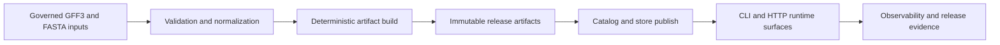
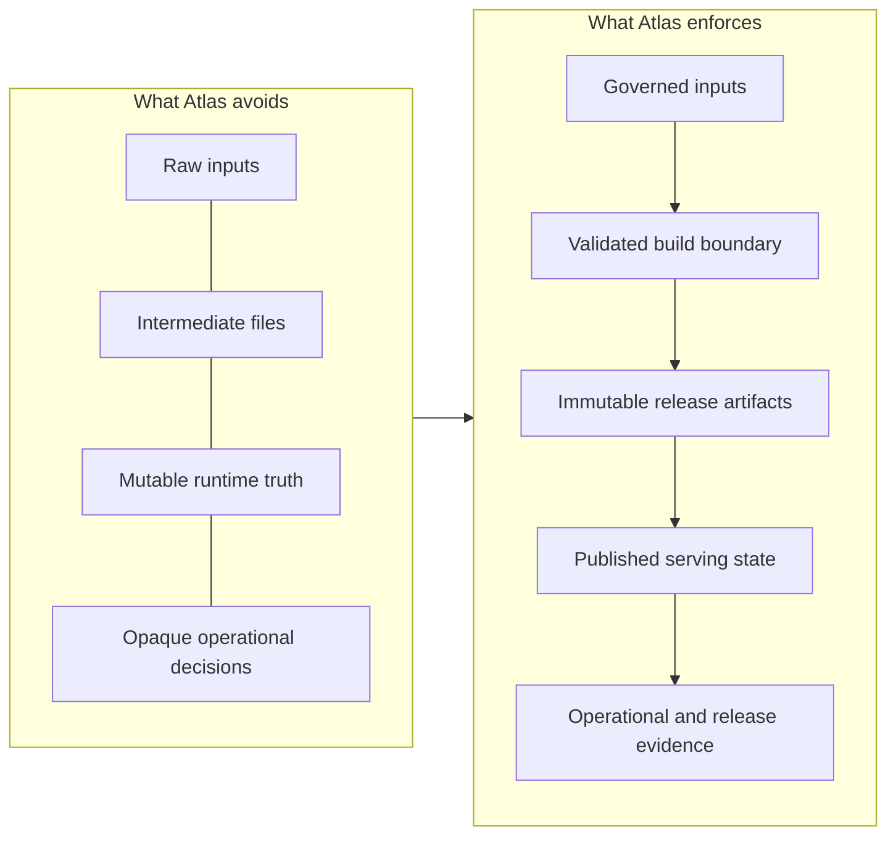
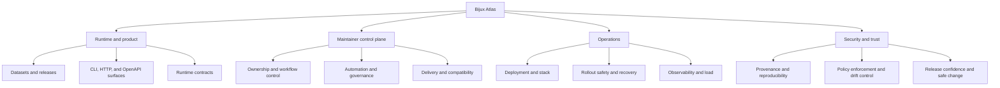
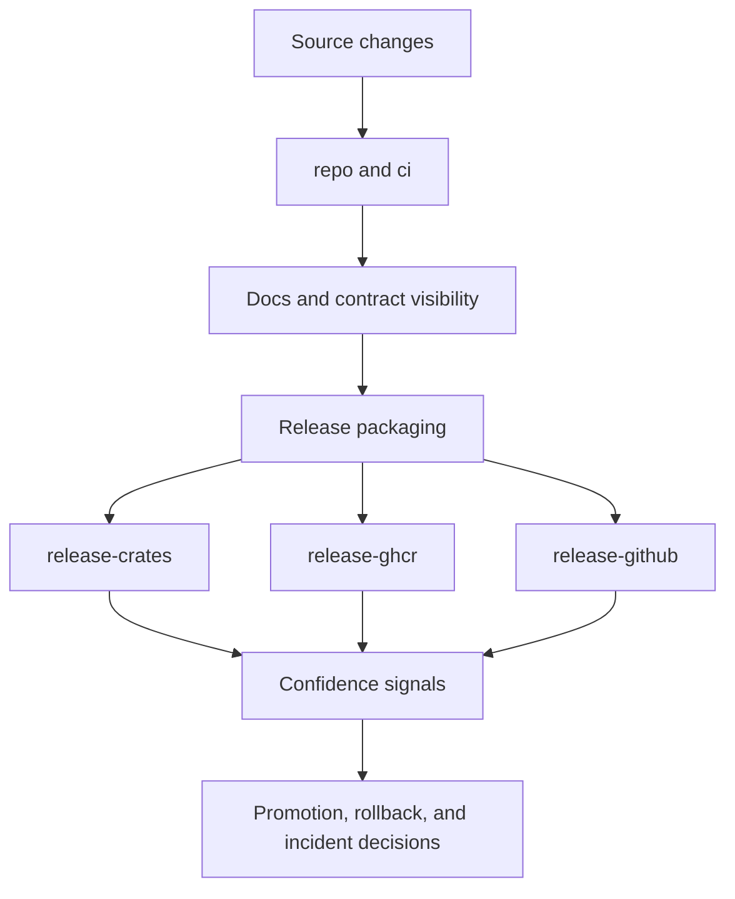

# Bijux Atlas

`bijux-atlas` is a governed release-backed data product for genomics datasets.
It takes governed GFF3 and FASTA inputs through explicit validation and
normalization, builds deterministic release artifacts, publishes those artifacts
into serving state, and exposes them through stable CLI, HTTP, and operational
surfaces.

Atlas exists to convert raw domain inputs into governed, release-backed,
trustworthy serving state.

<!-- bijux-atlas-badges:generated:start -->

<!-- bijux-atlas-badges:generated:end -->

## What Atlas Actually Is

Atlas is not only a server and not only a CLI. It is a full system for
building, publishing, serving, operating, and evolving release-shaped data
without hiding the artifact boundary behind mutable runtime behavior.

The center of gravity is the release artifact, not the running process. That is
why Atlas keeps ingest, build, publication, serving, and operational evidence
as explicit surfaces instead of letting them blur together.

Atlas combines four product responsibilities in one coherent path:

- validate and normalize source inputs
- build deterministic and immutable dataset artifacts
- publish release-backed state to a serving store and catalog
- serve that state through query, API, and operational runtime surfaces

## Why It Exists

Atlas exists to avoid a common failure mode in data systems: mixing raw inputs,
intermediate files, and mutable runtime state into one opaque process.

Atlas keeps those boundaries explicit so teams can answer high-stakes questions
without guessing:

- what was actually built
- what was actually published
- what is currently served
- what evidence supports promotion, rollback, or incident decisions

Atlas is strongest when teams need trusted serving of governed release data
rather than a convenient but opaque runtime that quietly mutates its own truth.

## What It Guarantees

- deterministic build behavior from governed inputs
- immutable release artifacts as the delivery unit
- explicit runtime, API, and configuration contracts
- release and operations evidence that can be reviewed and repeated

## What It Is Not

Atlas is not a generic mutable runtime that rewrites release truth in place.
It is not a replacement for source governance, and it is not a shortcut around
validation, publication, and release evidence.

## Atlas Has Four Linked Concerns

Atlas is easier to understand when its main concerns are explicit instead of
collapsed into one generic idea of "the runtime".

### Runtime and Product

This is the product face readers usually mean when they say "Atlas":
datasets, releases, queries, interfaces, and contracts.

### Maintainer Control Plane

Atlas is not meant to be changed through informal repository habits. The
maintainer surface exists so ownership, workflow control, automation, and
compatibility policy stay explicit instead of tribal.

### Operations

Atlas is a real deployed system, not just a local Rust binary. Deployment,
rollout safety, observability, load, recovery, and release evidence are part of
the product model.

### Security and Trust

Trust is not only vulnerability scanning. It covers provenance,
reproducibility, drift detection, controlled exceptions, and whether a release
can actually be believed.

## Operations and Trust Are Part of the Product

`bijux-atlas-ops` is not secondary documentation. It is where deployment,
rollout safety, observability, load budgets, and release trust are defined.

If your question is about running Atlas safely in real environments, operations
is the primary handbook.

The same is true of trust. Security and release assurance are not side checks
after the runtime is done. They are part of how Atlas proves what was built,
what was promoted, and what should be rolled back.

## Release Confidence Signals

Primary publication and confidence lanes:

- `repo/ci`
- `deploy-docs`
- `release-crates`
- `release-ghcr`
- `release-github`

These lanes are represented in the badges above, but the important point is not
the badges themselves. Atlas uses them to decide whether a release is ready to
promote, hold, or roll back.

Atlas is not complete when it merely builds. It is complete when build, docs,
contracts, publication channels, and operational evidence line up tightly
enough that release decisions are reviewable instead of improvised.

## Start From the Right Handbook

The three handbook surfaces are separated on purpose because they answer
different classes of questions.

### Repository

Use [Repository](bijux-atlas/index.md) when the question is about the Atlas
product itself: datasets, releases, workflows, interfaces, runtime
architecture, and compatibility contracts.

### Operations

Use [Operations](bijux-atlas-ops/index.md) when the question is about how Atlas
runs safely: deployment, rollout safety, observability, load, recovery, and
release operations.

### Maintainer

Use [Maintainer](bijux-atlas-dev/index.md) when the question is about how Atlas
changes safely: ownership, automation, workflow control, delivery, and
governance.

### Read Next

- product model and core boundaries: [What Atlas Is](bijux-atlas/foundations/what-atlas-is.md)
- runtime architecture, interfaces, workflows, and contracts:
  [Repository](bijux-atlas/index.md)
- deployment, rollout, observability, load, and release operations:
  [Operations](bijux-atlas-ops/index.md)
- governance, control-plane automation, and maintainer ownership:
  [Maintainer](bijux-atlas-dev/index.md)

## Purpose

This page explains Atlas as a whole system before readers dive into the
repository, operations, or maintainer handbooks. It is the high-level contract
for what Atlas is for, why its boundaries exist, and how the major handbook
surfaces fit together.

## Stability

This page is part of the canonical docs spine. Keep it aligned with the current
Atlas release model, runtime surfaces, operations surface, and maintainer
control plane.
