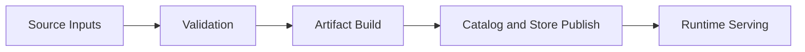

# Bijux Atlas

`bijux-atlas` is a data-serving system that turns validated source inputs into
immutable release artifacts and serves those artifacts through stable query
surfaces.

## What Bijux Atlas Is

Atlas is not only a server and not only a build tool. It is one product that
covers:

- input validation and normalization
- deterministic artifact building
- catalog and store publication
- runtime query and operational serving

## Why Bijux Atlas Exists

Atlas exists to solve a common reliability problem: teams often mix source
inputs, intermediate files, and live runtime state into one mutable workflow.
That makes results hard to trust, hard to reproduce, and hard to operate.

Atlas keeps those boundaries explicit so you can answer practical questions
quickly:

- what exactly was built
- what exactly was published
- what exactly is being served
- what evidence supports promotion or rollback decisions

## What Bijux Atlas Does

This flow is the core of atlas behavior. The artifact and publication boundary
is deliberate: successful local processing alone is not treated as serving
truth until publication is complete.

## How Operations Fits In

Operations is a core part of atlas, not a side appendix. The operations surface
covers stack topology, Kubernetes rollout safety, observability, load budgets,
and release evidence.

When you run atlas in real environments, operations answers whether a change is
safe to install, promote, or roll back.

## Release Confidence Signals

Primary confidence and publication lanes:

- `repo/ci`
- `deploy-docs`
- `release-crates`
- `release-ghcr`
- `release-github`

These lanes are shown in the badges and are the main release health indicators
for atlas.

<!-- bijux-atlas-badges:generated:start -->

 

<!-- bijux-atlas-badges:generated:end -->

## Start Here

- product runtime and contracts: [Repository](bijux-atlas/index.md)
- deployment, observability, load, and release operations: [Operations](bijux-atlas-ops/index.md)
- governance and control-plane maintenance: [Maintainer](bijux-atlas-dev/index.md)

## Stability

This page is part of the canonical docs spine. Keep it aligned with active
runtime behavior, operations workflows, and release lanes.
