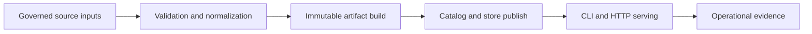

# Bijux Atlas

`bijux-atlas` is a Rust-first genomics dataset delivery platform.
It ingests governed GFF3 and FASTA inputs, builds immutable query artifacts,
publishes those artifacts into a serving catalog and store, and exposes stable
CLI and HTTP runtime surfaces.

<!-- bijux-atlas-badges:generated:start -->

 

<!-- bijux-atlas-badges:generated:end -->

## What It Does

Atlas combines four product responsibilities in one coherent workflow:

- validate and normalize source inputs
- build deterministic, immutable dataset artifacts
- publish release-shaped state to a serving store and catalog
- serve that state through query, API, and operational runtime surfaces

## Why It Exists

Atlas exists to avoid a common failure mode in data systems: mixing raw inputs,
intermediate files, and mutable runtime state into one opaque process.

Atlas keeps those boundaries explicit so teams can answer high-stakes questions
without guessing:

- what was actually built
- what was actually published
- what is currently served
- what evidence supports promotion, rollback, or incident decisions

## What It Guarantees

- deterministic build behavior from governed inputs
- immutable release artifacts as the delivery unit
- explicit runtime, API, and config contracts
- operations and release evidence that can be reviewed and repeated

## What It Is Not

Atlas is not a generic mutable runtime that rewrites release truth in place.
It is not a replacement for source governance, and it is not a shortcut around
validation, publication, and release evidence.

## Operations Is Part of the Product

`bijux-atlas-ops` is not secondary documentation. It is where deployment,
rollout safety, observability, load budgets, and release trust are defined.

If your question is about running atlas safely in real environments, operations
is the primary handbook.

## Release Confidence Signals

Primary publication and confidence lanes:

- `repo/ci`
- `deploy-docs`
- `release-crates`
- `release-ghcr`
- `release-github`

These lanes are represented in the badges above and are the main release health
signals for atlas.

## Continue Reading

- runtime architecture, interfaces, workflows, and contracts: [Repository](bijux-atlas/index.md)
- deployment, rollout, observability, load, and release operations: [Operations](bijux-atlas-ops/index.md)
- governance, control-plane automation, and maintainer ownership: [Maintainer](bijux-atlas-dev/index.md)
