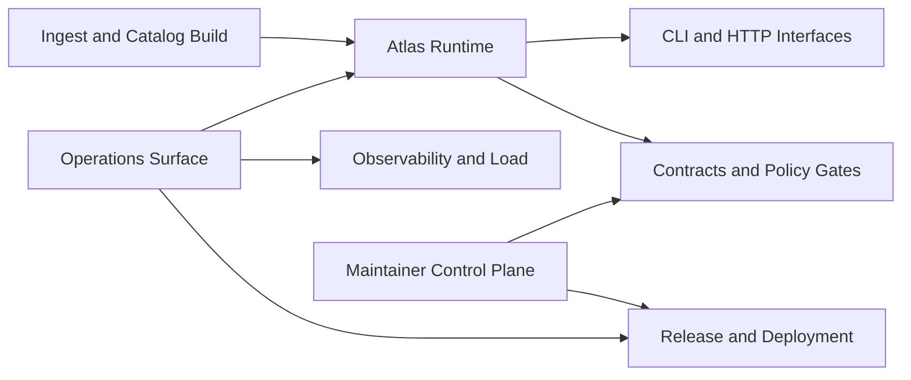

# Bijux Atlas

`bijux-atlas` is a governed atlas runtime with a first-class operations surface.
The repository is split into three documentation handbooks so readers can keep
product behavior, operations execution, and maintainer control-plane concerns
separate from the start.

This page is the system landing page. It should answer the first high-value
questions quickly:

- what atlas is for
- where runtime authority lives
- how operations are executed and validated
- which handbook owns the next question

Use the top navigation like the other Bijux repositories:

<!-- bijux-atlas-badges:generated:start -->

 

<!-- bijux-atlas-badges:generated:end -->

<strong>Start with ownership boundaries, not the file tree.</strong>
Repository docs explain atlas runtime behavior and contracts. Operations docs
explain stack, Kubernetes, observability, load, and release operations.
Maintainer docs explain control-plane automation, governance, and repository
health contracts.

  
<h3>Repository</h3>
Runtime architecture, interfaces, contracts, ingest/query behavior, and package ownership.

  
<h3>Operations</h3>
Cluster and stack operations, install profiles, observability posture, release operations, and evidence expectations.

  
<h3>Maintainer</h3>
Governance, workflow ownership, repository diagnostics, policy enforcement, and release readiness controls.

<a class="md-button md-button--primary" href="bijux-atlas/">Open Repository</a>
<a class="md-button" href="bijux-atlas-ops/">Open Operations</a>
<a class="md-button" href="bijux-atlas-dev/">Open Maintainer</a>

## System Snapshot

## Why This Landing Page Matters

Many readers stop here. This page therefore carries core system intent, not
just links:

- `bijux-atlas` is a runtime product, not only a data or docs repository
- `bijux-atlas-ops` is part of the product surface, not an appendix
- release and deployment are governed by explicit workflow and policy contracts
- maintainer controls exist to keep runtime and operations behavior explainable

## Start Here By Goal

| Goal | Open | Why |
| --- | --- | --- |
| Understand the runtime product | [Repository](bijux-atlas/index.md) | Runtime behavior, interfaces, contracts, and architecture are owned here. |
| Operate atlas in cluster or stack environments | [Operations](bijux-atlas-ops/index.md) | Install, render, validate, observe, and troubleshoot operations here. |
| Verify delivery, policy, and governance posture | [Maintainer](bijux-atlas-dev/index.md) | Repository controls, workflow ownership, and evidence rules live here. |

## Operations Depth On This Site

The operations handbook is intended for real execution decisions, not only
reference reading. It includes:

- stack and Kubernetes surfaces
- install and profile guidance
- release and distribution channels
- observability, traces, alerts, and diagnostics
- load and reproducibility contracts

If your question touches deployment risk, runtime safety, rollback, or
performance confidence, start with [Operations](bijux-atlas-ops/index.md).

## Release and Verification Lanes

Current release-critical lanes and documentation lanes for atlas are:

- `repo/ci`
- `deploy-docs`
- `release-crates`
- `release-ghcr`
- `release-github`

These lanes are represented in the badge row above and are the primary
publication and confidence signals for this repository.

## Handbook Map

- [Repository](bijux-atlas/index.md)
- [Operations](bijux-atlas-ops/index.md)
- [Maintainer](bijux-atlas-dev/index.md)

## Purpose

Use this page to understand atlas system intent quickly, pick the correct
handbook branch, and move to the source-backed pages that carry detailed proof.

## Stability

This page is part of the canonical docs spine. Keep it aligned with the
published handbook roots, active release and docs lanes, and the current atlas
runtime and operations surfaces.
