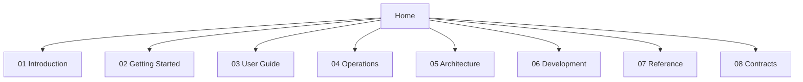

# Bijux Atlas

`bijux-atlas` is documented as a single, section-first guide with one home page
and eight canonical content sections.

Use the top navigation to move directly into the section you need.

<strong>Home is orientation only.</strong>
Section pages provide the full left-side navigation for smooth movement across
all pages in that section.

  
<h3>Introduction</h3>
Start with Atlas purpose, concepts, boundaries, and stability guarantees.

  
<h3>Getting Started</h3>
Install, run Atlas locally, load sample data, and verify first queries.

  
<h3>User Guide</h3>
Go deep on configuration, workflows, server usage, policy, and troubleshooting.

  
<h3>Operations</h3>
Run Atlas in production with clear guidance on reliability, security, and incidents.

  
<h3>Architecture</h3>
Understand code structure, lifecycle flows, and system boundaries.

  
<h3>Development</h3>
Change Atlas safely with workflow, testing, compatibility, and release discipline.

  
<h3>Reference</h3>
Find commands, API endpoints, environment variables, and exact lookup material.

  
<h3>Contracts</h3>
Review stable promises and compatibility surfaces that Atlas intentionally publishes.

<a class="md-button md-button--primary" href="01-introduction/">Open introduction</a>
<a class="md-button" href="02-getting-started/">Open getting started</a>
<a class="md-button" href="03-user-guide/">Open user guide</a>
<a class="md-button" href="04-operations/">Open operations</a>

## Sections

- [Introduction](01-introduction/index.md)
- [Getting Started](02-getting-started/index.md)
- [User Guide](03-user-guide/index.md)
- [Operations](04-operations/index.md)
- [Architecture](05-architecture/index.md)
- [Development](06-development/index.md)
- [Reference](07-reference/index.md)
- [Contracts](08-contracts/index.md)

## Reading Rule

Start from the section that matches your question. Use Home for orientation
only, then move into a section to use the left-side page navigation.
