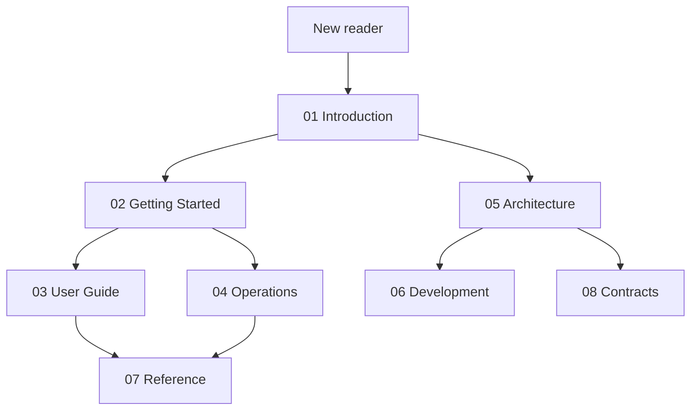
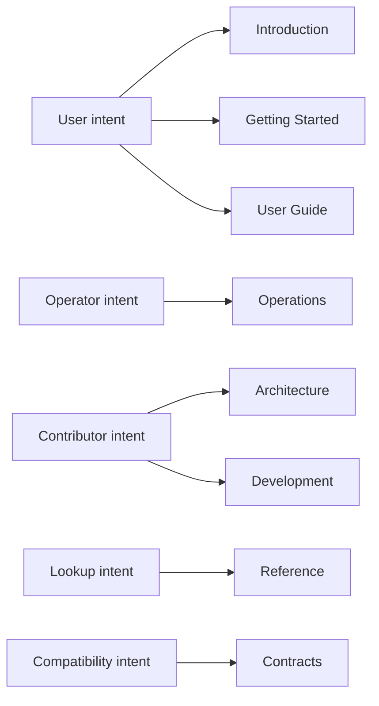
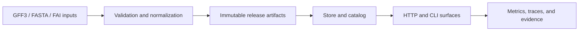

# bijux-atlas Documentation

Atlas is a contract-governed data platform for validating genomic dataset inputs, producing immutable release artifacts, and serving stable query surfaces over HTTP and CLI workflows.

This site is organized for three reader groups:

- users who need to ingest, validate, query, and serve data
- operators who need to run Atlas safely in real environments
- contributors who need to understand the architecture, code ownership, and change model

## How to Read This Site

If you are new to Atlas, start in `01-introduction`, then move through `02-getting-started`, and only after that branch into `03-user-guide` or `04-operations`.

If you are maintaining Atlas, treat `05-architecture`, `06-development`, `07-reference`, and `08-contracts` as the canonical explanation of how the system is designed and what behavior is promised.

The documentation is intentionally split by reader intent:

- introduction explains what Atlas is and why it exists
- getting started gets a real workflow running
- user guide covers normal product usage
- operations covers deployment, observability, and incident handling
- architecture explains the shape of the system
- development explains how to change it safely
- reference answers lookup questions
- contracts define stable promises

## Atlas at a Glance

Atlas turns source inputs such as GFF3, FASTA, and FAI into validated, release-shaped artifacts and exposes those artifacts through stable APIs and deterministic command outputs.

## Documentation Spine

- [01 Introduction](01-introduction/index.md)
- [02 Getting Started](02-getting-started/index.md)
- [03 User Guide](03-user-guide/index.md)
- [04 Operations](04-operations/index.md)
- [05 Architecture](05-architecture/index.md)
- [06 Development](06-development/index.md)
- [07 Reference](07-reference/index.md)
- [08 Contracts](08-contracts/index.md)

## What This Site Optimizes For

- one obvious place for each topic
- separation between explanation, procedure, reference, and compatibility promises
- reader-first organization rather than repo-history organization
- examples tied to real Atlas commands and real repository fixtures

## First Three Pages to Read

- [What Atlas Is](01-introduction/what-atlas-is.md)
- [Run Atlas Locally](02-getting-started/run-atlas-locally.md)
- [System Overview](05-architecture/system-overview.md)

