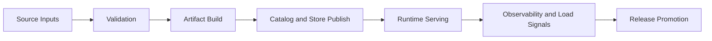

# Bijux Atlas

`bijux-atlas` turns validated source inputs into immutable release artifacts and
serves them through stable query surfaces. It is built for teams that need
traceable data workflows, predictable runtime behavior, and operations that can
be audited and repeated.

Atlas is one product with three connected surfaces:

- **Repository**: runtime architecture, interfaces, workflows, and contracts
- **Operations**: stack, Kubernetes, observability, load, rollout, and recovery
- **Maintainer**: governance, policy controls, and repository health gates

<!-- bijux-atlas-badges:generated:start -->

 

<!-- bijux-atlas-badges:generated:end -->

  
<h3>What Atlas Gives You</h3>
Deterministic ingest, immutable artifacts, explicit catalog state, and stable query behavior.

  
<h3>What Operations Gives You</h3>
Clear rollout controls, incident response paths, observability contracts, and load budgets.

  
<h3>What Maintainer Controls Give You</h3>
Repeatable release gates, governance checks, and evidence-backed publication decisions.

<a class="md-button md-button--primary" href="bijux-atlas/">Open Repository Handbook</a>
<a class="md-button" href="bijux-atlas-ops/">Open Operations Handbook</a>
<a class="md-button" href="bijux-atlas-dev/">Open Maintainer Handbook</a>

## Atlas Flow

## Choose Your Path

| If you need to... | Start here |
| --- | --- |
| understand runtime behavior, architecture, or API and CLI contracts | [Repository](bijux-atlas/index.md) |
| deploy, operate, debug, or recover atlas in real environments | [Operations](bijux-atlas-ops/index.md) |
| verify policy, governance, or release readiness | [Maintainer](bijux-atlas-dev/index.md) |

## Operations Pages Worth Opening First

| Operational question | Page |
| --- | --- |
| How is the system wired? | [Stack Service Topology](bijux-atlas-ops/stack/service-topology.md) |
| What protects rollout safety? | [Kubernetes Rollout Safety](bijux-atlas-ops/kubernetes/rollout-safety.md) |
| How do we run incident response? | [Observability Incident Response](bijux-atlas-ops/observability/incident-response.md) |
| What are the load pass/fail thresholds? | [Load Thresholds and Budgets](bijux-atlas-ops/load/thresholds-and-budgets.md) |
| What proves release trust? | [Release Signing and Provenance](bijux-atlas-ops/release/signing-and-provenance.md) |
| What goes into release approval evidence? | [Release Evidence](bijux-atlas-ops/release/release-evidence.md) |

## Current Release Health Signals

The main publication and confidence lanes are:

- `repo/ci`
- `deploy-docs`
- `release-crates`
- `release-ghcr`
- `release-github`

These are the signals shown in the badges above and the primary indicators of
release readiness for atlas.

## Handbook Map

- [Repository](bijux-atlas/index.md)
- [Operations](bijux-atlas-ops/index.md)
- [Maintainer](bijux-atlas-dev/index.md)

## Purpose

Use this page to quickly understand what atlas does, where operations depth
lives, and where to continue based on your current goal.

## Stability

This page is part of the canonical docs spine. Keep it aligned with active
runtime surfaces, operational workflows, and release lanes.
