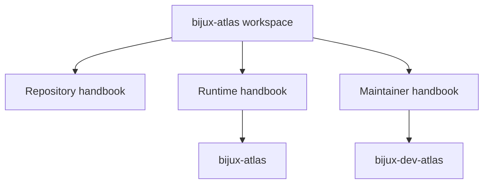

# Bijux Atlas

`bijux-atlas` is a deliberately split Rust workspace for genomics dataset
delivery and repository governance. The product runtime and the maintainer
control plane are documented separately so readers can find the owning package
without reverse-engineering the tree.

Use this page to choose the right handbook branch first, then the right package
surface second.

<strong>Start with ownership, not just section names.</strong>
Repository docs route cross-package questions. Runtime docs own ingest,
datasets, APIs, and runtime operations. Maintainer docs own repository
automation, docs tooling, policy, and evidence surfaces.

  
<h3>Repository</h3>
Use the repository handbook when a question crosses package boundaries or needs a workspace-level ownership decision.

  
<h3>Runtime</h3>
Use the runtime handbook for the product surface: ingest, dataset and catalog workflows, APIs, runtime operations, and stable runtime contracts.

  
<h3>Maintainer</h3>
Use the maintainer handbook for repository governance, docs validation, policy-backed checks, generated references, and report workflows.

<a class="md-button md-button--primary" href="repository/">Open the repository handbook</a>
<a class="md-button" href="runtime/">Open the runtime handbook</a>
<a class="md-button" href="maintainer/">Open the maintainer handbook</a>

## Choose a Path

- evaluating package ownership or cross-cutting change impact: start with [Repository Handbook](repository/index.md)
- trying or operating the product runtime: move to [Runtime Handbook](runtime/index.md)
- changing docs, checks, reports, or governance workflows: move to [Maintainer Handbook](maintainer/index.md)

## Start Here

- [Repository Handbook](repository/index.md)
- [Runtime Handbook](runtime/index.md)
- [Maintainer Handbook](maintainer/index.md)
