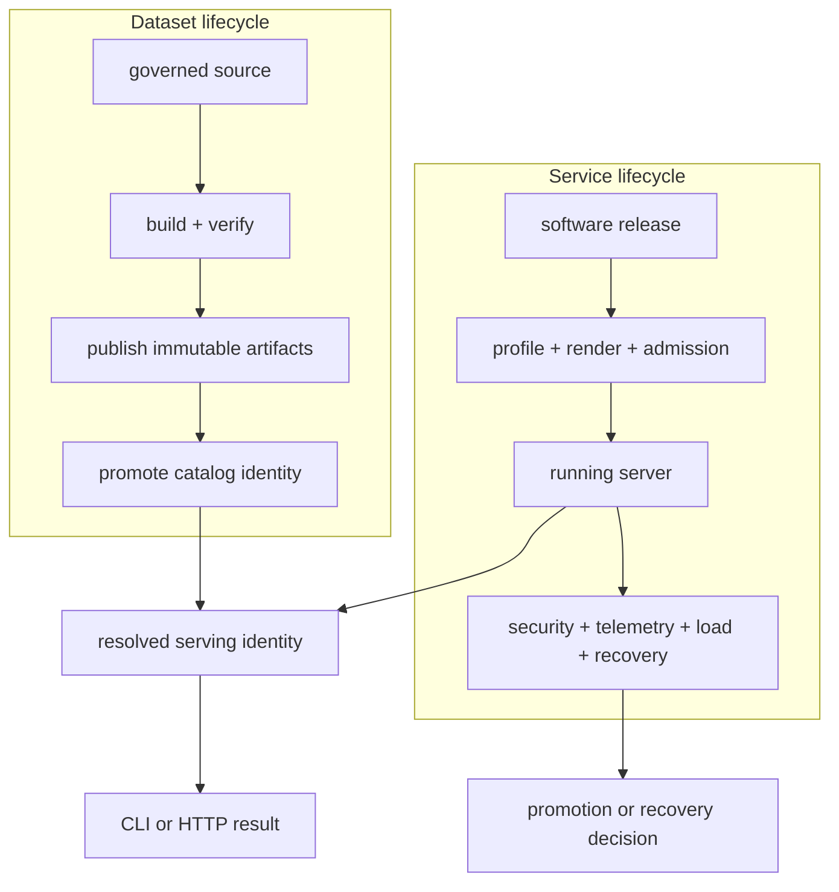

# Bijux Atlas

Bijux Atlas turns governed GFF3 and FASTA inputs into immutable genomic dataset
releases and serves them through Rust libraries, command workflows, and a
versioned HTTP API. Its documentation follows the decisions needed to build,
publish, operate, and trust those releases.

<!-- bijux-atlas-badges:generated:start -->

<!-- bijux-atlas-badges:generated:end -->

## Choose by Outcome

| Outcome | Handbook |
| --- | --- |
| understand dataset construction, publication, queries, and interfaces | [Atlas product](bijux-atlas/index.md) |
| run the complete committed sample journey | [Run Atlas locally](bijux-atlas/workflows/run-atlas-locally.md) |
| deploy, secure, observe, load-test, or recover a target | [Atlas operations](bijux-atlas-ops/index.md) |
| interpret release evidence or distribution trust | [Release operations](bijux-atlas-ops/release/index.md) |
| change repository automation, policy, or delivery | [Maintainer control plane](bijux-atlas-dev/index.md) |

## Understand the System

Atlas has two independent lifecycles that meet at a serving decision.

```mermaid
flowchart TB
    subgraph Dataset["Dataset lifecycle"]
        Source["governed source"] --> Build["build + verify"]
        Build --> Publish["publish immutable artifacts"]
        Publish --> Catalog["promote catalog identity"]
    end
    subgraph Service["Service lifecycle"]
        Software["software release"] --> Render["profile + render + admission"]
        Render --> Run["running server"]
        Run --> Qualify["security + telemetry + load + recovery"]
    end
    Catalog --> Identity["resolved serving identity"]
    Run --> Identity
    Identity --> Result["CLI or HTTP result"]
    Qualify --> Decision["promotion or recovery decision"]
```

A published dataset may have no qualified deployment. A healthy deployment may
observe the wrong catalog generation. A trustworthy result therefore binds:

- the dataset tuple `release/species/assembly`;
- manifest and artifact hashes;
- software, configuration, chart, profile, and target identity; and
- the request, observation window, or scenario that produced the evidence.

## Read by Ownership

The documentation is divided by who makes the decision:

| Surface | Owns | Does not own |
| --- | --- | --- |
| [product](bijux-atlas/index.md) | data model, ingest, publication, query, runtime, and interfaces | deployment qualification |
| [operations](bijux-atlas-ops/index.md) | topology, Kubernetes, security, signals, load, recovery, and release trust | product semantics |
| [maintenance](bijux-atlas-dev/index.md) | repository validation, generation, governance, and delivery automation | user-facing runtime behavior |

Evidence crosses these surfaces without transferring ownership. A maintainer
command can validate a chart contract but cannot declare a target healthy. An
operator can observe a correct query but cannot redefine the dataset identity
or wire contract.

## Match Evidence to the Claim

| Evidence | Establishes | Does not establish |
| --- | --- | --- |
| schema, policy, or registry | declared structure and required fields | that behavior ran |
| checked-in fixture | validator and serialization shape | target fitness |
| execution report | observed behavior for named inputs and a run | release binding unless identities are included |
| checksums and provenance | artifact membership and lineage | operational fitness |
| consumer verification receipt | coherence and authorization of exact received bytes | upstream biological correctness |

When evidence is missing, narrow the claim rather than filling the gap with a
later green check. Readiness does not prove capacity; a load result does not
prove recovery; an internally coherent release packet does not provide an
independent trust anchor.

## Current Qualification Boundaries

The documentation records limitations that affect present claims:

- production-oriented overlays are not all represented in executable lifecycle
  scenarios;
- registered rollout-under-load suites do not currently have executable control
  runners;
- administrative endpoint classification does not cover every registered route;
- the repository defines recovery contracts but does not provide an operational
  production backup schedule or restore runner; and
- the GHCR release path publishes compressed bundles as OCI artifacts, not
  evidence of runnable container images.

These are decision boundaries, not documentation footnotes. Follow the linked
operations pages before describing a deployment or release as qualified.

## Continue with a Concrete Question

- [What Atlas is](bijux-atlas/foundations/what-atlas-is.md)
- [Dataset and query workflows](bijux-atlas/workflows/index.md)
- [CLI, HTTP, OpenAPI, and configuration](bijux-atlas/interfaces/index.md)
- [Runtime and storage architecture](bijux-atlas/runtime/index.md)
- [Deployment and service topology](bijux-atlas-ops/stack/index.md)
- [Kubernetes delivery](bijux-atlas-ops/kubernetes/index.md)
- [Security assurance](bijux-atlas-ops/security/index.md)
- [Observability](bijux-atlas-ops/observability/index.md)
- [Load and resilience](bijux-atlas-ops/load/index.md)
- [Release and recovery](bijux-atlas-ops/release/index.md)
