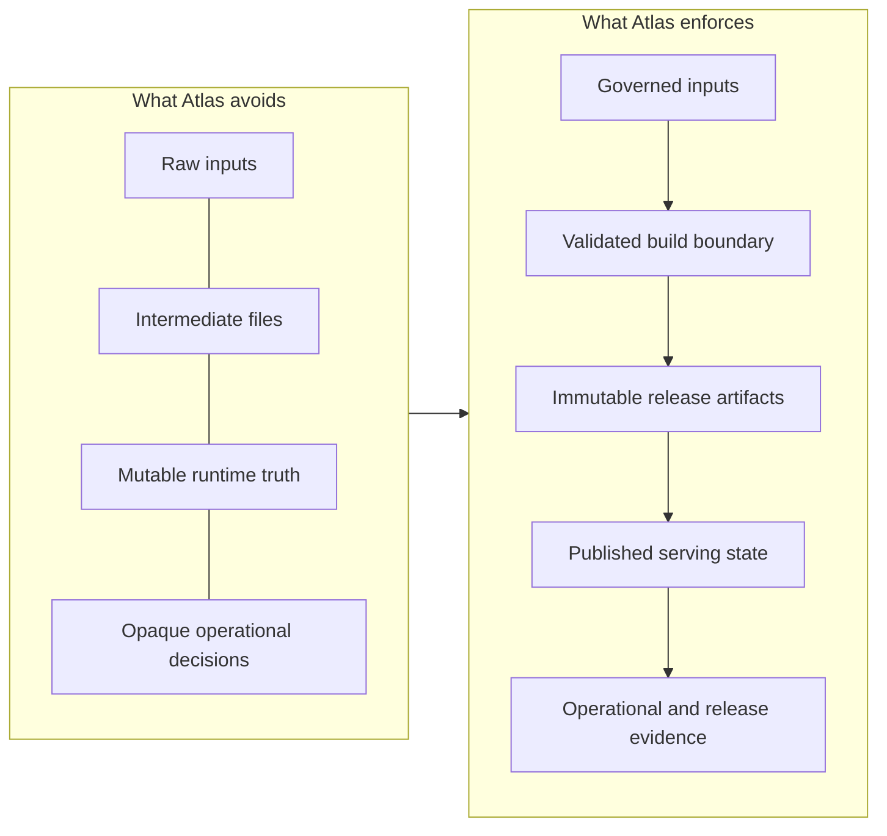
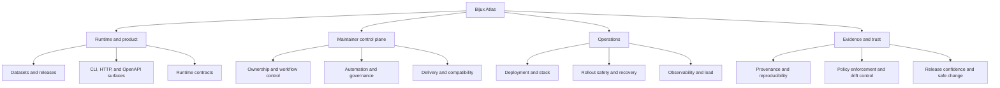
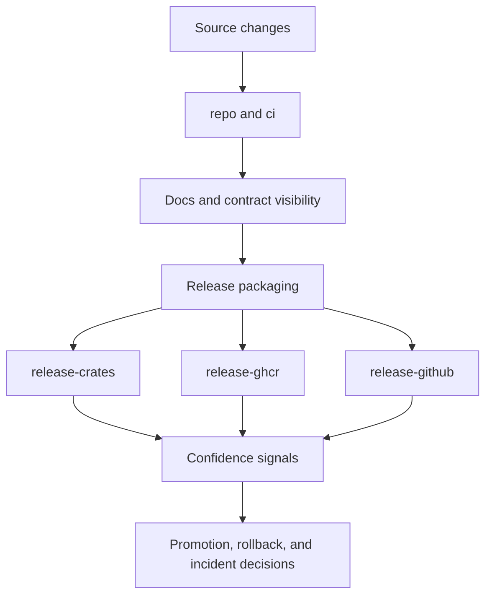

# Bijux Atlas

Bijux Atlas turns governed GFF3 and FASTA inputs into immutable genomic dataset
releases, places them behind explicit serving stores, and exposes them through
Rust libraries, command-line workflows, and a versioned HTTP API. Deployment,
load, security, observability, rollback, and release evidence are governed parts
of the same delivery system.

<!-- bijux-atlas-badges:generated:start -->

<!-- bijux-atlas-badges:generated:end -->

## Choose by Outcome

| Outcome | Start here | Decision owned there |
| --- | --- | --- |
| understand datasets, ingest, queries, and interfaces | [Product handbook](bijux-atlas/index.md) | product behavior and compatibility |
| deploy or recover Atlas | [Operations handbook](bijux-atlas-ops/index.md) | topology, security, rollout, telemetry, load, and recovery |
| change or release the repository | [Maintainer handbook](bijux-atlas-dev/index.md) | validation, governance, automation, and delivery |
| assess whether a claim is proven | [Evidence and Trust](bijux-atlas-ops/release/release-evidence.md) | relationship among contracts, observations, and released artifacts |

The product can be evaluated without learning repository automation. Operators
can reason about deployment evidence without treating checked-in examples as
live results. Maintainers can change the system without moving control-plane
logic into user-facing binaries.

## From Source Data to Operational Evidence

Atlas is an artifact-first system. Runtime processes consume published state;
they do not redefine release truth in place.

```mermaid
flowchart LR
    source[Governed GFF3 and FASTA inputs] --> validate[Validation and normalization]
    validate --> build[Deterministic artifact build]
    build --> release[Immutable release artifacts]
    release --> publish[Immutable store publication]
    publish --> promote[Catalog promotion]
    promote --> serve[CLI and HTTP runtime surfaces]
    serve --> observe[Health, metrics, logs, and traces]
    observe --> decide[Promotion, rollback, and incident evidence]
```

| Boundary | Authority | Evidence retained |
| --- | --- | --- |
| source admission | governed GFF3, FASTA, configuration, and policy inputs | validation findings and normalized identity |
| artifact build | deterministic ingest and model contracts | immutable dataset files, manifests, hashes, and provenance |
| store publication | artifact and store contracts | immutable payload, integrity lock, and backend-specific publication result |
| catalog promotion | catalog contract | discoverable release identity bound to the published payload |
| serving | CLI, HTTP, OpenAPI, query, and runtime policy | structured results, stable errors, metrics, logs, and traces |
| operations | stack, Kubernetes, load, security, and release contracts | conformance reports, baselines, drill results, checksums, and release packets |

## Why the Artifact Boundary Matters

Atlas exists to avoid a common failure mode in data systems: mixing raw inputs,
intermediate files, and mutable serving state into one opaque process.

Atlas keeps those boundaries explicit so teams can answer high-stakes questions
without guessing:

- what was actually built
- what was actually published
- what is currently served
- what evidence supports promotion, rollback, or incident decisions

Atlas is strongest when teams need trusted serving of governed release data
rather than a convenient but opaque runtime that quietly mutates its own truth.

```mermaid
flowchart LR
    subgraph avoid[What Atlas avoids]
        raw[Raw inputs]
        intermediate[Intermediate files]
        mutable[Mutable runtime truth]
        opaque[Opaque operational decisions]
        raw --- intermediate
        intermediate --- mutable
        mutable --- opaque
    end

    avoid --> boundary

    subgraph boundary[What Atlas enforces]
        governed[Governed inputs]
        validated[Validated build boundary]
        immutable[Immutable release artifacts]
        serving[Published serving state]
        evidence[Operational and release evidence]
        governed --> validated --> immutable --> serving --> evidence
    end
```

## Contract Boundaries and Limits

- deterministic build behavior from governed inputs and pinned configuration
- immutable release artifacts as the delivery unit
- explicit runtime, API, configuration, and structured-output contracts
- operational evidence tied to named scenarios, profiles, and release identity

These guarantees do not establish that upstream biological data is correct.
They establish that Atlas can show which inputs crossed its boundary, how the
release was built, which artifact was served, and which checks informed an
operational decision.

Atlas is not a generic mutable runtime that rewrites release truth in place, a
replacement for source governance, or a shortcut around validation,
publication, and release evidence. A schema-valid fixture proves a contract
shape; only an executed check or scenario proves observed behavior; only a
coherent release packet binds that evidence to distributed artifacts.

## One Product, Three Decision Surfaces

Atlas is easier to trust when its major concerns stay explicit instead of
being collapsed into one generic idea of "the runtime".

```mermaid
flowchart TB
    atlas[Bijux Atlas]

    atlas --> runtime[Runtime and product]
    atlas --> maintainer[Maintainer control plane]
    atlas --> ops[Operations]
    atlas --> trust[Evidence and trust]

    runtime --> runtime_a[Datasets and releases]
    runtime --> runtime_b[CLI, HTTP, and OpenAPI surfaces]
    runtime --> runtime_c[Runtime contracts]

    maintainer --> maintainer_a[Ownership and workflow control]
    maintainer --> maintainer_b[Automation and governance]
    maintainer --> maintainer_c[Delivery and compatibility]

    ops --> ops_a[Deployment and stack]
    ops --> ops_b[Rollout safety and recovery]
    ops --> ops_c[Observability and load]

    trust --> trust_a[Provenance and reproducibility]
    trust --> trust_b[Policy enforcement and drift control]
    trust --> trust_c[Release confidence and safe change]
```

## Operations Are Part of the Release

`bijux-atlas-ops` is where deployment, rollout safety, observability, load
budgets, and release trust are explained.

Security and release assurance are not side checks after the runtime is done.
They help prove what was built, promoted, and eligible for rollback.

The operating system spans four control loops:

| Control loop | Governing question | Decision evidence |
| --- | --- | --- |
| deployment | did the intended release and configuration reach the target? | render, admission, rollout, and identity observations |
| service | can the runtime serve the intended dataset within policy? | health, readiness, telemetry, and correctness probes |
| capacity | does behavior remain inside budgets under representative stress? | scenario-bound load results and comparable baselines |
| recovery | can operators detect divergence and restore coherent state? | drift findings, incident records, backups, and rollback drills |

These loops share release identity but not proof. A healthy rollout does not
establish capacity, and a valid backup does not establish restoration.

## Follow a Decision Across Boundaries

| Question | Owning guide |
| --- | --- |
| What request, response, OpenAPI, and error contract applies? | [HTTP interfaces](bijux-atlas/interfaces/api-endpoint-index.md) |
| Which runtime, catalog, store, cache, or telemetry component owns truth? | [Service topology](bijux-atlas-ops/stack/service-topology.md) |
| How strong is the observed signal path? | [Observability](bijux-atlas-ops/observability/index.md) |
| Is publication complete and consumer-verified? | [Release operations](bijux-atlas-ops/release/index.md) |

## Release Confidence Signals

Evidence gains strength as it moves from declared shape to release-bound proof:

| Evidence level | Establishes | Does not establish |
| --- | --- | --- |
| schema or policy | accepted structure and required fields | that a scenario ran |
| checked-in fixture or sample | representative serialization and validator behavior | current environment health |
| execution report | observed result for named inputs and run identity | artifact identity unless bound to it |
| checksums and provenance | artifact identity and build lineage | operational fitness without run evidence |
| verified release packet | agreement among artifacts, reports, checksums, and provenance | correctness of upstream biological claims |

Primary confidence lanes are `repo/ci`, `deploy-docs`, `release-crates`,
`release-ghcr`, and `release-github`.

Each lane contributes a distinct claim. Passing compilation does not establish
documentation integrity, package publication, image provenance, or rollback
readiness.

```mermaid
flowchart TB
    source[Source changes] --> ci[repo and ci]
    ci --> docs[Docs and contract visibility]
    docs --> package[Release packaging]
    package --> crates[release-crates]
    package --> ghcr[release-ghcr]
    package --> github[release-github]
    crates --> confidence[Confidence signals]
    ghcr --> confidence
    github --> confidence
    confidence --> decisions[Promotion, rollback, and incident decisions]
```

Atlas is not complete when it merely builds. It is complete when build, docs,
contracts, publication channels, and operational evidence line up tightly
enough that release decisions are reviewable instead of improvised.

## Published and Repository-Only Crates

The workspace declares eleven publishable Rust crates and keeps one maintainer
crate repository-only. Live registry badges report publication state.

Publishable crates: `bijux-atlas`, `bijux-atlas-api`, `bijux-atlas-cli`,
`bijux-atlas-core`, `bijux-atlas-ingest`, `bijux-atlas-model`,
`bijux-atlas-ops`, `bijux-atlas-query`, `bijux-atlas-runtime`,
`bijux-atlas-server`, and `bijux-atlas-store`.

Repository-only crate: `bijux-atlas-dev`.

Use this split when deciding where to start:
- product runtime and release behavior: `bijux-atlas`, `bijux-atlas-runtime`,
  `bijux-atlas-cli`, `bijux-atlas-server`, `bijux-atlas-api`
- leaf implementation contracts: `bijux-atlas-core`, `bijux-atlas-model`,
  `bijux-atlas-query`, `bijux-atlas-ingest`, `bijux-atlas-store`
- operational surfaces: `bijux-atlas-ops`
- repository governance and maintainer workflows: `bijux-atlas-dev`

## Choose a Decision Surface

Start from the surface that owns the decision in front of you.

### Repository

Use [Repository](bijux-atlas/index.md) when the question is about the Atlas
product itself: datasets, releases, workflows, interfaces, runtime
architecture, and compatibility contracts.

### Operations

Use [Operations](bijux-atlas-ops/index.md) when the question is about how Atlas
runs safely: deployment, rollout safety, observability, load, recovery, and
release operations.

### Maintainer

Use [Maintainer](bijux-atlas-dev/index.md) when the question is about how Atlas
changes safely: ownership, automation, workflow control, delivery, and
governance.

## Reference Surfaces

- [Badge Catalog](bijux-atlas-dev/governance/badge-catalog.md)
- [Shell JavaScript Ownership](assets/javascripts/shell/README.md)
- [Shell CSS Ownership](assets/styles/README.md)
