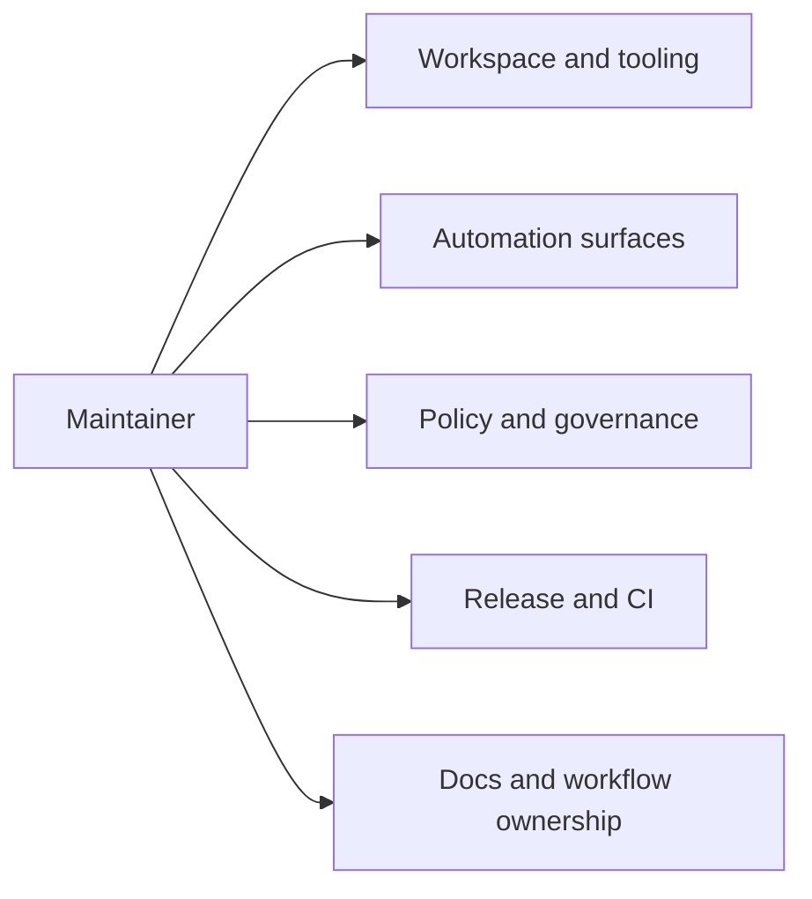

# Maintainer

The maintainer handbook is the control-plane handbook for `bijux-atlas-dev`.

It will hold the deep documentation for `bijux-dev-atlas`, `makes/`, docs
governance, GitHub workflow ownership, release support, and repository checks.

## Scope

Use this handbook when the question is about how the repository is operated and
maintained as a governed system rather than how the Atlas product behaves at
runtime.

## What Comes Next

The maintainer handbook is being rebuilt around `maintainer/bijux-atlas-dev/`
with five durable subdirectories so maintainer-only depth has a clear home and
stops competing with product and operations material.
