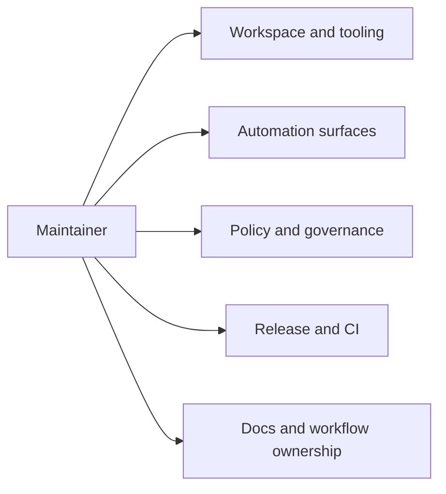

# Maintainer

The maintainer handbook is the control-plane handbook for `bijux-atlas-dev`.

It will hold the deep documentation for `bijux-dev-atlas`, `makes/`, docs
governance, GitHub workflow ownership, release support, and repository checks.

## Scope

Use this handbook when the question is about how the repository is operated and
maintained as a governed system rather than how the Atlas product behaves at
runtime.

## What Comes Next

The maintainer handbook is being rebuilt around `maintainer/bijux-atlas-dev/`
with five durable subdirectories so maintainer-only depth has a clear home and
stops competing with product and operations material.

## Current Paths

The active maintainer slices are:

- `maintainer/bijux-atlas-dev/workspace/`
- `maintainer/bijux-atlas-dev/automation/`
- `maintainer/bijux-atlas-dev/governance/`
- `maintainer/bijux-atlas-dev/delivery/`
- `maintainer/bijux-atlas-dev/workflow-ownership/`

## Workspace Pages

- [Workspace and Tooling](bijux-atlas-dev/workspace/workspace-and-tooling.md)
- [Local Development](bijux-atlas-dev/workspace/local-development.md)
- [Contributor Workflow](bijux-atlas-dev/workspace/contributor-workflow.md)
- [Decision Records and Ownership](bijux-atlas-dev/workspace/decision-records-and-ownership.md)
- [Package Surface](bijux-atlas-dev/workspace/package-surface.md)
- [Maintainer Entrypoints](bijux-atlas-dev/workspace/maintainer-entrypoints.md)
- [Repository Laws](bijux-atlas-dev/workspace/repository-laws.md)
- [Artifact Roots](bijux-atlas-dev/workspace/artifact-roots.md)
- [Generated Files](bijux-atlas-dev/workspace/generated-files.md)
- [Inventory Registry](bijux-atlas-dev/workspace/inventory-registry.md)

## Automation Pages

- [Automation Control Plane](bijux-atlas-dev/automation/automation-control-plane.md)
- [Adding CLI Surface](bijux-atlas-dev/automation/adding-cli-surface.md)
- [Adding HTTP Surface](bijux-atlas-dev/automation/adding-http-surface.md)
- [Adding Contracts](bijux-atlas-dev/automation/adding-contracts.md)
- [Automation Command Surface](bijux-atlas-dev/automation/automation-command-surface.md)
- [Automation Reports Reference](bijux-atlas-dev/automation/automation-reports-reference.md)
- [Command Routing](bijux-atlas-dev/automation/command-routing.md)
- [Subprocess Allowance](bijux-atlas-dev/automation/subprocess-allowance.md)
- [Generated Reference Workflows](bijux-atlas-dev/automation/generated-reference-workflows.md)
- [Tutorial Runs](bijux-atlas-dev/automation/tutorial-runs.md)

## Governance Pages

- [Documentation Standards](bijux-atlas-dev/governance/documentation-standards.md)
- [Change and Compatibility](bijux-atlas-dev/governance/change-and-compatibility.md)
- [Testing and Evidence](bijux-atlas-dev/governance/testing-and-evidence.md)
- [Automation Architecture](bijux-atlas-dev/governance/automation-architecture.md)
- [Automation Contracts](bijux-atlas-dev/governance/automation-contracts.md)
- [Docs Spine Governance](bijux-atlas-dev/governance/docs-spine-governance.md)
- [Redirects and Navigation](bijux-atlas-dev/governance/redirects-and-navigation.md)
- [Policy Loading](bijux-atlas-dev/governance/policy-loading.md)
- [Rule Enforcement](bijux-atlas-dev/governance/rule-enforcement.md)
- [Evidence Contracts](bijux-atlas-dev/governance/evidence-contracts.md)

## Delivery Pages

- [Release and Versioning](bijux-atlas-dev/delivery/release-and-versioning.md)
- [CI Lanes and Status Checks](bijux-atlas-dev/delivery/ci-lanes-and-status-checks.md)
- [GitHub Release Workflows](bijux-atlas-dev/delivery/github-release-workflows.md)
- [Docker and Crate Publish](bijux-atlas-dev/delivery/docker-and-crate-publish.md)
- [Compatibility Matrix](bijux-atlas-dev/delivery/compatibility-matrix.md)
- [Security Validation Lanes](bijux-atlas-dev/delivery/security-validation-lanes.md)
- [Docs Deploy Pipeline](bijux-atlas-dev/delivery/docs-deploy-pipeline.md)
- [Load and Benchmark Workflows](bijux-atlas-dev/delivery/load-and-benchmark-workflows.md)
- [Final Readiness](bijux-atlas-dev/delivery/final-readiness.md)
- [Dependency Updates](bijux-atlas-dev/delivery/dependency-updates.md)

## Workflow Ownership Pages

- [Pull Request Templates](bijux-atlas-dev/workflow-ownership/pull-request-templates.md)
- [Issue Templates](bijux-atlas-dev/workflow-ownership/issue-templates.md)
- [Codeowners and Review](bijux-atlas-dev/workflow-ownership/codeowners-and-review.md)
- [Required Status Checks](bijux-atlas-dev/workflow-ownership/required-status-checks.md)
- [Workflow Entrypoints](bijux-atlas-dev/workflow-ownership/workflow-entrypoints.md)
- [Docs Governance Workflow](bijux-atlas-dev/workflow-ownership/docs-governance-workflow.md)
- [Ops Validation Workflow](bijux-atlas-dev/workflow-ownership/ops-validation-workflow.md)
- [Release Candidate Workflow](bijux-atlas-dev/workflow-ownership/release-candidate-workflow.md)
- [System Simulation Workflow](bijux-atlas-dev/workflow-ownership/system-simulation-workflow.md)
- [Sustainability Validation Workflow](bijux-atlas-dev/workflow-ownership/sustainability-validation-workflow.md)
*** Add File: /Users/bijan/bijux/bijux-atlas/docs/maintainer/bijux-atlas-dev/workspace/package-surface.md
---
title: Package Surface
audience: maintainers
type: concept
status: canonical
owner: atlas-docs
last_reviewed: 2026-04-12
---

# Package Surface

`bijux-dev-atlas` is the Rust control-plane package that owns repository
automation, docs governance, reports, and enforcement.
