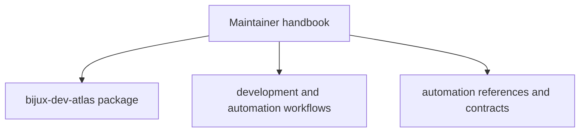

# Maintainer Handbook

`bijux-dev-atlas` owns the repository control plane for `bijux-atlas`. This
handbook routes maintainers through docs validation, policy-backed checks,
generated references, reports, release support, and other governance workflows.

<a class="md-button md-button--primary" href="packages/bijux-dev-atlas/">Open the bijux-dev-atlas package</a>
<a class="md-button" href="../06-development/">Open development workflows</a>
<a class="md-button" href="../07-reference/automation-command-surface/">Open automation command reference</a>

## Visual Summary

## Package Destination

- [`bijux-dev-atlas`](packages/bijux-dev-atlas/index.md) owns repository
  governance, docs tooling, checks, reports, and policy-backed automation

## Read This Handbook When

- you are validating docs, reports, references, or policy-backed repository surfaces
- you are working on release, CI, governance, or evidence collection flows
- the change belongs to the repository control plane rather than the product runtime

## Main Paths

- [Development](../06-development/index.md)
- [Automation Command Surface](../07-reference/automation-command-surface.md)
- [Automation Reports Reference](../07-reference/automation-reports-reference.md)
- [Automation Contracts](../08-contracts/automation-contracts.md)

## Related Handbooks

- [Repository Handbook](../repository/index.md)
- [Runtime Handbook](../runtime/index.md)
