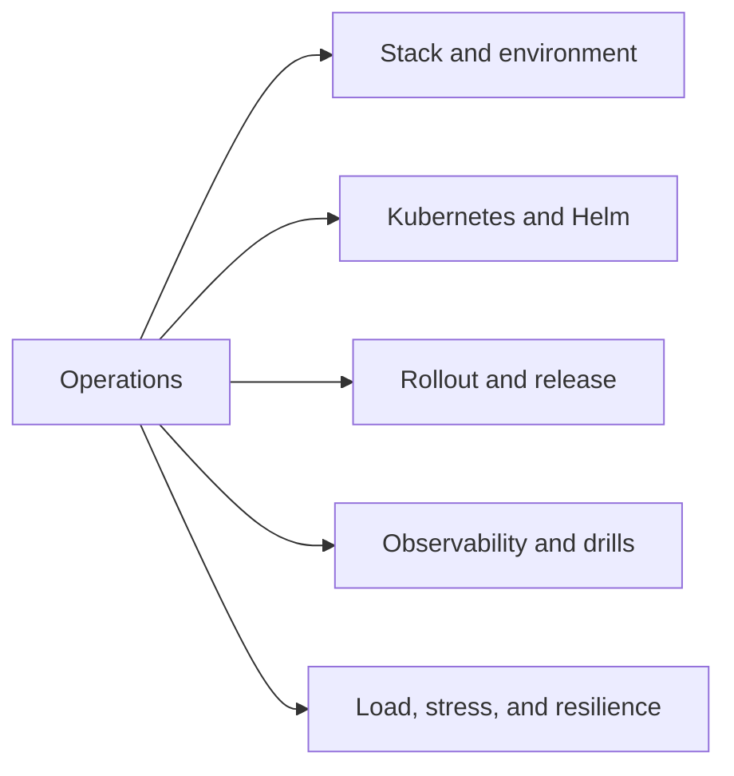

# Operations

The operations handbook is the operating surface for `bijux-atlas-ops`.

Atlas has a large operational footprint across `ops/`, `ops/k8s/`,
`ops/stack/`, `ops/observe/`, `ops/load/`, `ops/release/`, and surrounding
policy and report surfaces. This handbook exists so that depth has a real home
instead of being compressed into a small generic section.

## Scope

Use this handbook when the question is about operating Atlas safely:
deployment profiles, Helm values, Kubernetes validation, stack dependencies,
release drills, observability, or load execution.

## What Comes Next

The operations handbook is being rebuilt around `operations/bijux-atlas-ops/`
with five durable subdirectories so Kubernetes, Helm, stress, and operating
evidence can be documented at the depth the repository actually needs.

## Current Paths

The active operations slices are:

- `operations/bijux-atlas-ops/stack/`
- `operations/bijux-atlas-ops/kubernetes/`
- `operations/bijux-atlas-ops/release/`

They cover the platform topology, Kubernetes and Helm surface, and release
evidence path that already exist throughout `ops/`.
*** Add File: /Users/bijan/bijux/bijux-atlas/docs/operations/bijux-atlas-ops/stack/service-topology.md
---
title: Service Topology
audience: operators
type: concept
status: canonical
owner: atlas-docs
last_reviewed: 2026-04-12
---

# Service Topology

Atlas operations span the runtime service plus supporting dependencies such as
Redis, MinIO, Prometheus, Grafana, OpenTelemetry, and Toxiproxy.

## Source Anchors

- `ops/stack/`
- `ops/observe/`
- `ops/k8s/`
