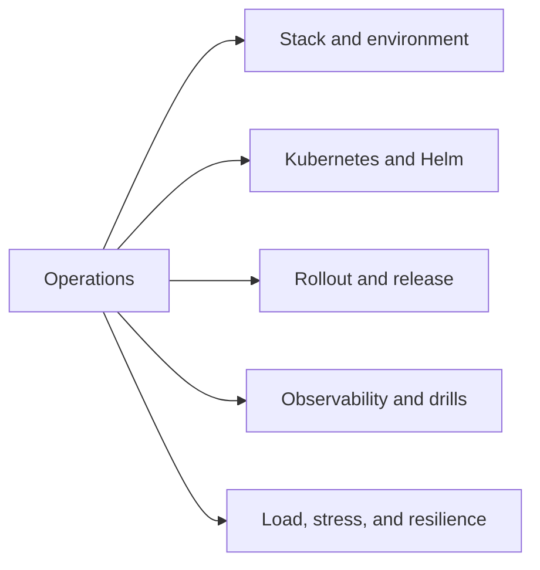

# Operations

The operations handbook is the operating surface for `bijux-atlas-ops`.

Atlas has a large operational footprint across `ops/`, `ops/k8s/`,
`ops/stack/`, `ops/observe/`, `ops/load/`, `ops/release/`, and surrounding
policy and report surfaces. This handbook exists so that depth has a real home
instead of being compressed into a small generic section.

## Scope

Use this handbook when the question is about operating Atlas safely:
deployment profiles, Helm values, Kubernetes validation, stack dependencies,
release drills, observability, or load execution.

## What Comes Next

The operations handbook is being rebuilt around `operations/bijux-atlas-ops/`
with five durable subdirectories so Kubernetes, Helm, stress, and operating
evidence can be documented at the depth the repository actually needs.

## Current Paths

The active operations slices are:

- `operations/bijux-atlas-ops/stack/`
- `operations/bijux-atlas-ops/kubernetes/`
- `operations/bijux-atlas-ops/release/`
- `operations/bijux-atlas-ops/observability/`
- `operations/bijux-atlas-ops/load/`

They cover the platform topology, Kubernetes and Helm surface, and release
evidence path that already exist throughout `ops/`, plus the observability and
stress surfaces that make Atlas operationally heavy.

## Stack Pages

- [Deployment Models](bijux-atlas-ops/stack/deployment-models.md)
- [Service Topology](bijux-atlas-ops/stack/service-topology.md)
- [Local Stack Profiles](bijux-atlas-ops/stack/local-stack-profiles.md)
- [Stack Components](bijux-atlas-ops/stack/stack-components.md)
- [Kind Clusters](bijux-atlas-ops/stack/kind-clusters.md)
- [Dependency Graph](bijux-atlas-ops/stack/dependency-graph.md)
- [Cache and Store Operations](bijux-atlas-ops/stack/cache-and-store-operations.md)
- [Environment Overlays](bijux-atlas-ops/stack/environment-overlays.md)
- [Toolchain Pins](bijux-atlas-ops/stack/toolchain-pins.md)
- [Offline Assets](bijux-atlas-ops/stack/offline-assets.md)

## Kubernetes Pages

- [Runtime Configuration](bijux-atlas-ops/kubernetes/runtime-configuration.md)
- [Helm Values Model](bijux-atlas-ops/kubernetes/helm-values-model.md)
- [Chart Layout](bijux-atlas-ops/kubernetes/chart-layout.md)
- [Install Matrix](bijux-atlas-ops/kubernetes/install-matrix.md)
- [Render and Validate](bijux-atlas-ops/kubernetes/render-and-validate.md)
- [Conformance Suites](bijux-atlas-ops/kubernetes/conformance-suites.md)
- [Rollout Safety](bijux-atlas-ops/kubernetes/rollout-safety.md)
- [Security Operations](bijux-atlas-ops/kubernetes/security-operations.md)
- [Debug Bundles](bijux-atlas-ops/kubernetes/debug-bundles.md)
- [Admin Endpoints Exceptions](bijux-atlas-ops/kubernetes/admin-endpoints-exceptions.md)

## Release Pages

- [Upgrades and Rollback](bijux-atlas-ops/release/upgrades-and-rollback.md)
- [Backup and Recovery](bijux-atlas-ops/release/backup-and-recovery.md)
- [Release Evidence](bijux-atlas-ops/release/release-evidence.md)
- [Release Packets](bijux-atlas-ops/release/release-packets.md)
- [Reproducibility](bijux-atlas-ops/release/reproducibility.md)
- [Drift Detection](bijux-atlas-ops/release/drift-detection.md)
- [Distribution Channels](bijux-atlas-ops/release/distribution-channels.md)
- [Version Manifests](bijux-atlas-ops/release/version-manifests.md)
- [Signing and Provenance](bijux-atlas-ops/release/signing-and-provenance.md)
- [Rollback Drills](bijux-atlas-ops/release/rollback-drills.md)

## Observability Pages

- [Health Readiness and Drain](bijux-atlas-ops/observability/health-readiness-and-drain.md)
- [Logging Metrics and Tracing](bijux-atlas-ops/observability/logging-metrics-and-tracing.md)
- [Incident Response](bijux-atlas-ops/observability/incident-response.md)
- [Dashboards and Panels](bijux-atlas-ops/observability/dashboards-and-panels.md)
- [Alert Rules](bijux-atlas-ops/observability/alert-rules.md)
- [Telemetry Drills](bijux-atlas-ops/observability/telemetry-drills.md)
- [Tracing Pipelines](bijux-atlas-ops/observability/tracing-pipelines.md)
- [Metrics Packages](bijux-atlas-ops/observability/metrics-packages.md)
- [Logging Contracts](bijux-atlas-ops/observability/logging-contracts.md)
- [Operational Evidence Reports](bijux-atlas-ops/observability/operational-evidence-reports.md)

## Load Pages

- [Performance and Load](bijux-atlas-ops/load/performance-and-load.md)
- [Load Suites](bijux-atlas-ops/load/load-suites.md)
- [Scenario Registry](bijux-atlas-ops/load/scenario-registry.md)
- [Thresholds and Budgets](bijux-atlas-ops/load/thresholds-and-budgets.md)
- [Concurrency Stress](bijux-atlas-ops/load/concurrency-stress.md)
- [Rollout Under Load](bijux-atlas-ops/load/rollout-under-load.md)
- [Pod Churn Resilience](bijux-atlas-ops/load/pod-churn-resilience.md)
- [Benchmark CI](bijux-atlas-ops/load/benchmark-ci.md)
- [Baseline Management](bijux-atlas-ops/load/baseline-management.md)
- [Failure Injection Load](bijux-atlas-ops/load/failure-injection-load.md)
*** Add File: /Users/bijan/bijux/bijux-atlas/docs/operations/bijux-atlas-ops/observability/dashboards-and-panels.md
---
title: Dashboards and Panels
audience: operators
type: reference
status: canonical
owner: atlas-docs
last_reviewed: 2026-04-12
---

# Dashboards and Panels

Grafana dashboards under `ops/observe/dashboards/` capture the curated
operational views for Atlas runtime and supporting systems.
*** Add File: /Users/bijan/bijux/bijux-atlas/docs/operations/bijux-atlas-ops/stack/service-topology.md
---
title: Service Topology
audience: operators
type: concept
status: canonical
owner: atlas-docs
last_reviewed: 2026-04-12
---

# Service Topology

Atlas operations span the runtime service plus supporting dependencies such as
Redis, MinIO, Prometheus, Grafana, OpenTelemetry, and Toxiproxy.

## Source Anchors

- `ops/stack/`
- `ops/observe/`
- `ops/k8s/`
