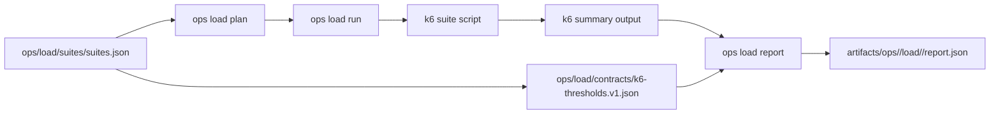

# Load Architecture Diagram

- Owner: `bijux-atlas-operations`
- Type: `concept`
- Audience: `operator`
- Stability: `stable`

## Purpose

Describe load execution flow from suite definition to report artifacts.

