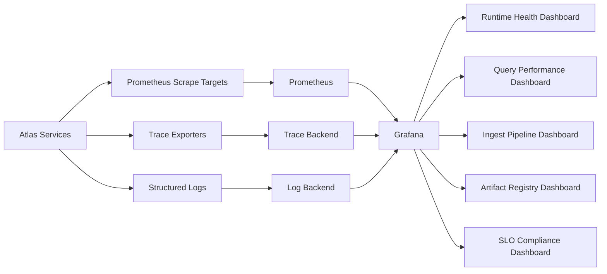

# Monitoring Architecture Diagram

```mermaid
flowchart LR
  A[Atlas Services] --> B[Prometheus Scrape Targets]
  A --> C[Structured Logs]
  A --> D[Trace Exporters]
  B --> E[Prometheus]
  D --> F[Trace Backend]
  C --> G[Log Backend]
  E --> H[Grafana]
  F --> H
  G --> H
  H --> I[Runtime Health Dashboard]
  H --> J[Query Performance Dashboard]
  H --> K[Ingest Pipeline Dashboard]
  H --> L[Artifact Registry Dashboard]
  H --> M[SLO Compliance Dashboard]
```
