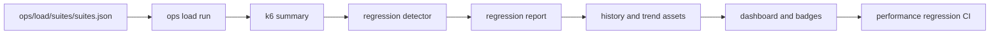

# Performance Architecture Diagrams

- Owner: `platform`
- Stability: `stable`
- Last verified against: `main@2228f79ef`

## Purpose

Describe performance governance data flow from suite execution to CI and operator evidence.

