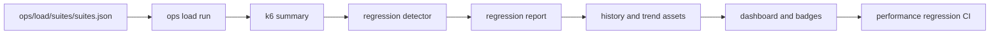

# Performance Architecture Diagrams

- Owner: `platform`
- Stability: `stable`
- Last verified against: `main@7dea4f4b9a65a61796b0f7ac8c2d185c0eaddb07`

## Purpose

Describe performance governance data flow from suite execution to CI and operator evidence.

